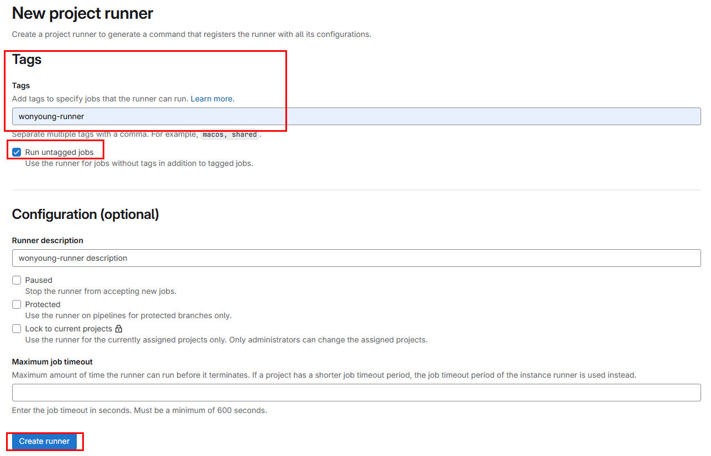
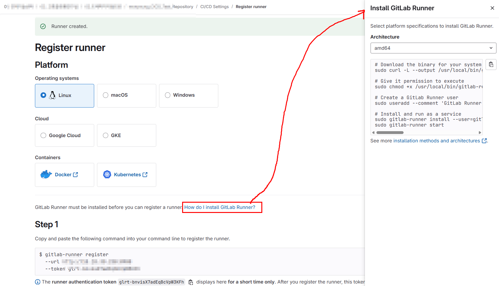
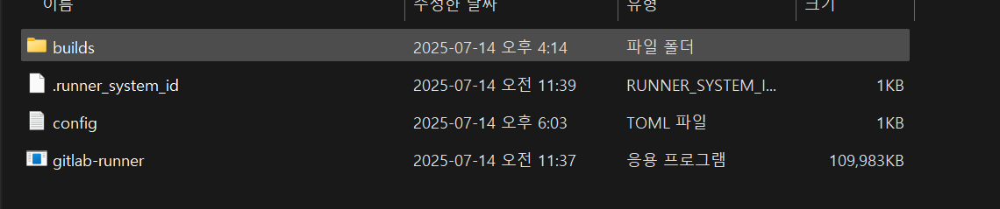

# GitLab Runner 동작 패턴

---

>[Docker Executor Docs](https://archives.docs.gitlab.com/17.11/runner/executors/docker/)
>
>[Docker Hub Url](https://hub.docker.com/_/gradle)

##  Runner 생성 



- 러너는 이미지를 로드하고, 프로젝트를 복제한 후, 로컬 또는 컨테이너에서 작업을 실행하는 역할을 한다. 
- Tags를 설정하는것이 좋다. 
  - **Tags를 이용해 어떤 runner 를 사용할지 정하기 때문!!**

## Register Runner 생성 방법  



- GitLab Register Runner 에는 기본적으로 Linux, Windows, macOS용 사용 예시를 알려준다. 
- 이후 예시들은 Runner 안에서 동작시킬 Job이 Frontend, Backend 2가지인 경우로 설명하겠다. 


| 번호 | 컨테이너                  | 역할                                              |
| ---- | ------------------------- | ------------------------------------------------- |
| ①    | **GitLab Runner**         | GitLab 서버로부터 Job을 받아 처리할 컨테이너 실행 |
| ②    | **Frontend Job 컨테이너** | Node.js 환경에서 `npm install`, `npm run build`   |
| ③    | **Backend Job 컨테이너**  | Java + Gradle 환경에서 `./gradlew build`          |

> **✔️ GitLab Runner는 "지휘관"**,
>  **✔️ 프론트/백 Job 컨테이너는 각각의 "작업자"이다. **

## Runner 와 GitLab Repo 연결 



- GitLab Runner 를 GitLab 의 Repository와 연결해야한다. 
  - Runner 가 Pulling 하는 방식으로 CI를 수행하기 때문에 
- Runner 종류에 대해서는 크게 4가지만 설명하겠다. 
  1. Linux 
  2. Windows (인코딩 문제 발생) -> **밑의 방법들 해당 방법기준으로 설명**
  3. macOS
  4. docker 

##### 1. Runner 등록

- Runner 종류별로 가이드되어있는대로 Runner를 설치한다. 

##### 2. Runner 실행 

- gitlab-runner 를 실행하고 register 하면 windows Runner 기준 `config.toml` 이 생성된다. 

  ```toml
  concurrent = 1
  check_interval = 0
  shutdown_timeout = 0
  
  [session_server]
    session_timeout = 1800
  
  [[runners]]
    name = "DESKTOP-NQORHFE"
    url = "http://[연결IP]:[연결port]" # 연결할 repository IP, port 
    id = 25
    token = "glrt-HWjktrUdXdrFPHsMyStA"
    token_obtained_at = 2025-07-14T06:22:26Z
    token_expires_at = 0001-01-01T00:00:00Z
    executor = "shell" # docker 사용할거라면 docker 로 변경 
    shell = "powershell" # script 실행할 shell 종류 
    tags = ["wonyoung-runner"] # GitLab-Runner 에 등록한 Tag이름과 일치 되도록 
    [runners.cache]
      MaxUploadedArchiveSize = 0
      [runners.cache.s3]
      [runners.cache.gcs]
      [runners.cache.azure]
  ```

##### 3. Runner 시작 

- Runner 를 시작 하고 GitLab에서 push 나 mr 시 동작하는지 확인한다. 

```powershell
# 시작
PS C:\GitLab-Runner> .\gitlab-runner.exe run

# 중지
PS C:\GitLab-Runner> .\gitlab-runner.exe stop

# 재시작
PS C:\GitLab-Runner> Restart-Service gitlab-runner

# 상태 체크
PS C:\GitLab-Runner> Get-Service gitlab-runner

# runner 삭제 
PS C:\GitLab-Runner> .\gitlab-runner.exe unregister --all-runners
```

------

##  실제 흐름

1. **GitLab 서버**에 push → `.gitlab-ci.yml`에 따라 Job 요청 발생
2. **Runner 컨테이너**가 GitLab과 연결되어 Job을 수신
   -  **Runner가 GitLab 서버로 주기적으로 "Job 있나요?"라고 요청**해서 받아가는  **“pull 방식”**이다. .
   - **Runner는 `--url http://...`로 등록된 GitLab 주소로 계속 polling 새 Job이 있는 경우 → 가져와서 실행**
   - **대부분의 Executor 는 job 시작 전에 “checkout code”**라는 *내장 단계*가 **자동으로 실행**
3. Runner는 `docker run node:18` 으로 프론트 Job 컨테이너 실행
4. Runner는 `docker run gradle:8-jdk` 으로 백엔드 Job 컨테이너 실행
5. 작업 완료 시 결과물 저장(artifacts)하고 컨테이너 자동 종료

```css
[ GitLab 서버 ]
        ↓
  [ GitLab Runner (컨테이너) ]
        ↓ docker run
  ┌────────────────────────────┐
  │ Frontend 컨테이너 (node)  │ ← npm install, npm run build
  └────────────────────────────┘

        ↓ docker run
  ┌────────────────────────────┐
  │ Backend 컨테이너 (gradle) │ ← ./gradlew build
  └────────────────────────────┘
```

