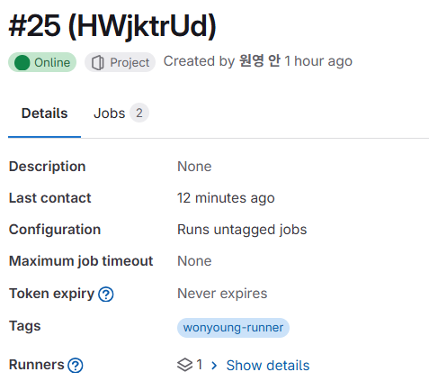

# [문제발생 및 해결]

---

>

## Windows 버전의 Runner 문제 발생 

1. 문제 이유 

   - MR 을 했는데도 Runner 에서 pending 걸려있었다. 
   - 확인결과 `.gitlab-ci.yml` 에 `tags` 정보와 GitLab Runner 의 tag 명칭을 설정하지 않았던게 문제였다. 
   - GitLab은 **Job에 `tags`가 명시되어 있지 않으면 Runner에 Job을 연결하지 않음**.

2. 해결방법

   - `.gitlab-ci.yml` 에 `tags` 정보와 GitLab Runner 의 tag 명칭을 동일하게 설정했다. 
   - 또한 `gitlab-runner` docker 에 설정 파일인 `config.toml` 설정파일에도 tags를 지정해줬다. 

   ```yaml
   # .gitlab-ci.yml
   backend-build:
     stage: backend
     image: gradle:7.6.1-jdk17  # Gradle이 포함된 Java 이미지 ㅇㄹㅇㄹ
     script:
       - ./backend/gradlew clean build -x test
     artifacts:
       paths:
         - build/libs/
     only:
       - dev
     tags:
       - wonyoung-runner
   ```

   

```toml
# Window버전의 GitLab-runner config.toml 설정
concurrent = 1
check_interval = 0
shutdown_timeout = 0

[session_server]
  session_timeout = 1800

[[runners]]
  name = "DESKTOP-Name"
  url = "http://[IP]:[Port]"
  id = 25
  token = "glrt-123"
  token_obtained_at = 2025-07-14T06:22:26Z
  token_expires_at = 0001-01-01T00:00:00Z
  executor = "shell"
  shell = "powershell"
  tags = ["wonyoung-runner"]
  [runners.cache]
    MaxUploadedArchiveSize = 0
    [runners.cache.s3]
    [runners.cache.gcs]
    [runners.cache.azure]

```

## Windows 경로 문제 발생

- CI/CD에서는 소스 체크아웃이 “자동”이어야 정상
  - **공식적으로 지원되는 대부분의 Runner 환경(Docker, shell-linux, ssh 등)** → job 시작 전 **자동 checkout code stage**를 실행
  - 하지만 “Windows PowerShell + shell executor”에서는 이 자동 checkout이 버그/제약/설정 미지원 등으로 “안 되는 경우”가 있음
- 그래서 직접 checkout(=git clone)을 추가해야 한다

## GitLab-runner 무한루프 문제 발생

1. 문제 원인 

   - MR 을 해도 gitlab-runner 에서 아무 반응 없이 pending 상태로 멈춰있음. 

   - 작업 cancle 시켰는데도 pending이 걸려 확인해본결과 계속 점유 상태로 Runner 가 돌고있었음 

     ```
     PS C:\GitLab-Runner> Restart-Service gitlab-runner
     경고: 'gitlab-runner(gitlab-runner)' 서비스가 중지될 때까지 기다리는 중...
     경고: 'gitlab-runner(gitlab-runner)' 서비스가 중지될 때까지 기다리는 중...
     경고: 'gitlab-runner(gitlab-runner)' 서비스가 중지될 때까지 기다리는 중...
     경고: 'gitlab-runner(gitlab-runner)' 서비스가 중지될 때까지 기다리는 중...
     ```

2. 해결방법

   - 그래서 강제종료 시키고 다시 재시작 함

     ```bash
     # 강제종료 -> 안될시 작업관리자에서 gitlab-runner 찾아서 작업 끝내기로 끄기
     Stop-Service gitlab-runner -Force
     ```

     


