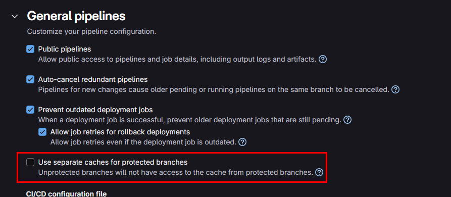
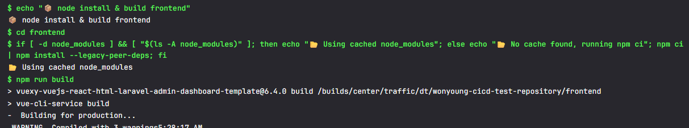

# GitLab Runner 캐시 이용 성능개선

---

>

## 학습 목적

- 나의 경우엔 docker compose 이용한 node_modules 파일을 캐시로 사용하기 위해 학습했다. 

  - docker-compose로 로컬 <-> Runner 연결, config.toml로 Runner <-> Job 컨테이너 연결. 
  - 이 두 단계를 거쳐서 로컬 ./runner-cache 까지 캐시 파일이 저장된다. 

  ```
  ┌──────────┐            ┌───────────────────┐           ┌───────────────────┐
  │   Host   │ ──(1)───▶ │ Runner Container  │ ──(2)──▶ │ Job Container     │
  │ (Docker) │           │  (/cache 마운트)  │           │  (node_modules/)  │
  └──────────┘           └───────────────────┘           └───────────────────┘
  ```

  **(1) Host ↔ Runner Container**

  - `docker-compose.yml` 에 정의한 `gitlab_runner_cache` 볼륨이 실제 호스트에 만들어진다. 
  - 이 볼륨을 Runner 컨테이너의 `/cache` 경로로 마운트합니다.

  **(2) Runner Container ↔ Job Container**

  - Runner 설정(`config.toml`)의 `volumes = ["/cache"]` 에 따라, Job 컨테이너도 동일한 Docker 볼륨(`gitlab_runner_cache`)을 `/cache`로 마운트한다. 
  - 즉, 모든 Job 컨테이너는 같은 `/cache` 디렉토리를 보고, 데이터를 읽고 쓰게 된다. 

## 아티팩트 vs 캐시 

- 저장위치가 다르다. 
- 아티팩트
  - 작업별로 생성되어 GitLab에 저장되며 다운로드할 수 있습니다.
- **캐시 **
  - **GitLab Runner가 설치된 위치에 저장된다.** .
  - `cache:`는 **잡이 끝난 뒤** 러너가 `frontend/node_modules/`를 tar로 묶어 **Job container의 캐시 디렉터리**(기본 `/cache`)에 저장한다. 
  - 캐시 작업(Push/Pull)은 GitLab Runner가 처리함

```
로컬 호스트 ./runner-cache
       ⇅ (docker-compose 마운트)
GitLab Runner 컨테이너 /cache
       ⇅ (config.toml volumes 전달)
CI Job 컨테이너 (node:14.17-alpine) /cache
```

## 캐시 구조

1. **key**: 브랜치별 또는 프로젝트별 고유 키.
2. **paths**: 캐시할 디렉토리(`node_modules/`)를 지정.
3. **policy**:
   - `pull-push` (기본) → 먼저 캐시 복원 후, 스크립트 실행 뒤 변경된 캐시를 푸시
   - `pull` → 복원만
   - `push` → 푸시만

## Job간 캐시 공유 방법

##### 1. 순서

1. **install** Job에서 `npm install`로 `node_modules/` 생성
2. 캐시가 자동으로 업로드
3. 이어지는 **test**·**deploy** Job에서 동일한 `cache.key`를 쓰면, 빌드 환경에 캐시 복원 → `node_modules/`가 살아있는 상태로 시작

##### 2. 볼륨 마운트 경로 설정 

- 나같은 경우는 이걸로 정말 많은 시간 소요함.... cache 를 마운트 해야되는데 계속 안되서 많이 찾아봄 

1. config.toml 

   - 해당 설정의 `runners.docker` 에 있는 설정이 `Job Container` 의 설정이다.  

   - **즉, 여기서 볼륨 설정해야 Job Container도 로컬경로와 볼륨 설정됨** 

   - 주의할점 : 여기서의 **볼륨 마운트는 상대경로 사용 못함** -> Job Container라 절대경로로 잡아줘야함 !!!!!!!!

     ```yml
     [runners.docker] # Job Container 설정
     tls_verify   = false
     image        = "alpine:3.19"
     privileged   = true
     volumes      = [
       "/var/run/docker.sock:/var/run/docker.sock",
       "/home/user/git-runner/runner-cache:/cache",        # 캐시 볼륨 마운트 ( 호스트 - Job 컨테이너 볼륨 마운트)
       "/mnt/c/build/backend:/output/backend",        # build 파일 마운트  
       "/mnt/c/build/frontend:/output/frontend"
     ]
     ```

2. docker-compose-register.yml 

   - gitlab runner 와 연결하기 위한 파일  

   - Host 와 runner 컨테이너 간 연결 볼륨을 관리한다. 

   - 만약 gitlab-runner 컨테이너에서 cache 를 사용하려면 여기에서 Host-runner container 간 볼륨마운트 설정을 해주면 된다. 

   - `docker-volumes` 을 이용해 config.toml 에 직접 세팅해줄수도 있다. 

     ```yml
     services:
       gitlab-runner-register:
         container_name: gitlab-runner-register
         image: gitlab/gitlab-runner:latest
         restart: "no"
         volumes: # Host 와 runner 컨테이너 간 연결 
           - './config:/etc/gitlab-runner'               # Runner 설정 파일
           - '/var/run/docker.sock:/var/run/docker.sock' 
         command: 
           gitlab-runner register
           --non-interactive
           --url http:[IP]
           --registration-token $REGISTRATION_TOKEN
           --executor docker
           --docker-image alpine:3.19
           --locked=false
           --name p2
           --docker-volumes /var/run/docker.sock:/var/run/docker.sock
         environment:
           - REGISTRATION_TOKEN=[runner Token]
     ```

3. docker-compose-run.yml 

   - container 를 실행하기 위한 파일 

   - 여기서 **로컬호스트와 gitlab-runner 를 볼륨 마운트** 할 수 있다. 

     ```yml
     services:
       gitlab-runner-run:
         container_name: gitlab-runner-run
         image: 'gitlab/gitlab-runner'
         restart: always
         volumes:
           - './config:/etc/gitlab-runner'
           - '/var/run/docker.sock:/var/run/docker.sock'
         command:
           - run
     ```

4. 정리 

   - config.toml : **로컬과 Job Container 볼륨 마운트** 
   - docker-compose-run.yml : **로컬과 Gitlab-runner 볼륨 마운트** 

## cache 설정시 주의 할점 

1. cache 파일명 

   - 브랜치 보호가 설정되어있으면 같은 cache key 를 지정하더라도 cache 되는 이름이 달라진다. 

     - 예시) `0_package-lock-default-non_protected`  와 `0_package-lock-default-protected`
     - 보호된 브랜치는 protected , 보호 안되어있는 브랜치는 non_protected 로 뒤에 붙게된다. 

   - 해결방법

     - CI/CD 설정 -> `Use separate caches for protected branches` **체크 해제**

     

2. `node install 명령어`

   - `npm ci`는 node_modules가 있으면 무조건 삭제 후 새로 설치하기 때문에  캐시를 쓰려면 `npm ci`를 조건적으로 실행해야 함.

## 폴백 캐시

- 캐시를 찾지 못하면 작업은 캐시를 사용하지 않고 실행하게 된다. 
- 이때 디폴트 캐시를 설정해 적용할 수 있다. 

```bash
cache:
- key: cache-1 # 1순위 key 로된 캐시를 찾음 
  fallback_keys: # cache-1 key 가 없는경우 순차적으로 찾음 
    - cache-$CI_DEFAULT_BRANCH
    - cache-default
  paths:
    - vendor/ruby
```

## 결과 


