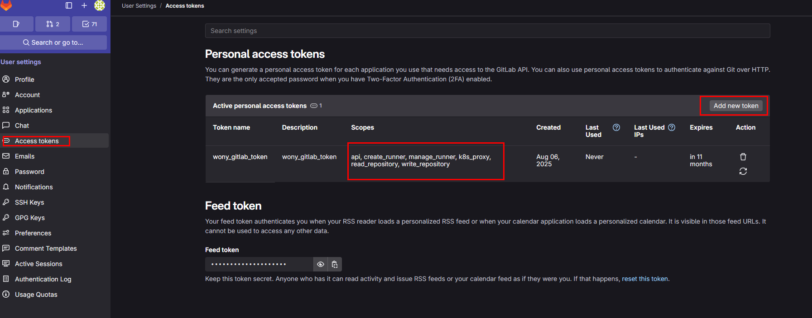
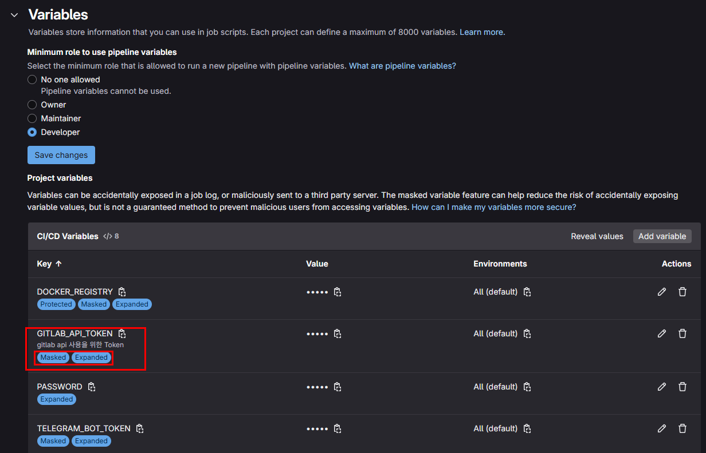
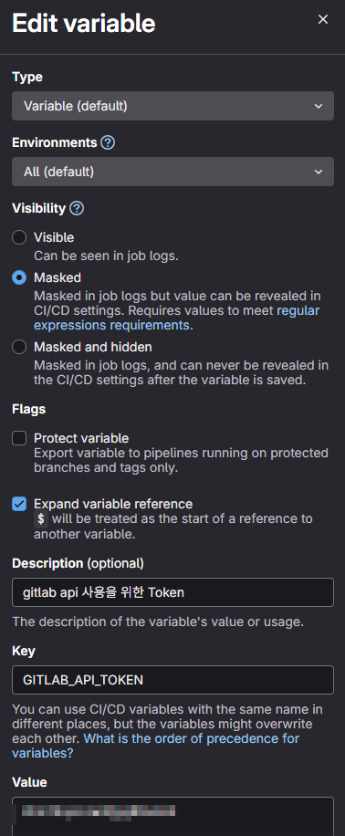

# Noti시 Review 이름 표시 방법

---

>

## 방법

1. **GitLab API를 호출해서 MR Reviewer 정보 가져오기**
2. 가져온 Reviewer 이름을 `.gitlab-ci.yml` 의 Noti 메시지에 포함
3. Telegram 메시지 전송 

## 필요한 value 

| 항목                 | 설명                                                         |
| -------------------- | ------------------------------------------------------------ |
| $GITLAB_API_TOKEN    | API 권한이 있는 Personal Access Token                        |
| Runner 이미지        | `jq`가 필요하므로 `curlimages/curl` 또는 `alpine/curl`에 `jq` 설치 |
| CI_MERGE_REQUEST_IID | GitLab에서 MR 파이프라인이면 자동으로 변수 제공              |

## 이용 방법 

##### 1. GitLab API 이용 Token 발급

- Gitlab API 를 이용하기 위해선 `계정 Access Token` 이 필요하다. 

- `프로필 -> Preferences -> Access Token` 에서 발급 받을 수 있다. 

- 주의할점은 Token의 Scope 이다. (권한 범위에 api 를 무조건 포함해야함. 만료기간은 최대 1년까지밖에 안됨)

- 추가 팁 : 기관이나 회사에서 이용한다면 CICD Bot 용 gitlab 계정을 하나 파서 token 발급 받는것이 좋다. (개인 토큰 사용시 Block 됐을 때 Access Token 사용불가능함)

  

##### 2. Variables 등록 

1. `GITLAB_API_TOKEN` 의 변수 이름으로 gitlab `CI/CD 세팅에서 Variables` 로 등록해야한다. 
2. 주의할점은 등록 시 Visiblity 와 Flags 이다. 해당 설정으로 인해 CI/CD 동작시 값이 제대로 들어가지 않을 수 있다. 





##### 3. gitlab-ci.yml 에서 Gitlab API 사용 

- 발급받은 Token을 이용해 yml 파일에서 Reviewer 정보를 파싱해온다. 
  - 이때 API Call 시 Token, GitLab URL 정보, MR 정보가 필요함 
- jq 이미지 사용 파싱 
  - 요청 파라미터에서 리뷰어 명칭만 파싱하기 위해 jq 이미지를 사용했다. 

```yml
echo "👉 merge ID : CI_MERGE_REQUEST_IID = $CI_MERGE_REQUEST_IID"
echo "👉 API URL : CI_API_V4_URL = $CI_API_V4_URL"
echo "👉 Project ID : CI_PROJECT_ID = $CI_PROJECT_ID"
echo "👉 Token : GITLAB_API_TOKEN = $GITLAB_API_TOKEN"
echo "👉 API CALL URL: $CI_API_V4_URL/projects/$CI_PROJECT_ID/merge_requests/$CI_MERGE_REQUEST_IID"
# 예시 URL (http://[GITLAP 서버 IP]:[서버 Port]/api/v4/projects/441/merge_requests/23)

echo "📦 리뷰어 정보 조회 (GitLab API)"
REVIEWERS_JSON=$(curl --silent --header "PRIVATE-TOKEN: $GITLAB_API_TOKEN" \
"$CI_API_V4_URL/projects/$CI_PROJECT_ID/merge_requests/$CI_MERGE_REQUEST_IID")

# 리뷰어 정보 파싱 
REVIEWERS=$(echo "$REVIEWERS_JSON" | jq -r '[.reviewers[]?.name] | select(length > 0) | join(", ")')
```

## 예시 코드 

```yml
# (.gitlab-ci.yml)
notify-build-success:
  stage: notification-hook
  image: alpine/curl:latest
  needs: 
  - job: frontend-build
    artifacts: false
  - job: backend-build
    artifacts: false
  before_script:
  - apk add --no-cache jq
  script:
    - |
      BRANCH_NAME=${CI_COMMIT_BRANCH:-${CI_MERGE_REQUEST_SOURCE_BRANCH_NAME}}
      echo "👉 merge ID : CI_MERGE_REQUEST_IID = $CI_MERGE_REQUEST_IID"
      echo "👉 API URL : CI_API_V4_URL = $CI_API_V4_URL"
      echo "👉 Project ID : CI_PROJECT_ID = $CI_PROJECT_ID"
      echo "👉 Token : GITLAB_API_TOKEN = $GITLAB_API_TOKEN"
      echo "👉 API CALL URL: $CI_API_V4_URL/projects/$CI_PROJECT_ID/merge_requests/$CI_MERGE_REQUEST_IID"

      echo "📦 리뷰어 정보 조회 (GitLab API)"
      REVIEWERS_JSON=$(curl --silent --header "PRIVATE-TOKEN: $GITLAB_API_TOKEN" \
        "$CI_API_V4_URL/projects/$CI_PROJECT_ID/merge_requests/$CI_MERGE_REQUEST_IID")

      # API 호출 실패 시
      if [ -z "$REVIEWERS_JSON" ] || [ "$REVIEWERS_JSON" = "null" ]; then
        echo "🚨 API 호출 실패 또는 데이터 없음"
        REVIEWERS="(불러오기 실패)"
        echo "✅ 최종 리뷰어 목록: $REVIEWERS"
        exit 0
      fi

      # reviewers 필드 파싱 및 null 방어
      REVIEWERS=$(echo "$REVIEWERS_JSON" | jq -r '[.reviewers[]?.name] | select(length > 0) | join(", ")')

      # reviewers가 비어있다면 기본값 처리
      if [ -z "$REVIEWERS" ]; then
        REVIEWERS="(지정되지 않음)"
      fi

      echo "✅ 최종 리뷰어 목록: $REVIEWERS"

      MESSAGE="
        <b>[ Noti 알림 ]</b>%0A\
        🔔 <b>Merge Request Opened</b> 🔔 %0A\
        <b>Project:</b> ${CI_PROJECT_NAME}%0A\
        <b>Author:</b> ${GITLAB_USER_NAME}%0A\
        <b>Reviewer:</b> ${REVIEWERS}%0A\
        <b>Branch:</b> <code>${BRANCH_NAME}</code>%0A\
        <b>Pipeline:</b> <code>${CI_PIPELINE_ID}</code>%0A\
        <b>Title:</b> ${CI_MERGE_REQUEST_TITLE}%0A\
        <b>Link:</b> ${CI_MERGE_REQUEST_PROJECT_URL}/-/merge_requests/${CI_MERGE_REQUEST_IID}"

      URL="https://api.telegram.org/bot${TELEGRAM_BOT_TOKEN_WONY}/sendMessage"
      echo "Telegram API URL: $URL"
      echo "Telegram Chat ID: ${TELEGRAM_CHAT_ID_WONY}"
      echo -e "Telegram Message:\n$MESSAGE"

      curl -s -X POST "$URL" \
        -d chat_id="${TELEGRAM_CHAT_ID_WONY}" \
        -d parse_mode="HTML" \
        -d text="$MESSAGE"
  rules:
    - if: $CI_PIPELINE_SOURCE == "merge_request_event"
      when: on_success
  tags: 
    - gitlab-runner
```

