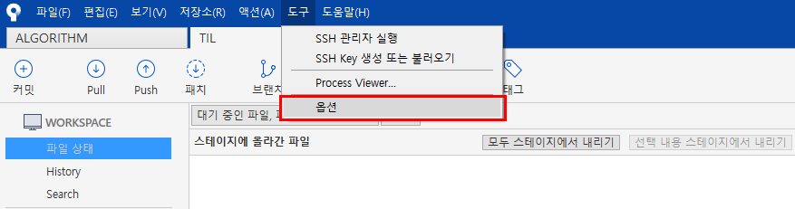
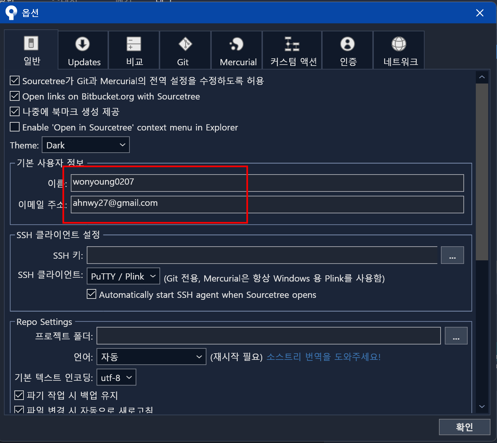
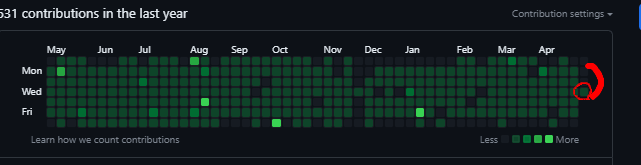

# Github contribution(잔디) 표기안됨

---

>[참고 사이트1](https://develaniper-devpage.tistory.com/76)
>
>[참고 사이트2](https://velog.io/@think2wice/Github-%EB%B6%84%EB%AA%85-commit%EC%9D%84-%ED%96%88%EB%8A%94%EB%8D%B0-%EC%99%9C-contribution-%EA%B7%B8%EB%9E%98%ED%94%84%EB%8A%94-%EC%95%88%EC%B1%84%EC%9B%8C%EC%A7%80%EC%A7%80)

## Contribution 

- 원격저장소인 github 에 code review, commit, pull request 등의 활동을 하면 초록색으로 당일 그래프부분이 채워진다. 

### 그래프가 채워지는 조건 

- *Github 공식 홈페이지 번역*
- contribution 그래프가 채워지기 위해서는 다음의 세가지 조건이 모두 충족되어야 합니다.
  1. 커밋할때 사용한 **이메일 주소**(local repository의 user.email)가 **github계정의 이메일 주소**와 같아야 합니다.
  2. **fork**를한 commit은 적용되지 않고 독립적인 repository에서 이루어진 commit이여야 합니다.
     - 이 때 fork를 실행한 commit이 그래프에 나타나게 하려면 fork한 repo의 parent repo에 merge될 수 있도록 open pull-request해야합니다.
  3. 커밋은 다음으로 만들어져야 합니다:
     - repository의 **default branch** (보통은 master)
     - `gh-pages` [branch](https://help.github.com/en/github/working-with-github-pages/about-github-pages#types-of-github-pages-sites) (github page branch)

### 문제 원인

- 나의 경우에는 SourceTree를 설치하면서 기본 커밋 이메일 설정이 변경되어 'user.email' 부분이 다른 이메일로 변경되어있었다. 
- 깃허브 이메일은 gmail 이지만, SourceTree 에서 사용하는 이메일은 다른 플랫폼 이메일 이였음. 

### 해결방법 1

- 먼저 자신의 이메일 주소를 확인해본다. 

```null
git config user.email
```

- 이번에는 변경하는 법입니다. github계정 이메일과 동일하게 바꿔주면 됩니다.

```java
// 전체 레포지토리 작성자 변경 
git config --global user.email 바꿀@이메일주소.com

// 해당 레포지토리의 작성자만 변경할 떄 사용
git config --local user.email abc@gmail.com
```

- 바뀐 이메일을 잘 바뀌었는지 확인만 해주면 끝
  - 이후로 commit한 내용들에 대해서는 contribution 그래프가 색칠될 것이다. 
- 만약 이렇게 했는데도 그래프가 채워지지 않으면 다른 조건들이 부합하는지 체크해봐야 한다. 

### 해결방법 2





- 사용자 정보가 github의 정보와 동일해야한다. 나의 경우에는 이메일주소가 gmail 이 아닌 다른 주소였다. 




- 변경 후 commit 하면 정상작동한다. 
  - 3일차에 알아차려서 총 2일 잔디 빵꾸났다. 