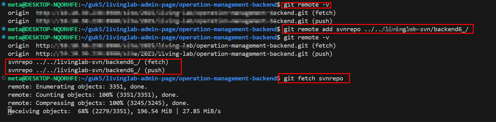

## 핵심

> **SVN → Git 변환은 별도 repo에서 하고 → 그 repo를 remote로 연결해서 가져온다**

## 방법

##### 1.  SVN → Git 변환 (독립 repo)

- 먼저 **완전히 별도 폴더** 에 svn 용 git init 생성 

```
git svn clone SVN주소 svn-migrated-repo
```

- 구조

```
svn-migrated-repo/
 └─ .git
```

- 여기에는 `SVN revision → Git commit` 히스토리가 들어있음.
- 기본적으로 `svn clone` 하면 remote 는 설정 안되어있는거같음 (빈값 나옴)


##### 2. 최종 목적지 repository 이동

```
cd A-repository
```


##### 3. SVN repo를 최종 목적지 repo 와 연결

- 현재 경로는 최종 목적지 A-repository 임 ( 즉, svn 을 가져올 repo )

```
# 연결 체크 
git remote -v

# 로컬 경로의 svn 마이그레이션한 폴더를 연결 
git remote add svnrepo ../svn-migrated-repo
```




##### 4. SVN history 가져오기

```
git fetch svnrepo
```

- 이제 브랜치가 보임

```
svnrepo/[브랜치명]
```


##### 5. main 위에 SVN history merge

```
git switch main
git merge svnrepo/[브랜치명] --allow-unrelated-histories
```

- 결과 구조 

```
main:        A---B---C
                \
                 M
                /
svn history: S1---S2---S3
```

- 두 history가 **하나의 repo로 연결됨.**


##### 6.  remote 제거 (선택)

- 작업 끝났으면 제거 

```
git remote remove svnrepo
```

# 장점

이 방법이 좋은 이유

- git init 충돌 없음
- nested repo 없음
- history 유지
- merge 구조 명확
