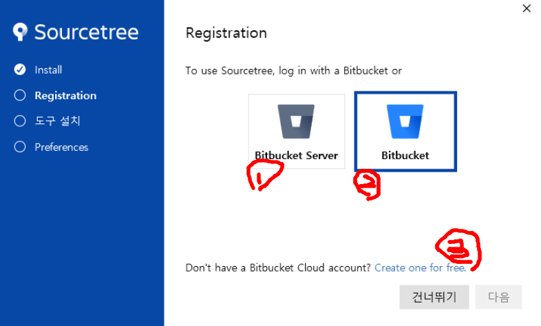
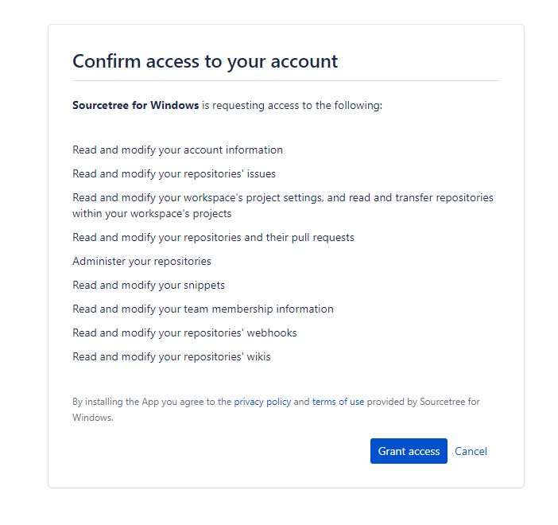
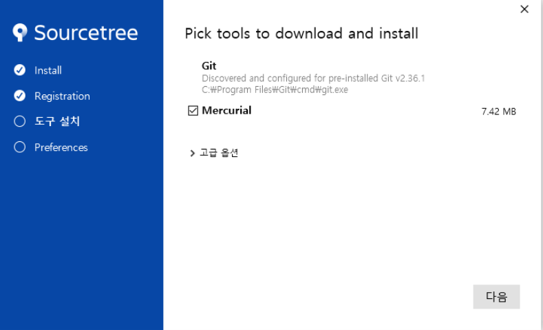
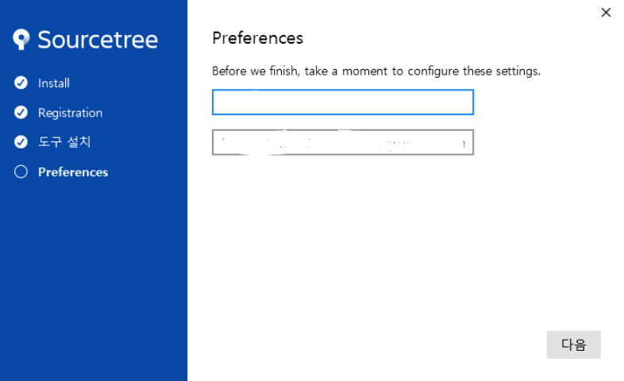

# SourceTree 개념정리 

---

>[참고 사이트1](https://parkjh7764.tistory.com/99)
>
>[참고 사이트2](https://ux.stories.pe.kr/181)
>
>[참고 사이트3](https://www.biew.co.kr/entry/GIT-GUI%EC%86%8C%EC%8A%A4%ED%8A%B8%EB%A6%ACSourceTree-%EC%84%A4%EC%B9%98%EB%B0%A9%EB%B2%95-1%ED%8E%B8)

## SourceTree

### 정의

- Jira로 유명한 Atlassian에서 만든 **Git GUI** 로써 Git 을 보다 편리하게 사용할 수 있도록 도와주는 **도구**이다. 

### 이용방법

1. [SourceTree](https://www.sourcetreeapp.com/) 에서 윈도우 버전 다운로드.

2. 회원가입

   - SourceTree 를 이용하기 위해서는 **회원가입**을 해야한다. 

   - **Bitbucket Server 와 Bitbucket** 원격 저장소(Remote Repository)를 **사용하지 않으려면** **건너뛰기 버튼**을 누른다. 

     1. **Bitbucket Server**은 설치형으로 개별 서버를 설치한 경우 거기에 로그인을 할때 선택한다.
     2. **Bitbucket**은 Atlassian의 Bitbucket에 회원가입된 사용자가 로그인 할때 선택한다.
     3. 만약 회원가입이 안되어 있는경우 **Create one free**를 선택하여 회원가입을 먼저 해야 한다.

     

3. 접근 권한 설정

   - 로그인 후 설치하면 접근 권한 설정하라는 창이 웹으로 뜬다. 

   - `Grant access` 를 눌러 권한을 부여한다. 

     

4. 권한을 부여하면 '등록 완료!' 창이 뜬다. 

5. Mercurial 체크박스 해제 

   - Mercurial 은 깃(Git) 과 비슷한 버전관리 툴이다. 만약 git이 있다면 설치하지 않아도 된다. 

     

6. 소스트리에서 Git을 사용할 때 쓰일 계정선택. 

   