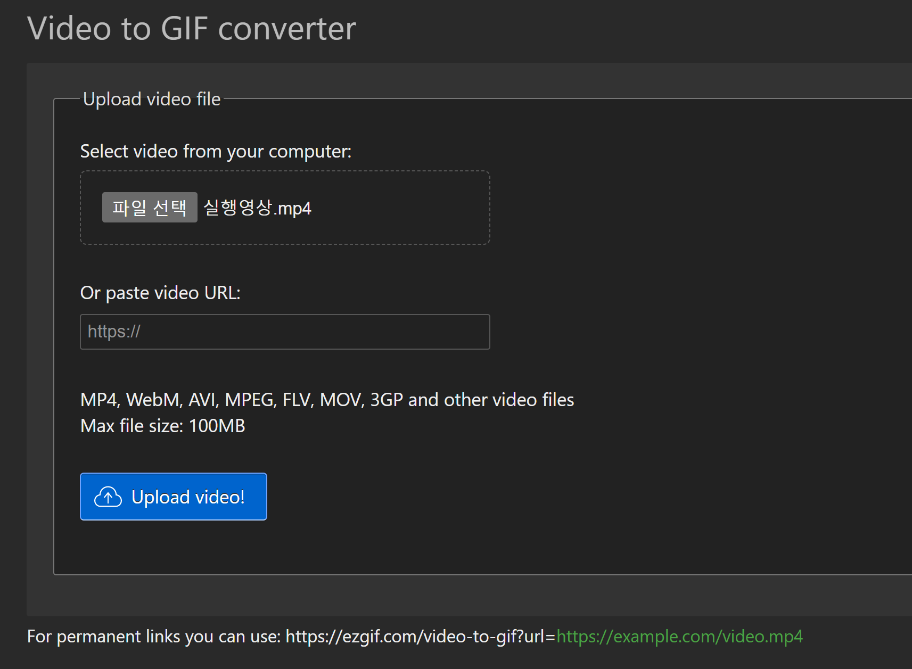
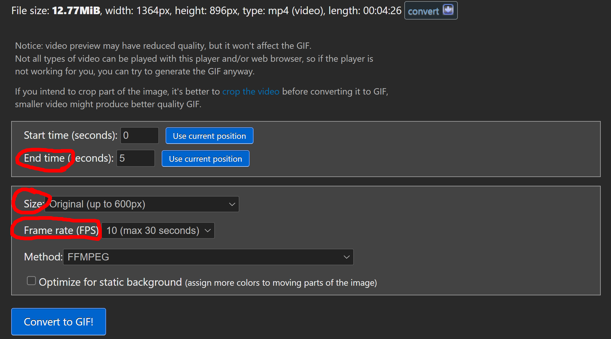
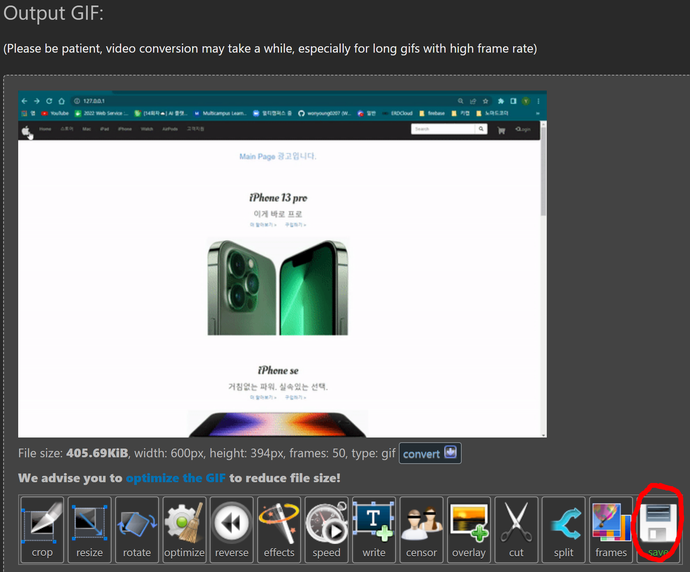

# gif 파일로 변경 후 github에 올리기 

---

## 순서

1. mp4파일을 준비한 후 gif 로 변경할수 있는 사이트로 이동한다. 

   - [gif 변경 사이트 ](https://ezgif.com/)

2. 해당 사이트에서 Video to GIF 메뉴를 선택한다

3. 파일선택을 눌러 gif 로 변경할 비디오를 선택한다. 

4. Uploade Video 버튼을 눌러 동영상을 업로드한다. 

   

5. 변경된 gif의 크기, 영상 길이와 FPS 를 설정한다. 

   - Size : gif의 크기로, original 600px로 하면 적당하다. 
     - resize를 선택해 %로 크기를 조절할 수도 있다. 

   - **end time** : 동영상에서 몇초까지를 gif로 변경할지 정하는 곳 ( 설정 안하면 5초만 gif로 변경되기 때문에 **길게하고 싶다면 무조건 변경**해줘야한다. )
   - FPS : 프레임으로, end time에 의해 제한이 된다. 
     - 만약 30pfs 로 한다면 10초만 gif 로 변경할 수 있게 제한이 걸린다. 

   

6. **Convert to Gif** 버튼을 눌러 gif로 변경한다. 

7. 밑에있는 SAVE 버튼을 눌러 gif파일을 저장한다. 

   

8. 변경된 gif를 markdown 문법으로 적용시킨다. 

   ```
   
   ```