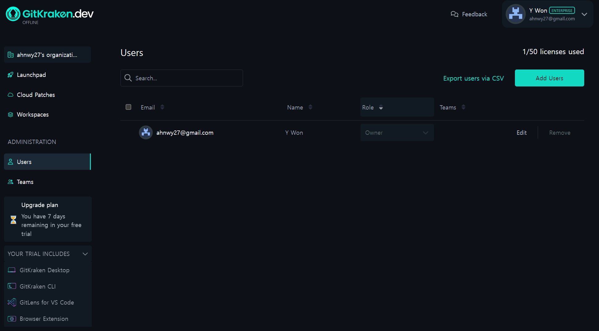
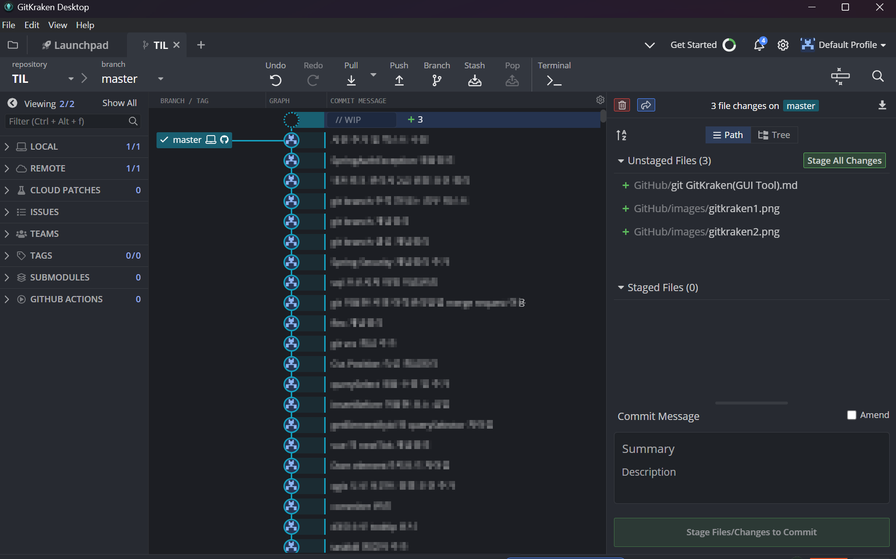

# GitKraken 개념정리 

---

>[GitKraken 다운로드](https://www.gitkraken.com/download/windows64)

## GitKraken

1. git 을 쉽게 다룰 수 있도록 도와주는 GUI Tool 의 종류 중 하나이다.

### 설치

1. [GitKraken](https://www.gitkraken.com/download/windows64) 공식홈페이지에서 다운로드 받을 수 있다. 

   

### GitKraken Desktop 이용모습 

