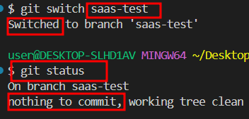

# git branch 생성 개념정리

---

>[git push 저장소](https://www.freecodecamp.org/korean/news/git-push-to-remote-branch/)

## 1. git branch 란? 

1. 독립된 작업 흐름을 가능하게 해주는 기능으로, 프로젝트의 한 지점을 나타내는 포인터이다. 
2. 각 브랜치는 프로젝트의 특정 커밋을 가리키며, 이를 통해 여러 가지 기능이나 버그 수정을 독립적으로 작업하고, 나중에 병합할 수 있다. 

## 2. branch 목록 확인

```bash
git branch          # 로컬 브랜치 목록
git branch -r       # 원격 브랜치 목록
git branch -a       # 로컬 및 원격 브랜치 목록 전체
```

## 3. git push 동작 매커니즘 

1. 현재 작업 중인 브랜치가 `main`인 경우,
2. `git push` 명령어는 두 개의 기본 매개변수를 제공하기 때문에 `git push origin main` 과 같은 작업을 실행한다.
3. `origin`은 GitHub 원격 저장소이고, main은 현재 브랜치이다. 

```bash
# 현재 브랜치로 push 
git push origin main 

# 만약 다른 브랜치로 push 하고 싶은경우 사용 
git push origin 로컬branch명:원격branch명
```

## 4. checkout 된 브랜치 ? 

1. checkout 이란 git 의 명령어로도 쓰이고,  현재 선택된 브랜치를 뜻하는 말로도 사용된다. 
2. 즉, 현재 브랜치를 `체크아웃된 브랜치` 라고 하기도 한다. 

## 5. branch 생성

1. 브랜치 생성 방법에는 크게 2가지가 있다 

   1. `git branch branch명`
   2. `git checkout branch명`

2. **`checkout` 명령어 이용**

   1. `branch` 명령어와 다른점은, 브랜치 생성 후 checkout 되어 생성한 branch로 이동한다는 것이다. 

   2. 현재 브랜치 기준으로 브랜치 생성 

      ```bash
      git checkout -b branch명
      ```

   3. 특정 브랜치를 기준으로 브랜치 생성 

      ```bash
      git checkout -b 생성branch명 기준branch명
      ```

3. **`branch` 명령어 이용**

   1. 현재 브랜치 기준으로 브랜치 생성 

      ```bash
      git branch branch명
      ```

   2. 특정 브랜치를 기준으로 브랜치 생성 

      ```bash
      git branch 생성branch명 기준branch명
      ```

## 6. 로컬 branch 원격 저장소와 연결

1. **추적관계 설정이 되어있지 않으면 원격 저장소의 변경사항을 읽어오지 못한다.** 

   1. 로컬 브랜치 생성 후 push ( 추적관계 없는 상태 )
      1. `git status` 로 추적관계 설정 안되어있는거 확인 

   

   1. 원격저장소의 `saas-test` 브랜치 clone 해서 다른 곳에서 변경 후 커밋 
      1. commit 정상적으로 이루어진거 확인 
      2. 만약 정상적으로 추적 관계에 있으면 로컬의 `saas-test` 브랜치에서 "saas 변경 후 push 라는 commit" 기록이 떠야한다. 

   

   1. 로컬 브랜치에서 변경사항을 인식하지 못함
      1. `git status` 로 확인한 결과 commit 기록 인지 못함  

   

   1. pull 로 변경사항 가져오려고 시도
      1. `git pull` 명령어 이용해 변경사항 가져오려고 시도 
      1. 에러발생 

   

---

## 이외 branch 명령어

1. 브랜치 이동(변경)

   ```bash
   git checkout -b branch명
   git switch branch명
   ```

2. 브랜치 병합

   ```bash
   git merge branch명
   ```

3. 브랜치 삭제 

   ```bash
   # 로컬 브랜치 삭제 
   git branch -d branch명
   
   # 원격 브랜치 삭제 
   git push origin --delete branch명
   ```

4. 원격 브랜치 명

   ```bash
   git branch -r
   ```

5. 원격 브랜치 가져오기 

   ```bash
   # checkout 사용
   git checkout -b develop origin/develop
   
   # fetch 사용 
   git fetch origin '원격의 가져올 branch명':'로컬로 가져올때의 branch명'
   ```
   
   