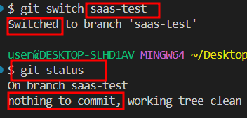
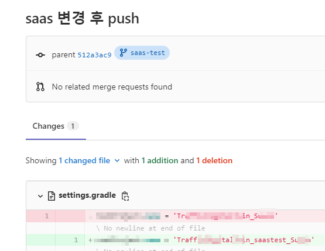
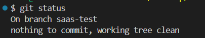
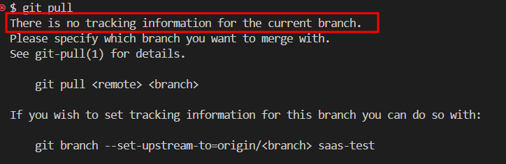

#  브랜치 추적 관계 아닌 경우 테스트 

---

> 

## 진행 이유

1. 로컬에서 브랜치 생성 후 그냥 push 
2. 다른 곳에서 해당 브랜치 clone 하고 작업 후 변경사항 push
3. 로컬의 브랜치가 변경사항을 감지 못하는 경우 발생 

## 추적 관계 테스트 방법 및 결과 

### 1. push 의 동작 매커니즘

1. 만약 로컬에서 브랜치를 생성하고 변경 사항을 원격 저장소에 push 하려면 연결하는 작업이 필요하다. 

   1. `git push` 명령어를 실행하면 Git는 푸시 동작을 행할 **원격 저장소와 푸시할 로컬 브랜치의 두 매개변수를 기본값으로 설정**된다. 

   2. 따라서, 사용자가 이 두 매개변수를 지정하지 않는다면 Git는 기본적으로 *`origin`을 원격 저장소로, 현재 작업하고 있는 브랜치를 푸시할 브랜치*로 지정한다. 

      ```bash
      git push <remote> <branch>
      ```

2. 이때, 그냥 push 를 하면 문제가 발생한다. 

   1. 원격 저장소에 해당 브랜치가 없기 떄문에 새로 만들어진다. (push는 잘됨)
   2. 하지만 로컬에서 브랜치를 생성했기 때문에 원격 저장소와 해당 브랜치가 "추적 관계" 설정이 되어있지 않은 상태이다. (pull 을 할 수 없음)

3. 즉, 그냥 push 한다면 두 저장소는 **추적 관계 설정** 이 되어있지 않기 때문에 원격 저장소의 변경사항을 읽어오지 못한다.

### 2. 추적 관계 테스트

1. 로컬 브랜치 생성 후 push ( 추적관계 없는 상태 )

   1. `git status` 로 추적관계 설정 안되어있는거 확인 

   

2. 원격저장소의 `saas-test` 브랜치 clone 해서 다른 곳에서 변경 후 커밋 

   1. commit 정상적으로 이루어진거 확인 
   2. 만약 정상적으로 추적 관계에 있으면 로컬의 `saas-test` 브랜치에서 "saas 변경 후 push 라는 commit" 기록이 떠야한다. 

   

3. 로컬 브랜치에서 변경사항을 인식하지 못함

   1. `git status` 로 확인한 결과 commit 기록 인지 못함  

   

4. pull 로 변경사항 가져오려고 시도

   1. `git pull` 명령어 이용해 변경사항 가져오려고 시도 
   2. 에러 발생

   

### 3. 결과

1. 로컬에서 브랜치 생성 후 그냥 push 한다면 두 저장소는 **추적 관계 설정** 이 되어있지 않게 된다. 
2. 따라서 원격 저장소의 변경사항을 읽어오지 못한다.