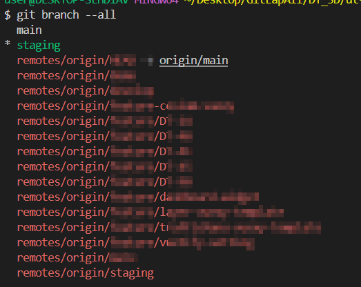
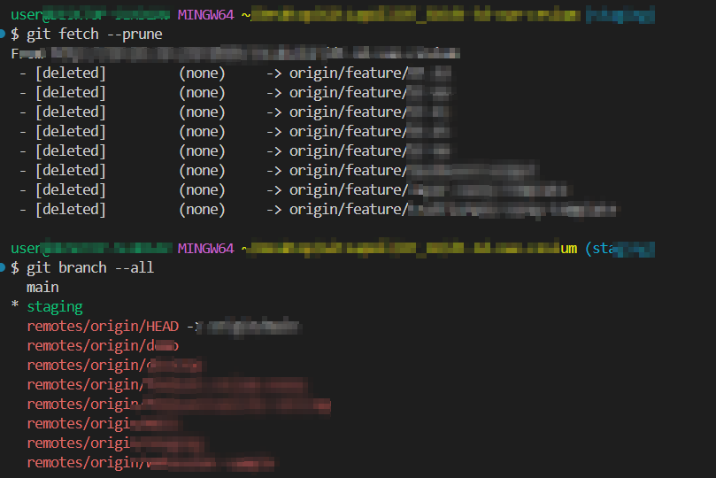

# git fetch 개념정리 

---

> ㅇㄹ

## git fetch 

### 사용 이유 

1. 원격 저장소에서 최신 커밋과 참조 정보를 가져와 로컬 저장소를 업데이트하는 데 사용된다. 
   1. 원격 저장소의 변경 사항을 로컬 저장소에 반영하지만, 작업 중인 브랜치나 파일에는 아무런 변경을 가하지 않는다. 
   2. 즉, `git fetch`는 새로운 데이터를 로컬 저장소에 다운로드하지만, 이를 적용하려면 별도의 병합이나 체크아웃 과정을 거쳐야 한다. 

### 사용방법

``` bash
# remote : 원격 저장소의 이름 (예: origin).
# refspec : 가져오고자 하는 브랜치나 태그 등 (예: main).
git fetch <remote> <refspec>
```

1. **`git fetch`**
   1. 모든 원격 저장소의 최신 변경 사항을 가져온다. 
2. **`git fetch <remote>`**
   1. 특정 원격 저장소에서 데이터를 가져온다 
3. **`git fetch <remote> <branch>`**
   1. 특정 원격 저장소의 특정 브랜치 데이터를 가져온다. 

### 옵션

1. **`--all`**: 

   1. 모든 원격 저장소에서 데이터를 가져온다. 

      ```bash
      git fetch --all
      ```

2. **`--prune`**

   1. 원격 저장소에서 삭제된 브랜치나 태그를 로컬에서도 삭제

      ```bash
      git fetch --prune
      ```

3. `--dry-run`

   1. 실제로 가져오지 않고 어떤 변경 사항이 있을지 미리 확인

      ```bash
      git fetch --dry-run
      ```

### fetch   VS   pull 

1. `git pull`
   1. `git fetch`와 `git merge`를 결합한 명령어
   2. 원격 저장소에서 데이터를 가져온 후 자동으로 현재 브랜치에 병합한다. 
2. `git fetch`
   1. 데이터를 가져오기만 하고 병합은 사용자가 수동으로 해야 한다. 


## 문제 발생 1

##### 원인

1. 원격 브랜치 정보 업데이트 안되는 문제 
1. `git fetch`만 실행하면 원격 저장소의 최신 상태를 로컬 저장소로 가져오지만, 원격에서 삭제된 브랜치는 로컬에서 자동으로 정리되지 않는다.

##### 문제점

1. MR 로 인해 `원격 브랜치`에서 브랜치가 삭제되었다. 
2. 로컬에서 `git fetch` 를 이용해 **원격 저장소와 동기화**를 진행했는데도, `git branch --all` 명령어를 사용하면 **원격의 삭제된 브랜치 정보가 출력**되었다. 
3. 즉, 실제로 원격 저장소에서는 브랜치가 삭제되었지만, 로컬에서는 `fetch` 를 해도 원격에서 **삭제된 브랜치 정보가 남아있는것**이다. 
   1. 밑의 이미지는 원격 브랜치에서 삭제된 브랜치가 로컬에는 남아있는 모습이다. 



##### 해결책

1. `--prune` 옵션 사용 

   1. 원격 저장소에 없는 브랜치를 로컬에서 삭제할때 사용한다. 

   2. 즉, 원격 저장소에 없는 브랜치 정보를 정리하려면, **원격 추적 브랜치를 삭제**해야 하는데, 이때 `--prune` 옵션을 사용한다. 

      ```bash
      git fetch --prune
      
      # git config를 사용해 기본 동작으로 prune 설정
      git config fetch.prune true
      ```

