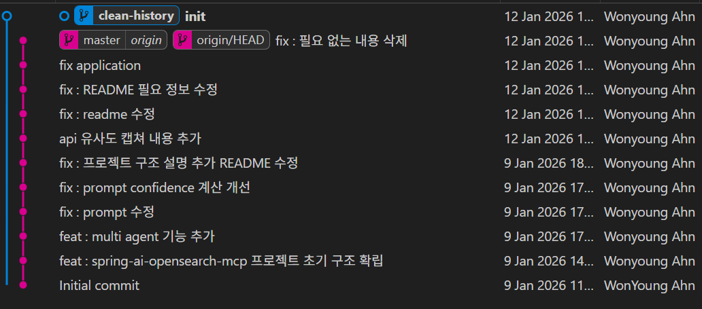
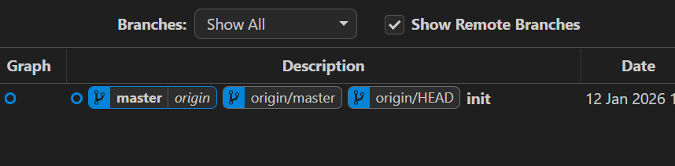

# Git History 초기화 ( orphan 브랜치 이용)

---

>

## 학습 개요 

- 회사에서 repository 를 파서 테스트 및 개발하던 도중 회사 계정의 로그인 정보를 가진 Application.properties 를 remote 로 올려버림
- 다행히 운영하는 레포지토리가 아니라 아예 새롭게 remote history 를 clean 할 수 있는 방법을 찾던 도중 알게되어 적용해봤다. 

## orphan 브랜치 란? 

- 기존 커밋 히스토리와 완전히 단절된, 최초 커밋부터 시작하는 브랜치

------

## 일반 브랜치 vs orphan 브랜치

##### 1. 일반 브랜치

```
A -- B -- C (main)
           \
            D (feature)
```

- 이전 커밋을 **부모로 가짐**
- 히스토리 연결됨

##### 2. orphan 브랜치

```
X (clean-history)
```

- **부모 커밋 없음**
- main / develop 과 **아무 연결도 없음**
- 완전 새 Git 저장소처럼 시작

------

## orphan 브랜치 만드는 명령어

```bash
git checkout --orphan clean-history
```

- 브랜치는 생기지만 **index(staging)와 working tree는 기존 파일 상태 그대로**

------

## 동작 흐름 

##### 하드 푸쉬 하기 전 (기존 브랜치 기록 남아있음)



```bash
# 1. 히스토리 없는 새 브랜치 생성
git checkout --orphan clean-history

# 2. 완전히 새로운 첫 커밋 생성
git add .
git commit -m "Initial commit"

# 3. master 브랜치로 명칭 변경 
git branch -M master 

# 4. master 브랜치로 하드 푸쉬 ( remote history 없어짐 )
git push -f origin master
```

- `git log` 찍으면 **딱 1개만 나옴**
- 이전 history 접근 불가

##### 하드 푸쉬 한 후 ( 기존 브랜치 제거됨 )



------

## 사용하는 경우 

### 1. Git history 완전 초기화

- PoC / 실험 코드 정리
- 회사 repo 공개 전 정리
- 실수로 커밋 난장판 됐을 때

### 2. 문서-only 브랜치

- `gh-pages`
- `docs` 브랜치

### 3. 기존 코드 없이 새 시작

- 구조 완전 변경
- monorepo → multi repo 분리 전

------

## 주의사항

##### merge 불가

```
git merge main
```

- 논리적으로 의미 없음 (공통 조상 X)

##### 이전 커밋 참조 불가

```
git checkout <old-commit>
```

- orphan 브랜치 기준에서는 접근 불가 (단, 다른 브랜치로 이동하면 가능)

------

## orphan 브랜치 + force push 조합

- 이 조합이 바로 **remote history 삭제의 핵심**

```
git push -f origin main
```

- remote는
  - “아… 이 브랜치의 시작 커밋이 이거구나”
  - 라고 인식해서 기존 히스토리 전부 끊김

------

## 정리

- orphan 브랜치는 **Git 히스토리를 리셋하고 새 인생을 시작하는 브랜치**다.