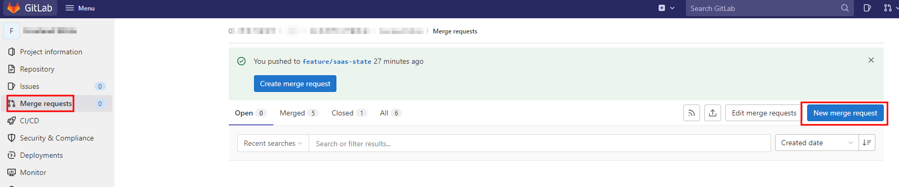
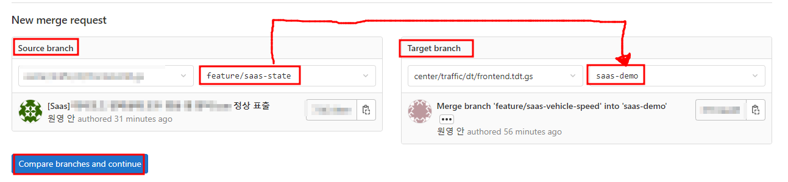
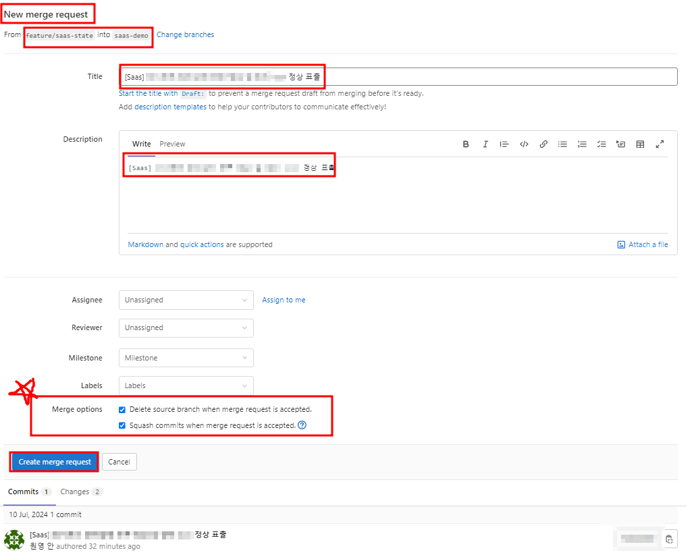
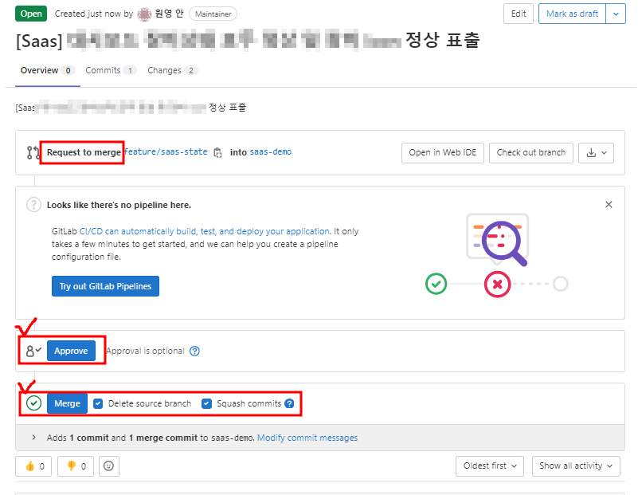
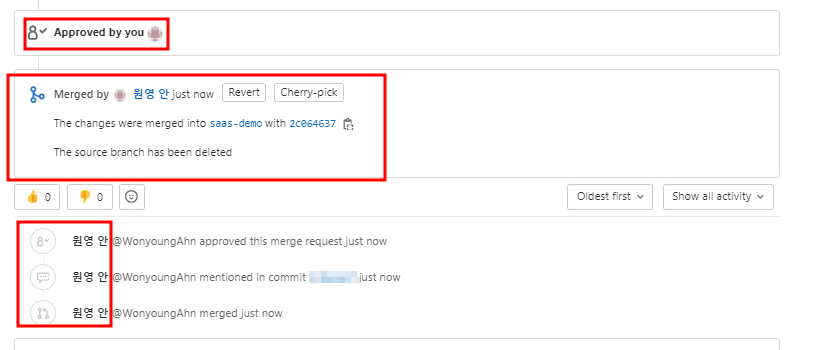

# GitLab 이용 Merge Request 과정 

---

>

## 1. Merge Request 탭으로 이동 

1. merge request를 하기위해 create 를 누른다. 

## 2. branch 선택

1. merge 할 branch를 선택한다. 
2. source branch 
   1. 기능 개발한 브랜치 
   2. 즉, base branch 에서 분리된 브랜치이다. 
3. Target branch 
   1. bash branch 로 기준이 되는 브랜치이다. 
   2. 결과적으로, 해당 branch로 기능개발한 branch 를 merge 시키게 된다. 

## 3. merge request 내용 작성

1. merge request시 기준이 되는 명칭을 작성한다. 
2. **merge option** 
   1. merge request 의 중요한 점 중 하나로, 다음 2가지 옵션을 제공한다. 
   2. **delete source branch**
   3. **squash**

### delete source branch 

1. 기능개발한 브랜치를 레포지토리에서 삭제한다. 
2. merge request를 한다는것은 하나의 기능을 완성했다는 의미이다. 
3. 따라서 기능 개발을 완료한 브랜치이기 때문에 레포지토리에서 삭제하는것이 권장된다. 
4. 권장일 뿐 브랜치를 삭제하지 않아도 된다. 
   1. 왜냐하면 추후 기능개발이 더 필요한 경우가 있을 수 있기 때문이다. 

### squash

1. 기능개발한 브랜치의 여러 commit 기록을 하나의 commit 기록으로 만들어준다. 
2. 분리 후 개발한 브랜치의 commit 기록을 깔끔히 하기 위해 사용되기 때문에 사용이 권장된다. 
3. squash 사용
   1. 해당 브랜치의 commit 기록이 최종 commit 기록 하나로 합쳐저 base branch 로 병합된다. 
   2. 예시
      1. 파일을 A~E 까지 작성하는 것이 목표인 브랜치가 있다면
      2. 첫번째 커밋에서 `A` -> 두번째 커밋에서 `AB` -> .... -> 다섯번째 커밋에서 `ABCDE` -> 개발 완료 
      3. 이때 상위 브랜치로 바로 합쳐버리면, Commit 기록이 여러 point 로 기록되어 한번에 식별하기 어렵게 된다. 
      4. 그래서 SQUASH 하게 되면, 단 한개의 커밋 기록인 `ABCDE` 의 변경사항으로 커밋 기록이 새로 생성되고
      5. `ABCDE ` 의 커밋 기록이 base branch 로 병합되어 표시된다.
4. squash 사용 X
   1. git graph 상 commit 기록이 하나의 point 로 남아 기록된다. 
   2. 즉, git graph 상에서 분리된 브랜치의 commit 기록들이 base branch 와 연결된다. 

## 4. merge request 허용 

1. approve 
   1. 누구에게 merge request 에 대해 허용할 것인지 선택 가능
   2. 즉, 상급자에게 내가 만든 기능이 재대로 만들어졌는지 마지막으로 검토하는 과정이 된다. 
   3. 이 과정에서 상급자는 기록을 보고 수정 및 보완을 할 수 있다. 
2. merge
   1. `git merge '가져올branch명'` 의 명령어와 같다. 
   2. 기준 branch 에 기능개발한 branch 내용을 병합시키는 과정이다. 

## 5. merge 완료 

1. approve와 merge 가 정상적으로 진행되면 merge request 가 완료된다. 

