# Git  merge request 과정 

---

>[squash 참고 사이트](https://velog.io/@bang9dev/Squash-merge-%EA%B0%80-%ED%95%84%EC%9A%94%ED%95%9C-%EC%9D%B4%EC%9C%A0)

## 사용이유

1. Git을 이용한 커밋 이력관리 방법에 사용된다. 
2. 협업에 있어 commit 을 관리하는것은 중요하다. 
   1. 어떤 사람이 어느 부분을 고쳤고, 어떤 내용이 추가되었는지 확인이 필요하다. 
3. 하나의 기능을 만들 떄 여러 commit 기록으로 인해 보기가 불편하다. 
   1. 따라서 이력을 관리해 하나의 기능에 어떤 부분들이 달라졌는지 쉽게 파악할 수 있도록 만드는것이 좋다. 

## 사용방법

### 1. 브랜치 생성 

1. 먼저 기능개발에 필요한 브랜치를 만들어야한다. 
2. 브랜치의 생성은 기준 브랜치에서 분리해야하며, 브랜치의 이름은 규칙에 따라 `feature/branch-name` 의 형태로 만든다. 
3. 이때 주의할점이 **로컬**에서만 브랜치가 생성되는것이 아닌 GitHub나GitLab 의 **레포지토리 자체에 브랜치**가 생성될 수 있도록 만들어야 한다. 

##### 1-1. 원격 저장소에서 브랜치 생성한 경우 

1. 원격 저장소에서 브랜치 생성

   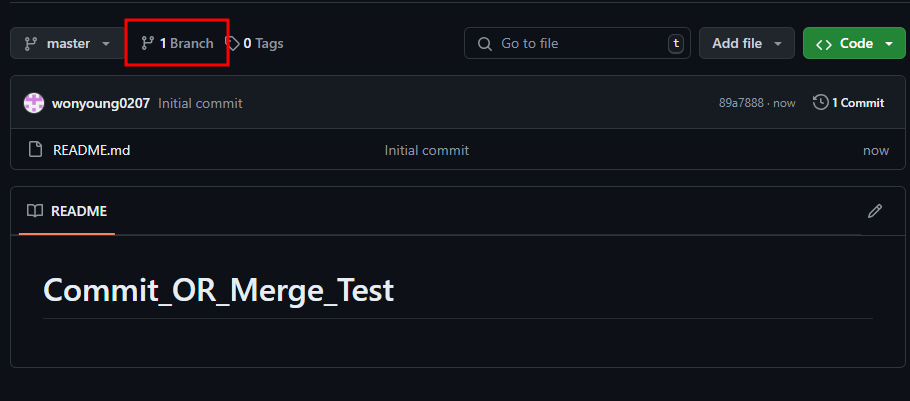

   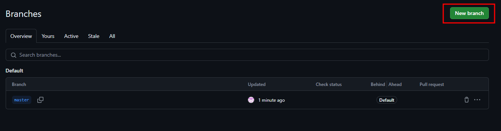

   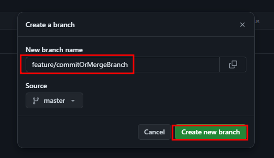

   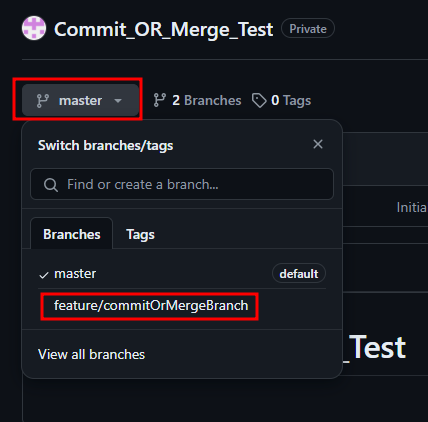

2. 원격 저장소의 브랜치를 로컬 저장소로 가져오기 

   ```bash
   git fetch origin feature/branch-test:feature/branch-test
   ```

   1. `git fetch`
      1. 원격 저장소의 변경 사항을 가져오되, 로컬 브랜치를 업데이트하지 않는 명령어이다. 
   2. `origin`
      1. 원격 저장소의 이름. 
      2. 일반적으로 `origin`은 기본 원격 저장소를 가리킨다.
   3. `feature/branch-test:feature/branch-test`
      1. 원격 브랜치와 로컬 브랜치를 지정하는 형식이다. 
      2. 여기서 왼쪽 `feature/branch-test`는 원격 저장소의 브랜치 이름이고, 
      3. 오른쪽 `feature/branch-test`는 로컬 저장소에 생성되거나 업데이트될 브랜치 이름이다.
      4. 만약 로컬에 `feature/branch-test` 브랜치가 이미 존재한다면, 이 브랜치가 원격 저장소의 최신 상태로 업데이트된다.

   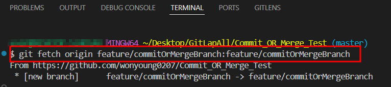

   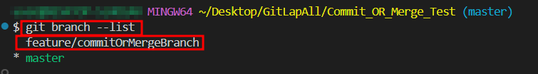

   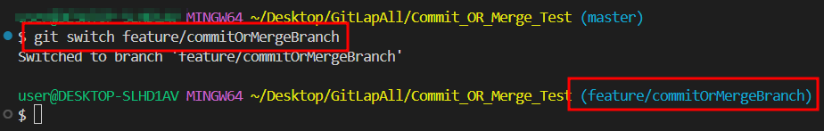

##### 1-2. 로컬에서 브랜치 생성한 경우 

1. 로컬에서 브랜치 생성
   1. `checkout` 이나 `branch` 명령어를 통해 브랜치 생성 
   2. `git checkout -b feature/branch-name`
   3. `git branch feature/branch-name`
2. 생성한 브랜치로 변경 
   1. `git switch feature/branch-name`
3. 브랜치 작업 수행
   1. add 와 commit 진행 
4. 로컬 브랜치를 원격 저장소에 푸시 
   1. `git push -u origin feature/branch-name`
   2. `feature/branch-name` 브랜치를 원격 저장소(`origin`)에 푸시하고, 로컬 브랜치를 원격 브랜치와 연결한다.
   3. 위의 명령어를 사용하면 이후 `git push` 또는 `git pull` 명령어를 사용할 때 브랜치 이름을 생략할 수 있다. 

### 2. 기준 브랜치와 동기화 

1. 분리의 기준이 된 브랜치에서 변경사항이 있을 수 있기 때문에 병합 전 동기화 해주는 과정이 필요하다. 
   1. 분리해온 브랜치의 최신을 땡겨와 기능개발이 완료된 브랜치에 적용 시킨다. 
   2. 바로 병합하지 않는 이유는 머지할때 충돌이 나는것을 방지하기 위해서이다. 
2. 이때 동기화에 사용할 수 있는 방법은 크게 2가지가 있다. 
   1. **merge** : 지정 브랜치의 내용을 현재 브랜치로 병합 
   2. **rebase** : 다른 브랜치에서 작업한 내용을 내 브랜치 위로 이동

##### 2-1. 병합 (Merge) 예제

```bash
git checkout feature/branch-test # feature/branch-test 브랜치로 이동(switch)
git merge main # feature/branch-test 브랜치로 main브랜치의 변경사항 가져오기 
```

##### 2-2. 재배치 (Rebase) 예제

```bash
git checkout feature/branch-test # feature/branch-test 브랜치로 이동(switch)
git rebase main # feature/branch-test 브랜치의 변경사항 위로 main브랜치의 변경사항 올리기 ( 가져오기 ) 
```

##### 2-3. 최종 사용 명령어 

```bash
git fetch origin # 원격 저장소의 최신 변경사항 내려받기 
git merge {branch명} # 현재 브랜치에 기준 브랜치 변경사항 병합
git pull origin {기준 branch명} # 이 명령어가 더 좋음 ( origin 브랜치와 local 브랜치를 구분해 주기 때문에 )
```

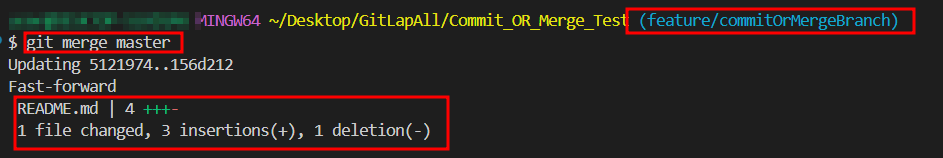

### 3. Merge Request 

1. 기능개발 및 push 

   1. 기능을 개발하고 commit & push 를 진행한다. 

   2. 이때 push는 새로 만든 브랜치로 push 한다. 

      ```bash
      git push -u origin feature/branch-name
      ```

2. 기능개발이 끝나고 변경사항을 기존 분리해온 브랜치로 병합한다. 

   1. push 가 완료됐으면 `pull requests` 를 통해 관리자에게 머지를 요청한다. 
   2. 이때 bash 브랜치는 분리해온 브랜치이고, compare 은 기능개발한 브랜치 이다. 

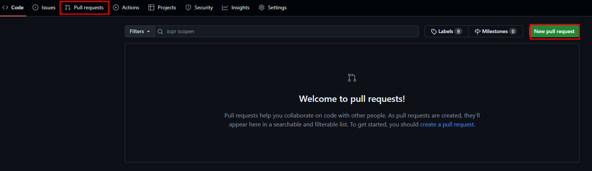

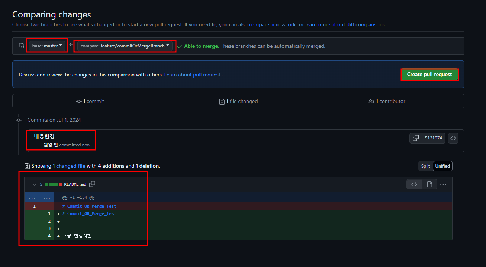

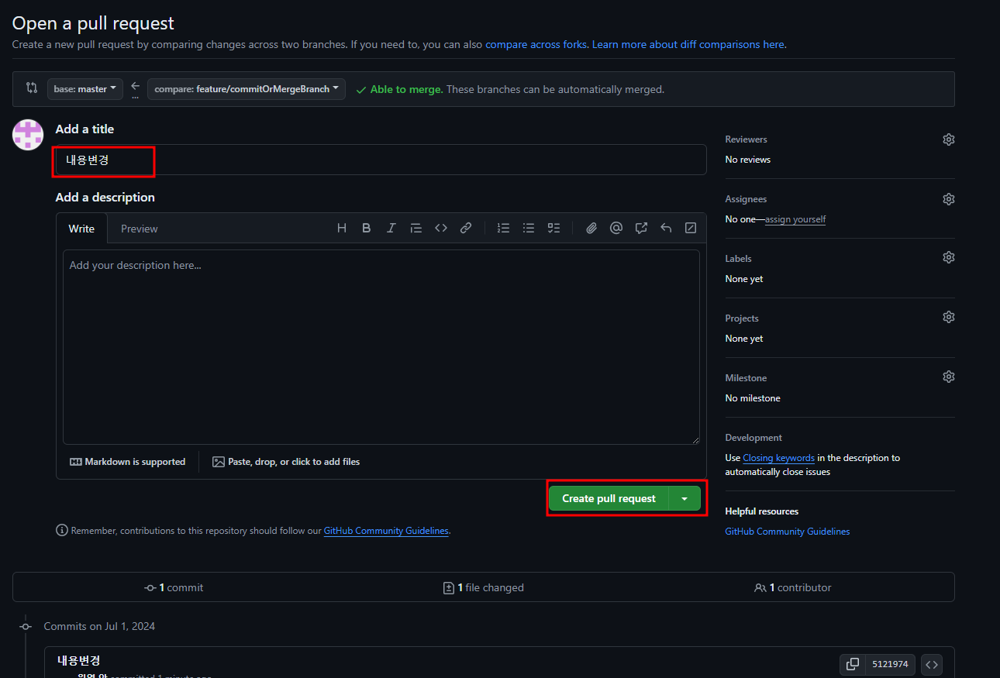

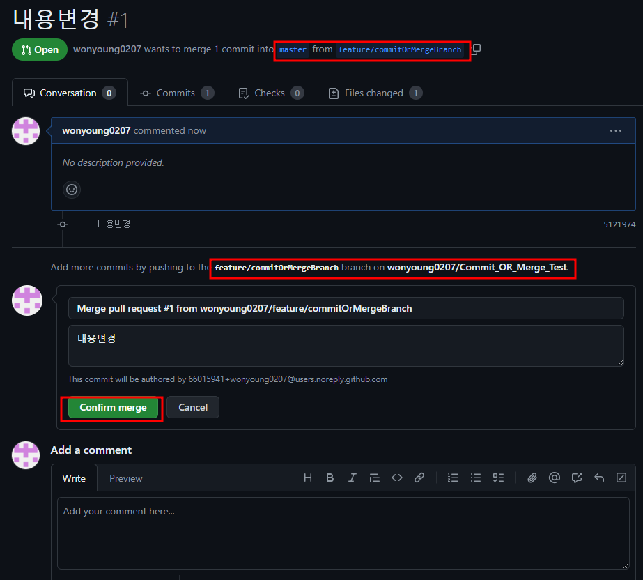

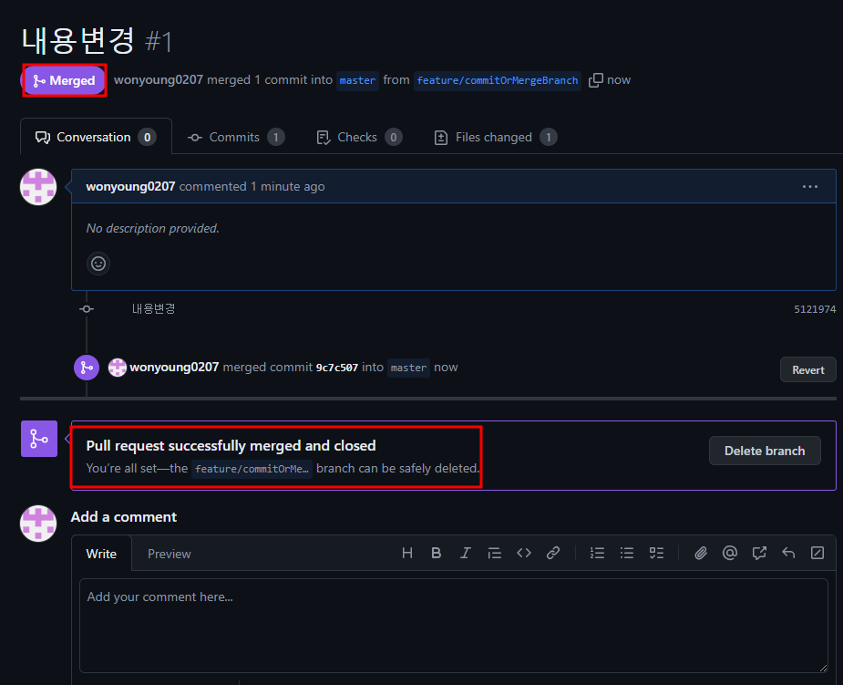

## 정리

1. 커밋기록의 이력관리를 위해 branch 를 생성하며, 생성한 브랜치를 기존 브랜치에 병합한다. 
2. 이렇게 하면 한 사람이 하나의 기능개발에 수정한 코드를 깔끔하게 볼 수 있다. 


---

## 이외 명령어

1. 브랜치 변경

   ```bash
   git switch {branch명}
   ```

2. 브랜치 리스트

   ```bash
   git branch --list
   ```

3. 브랜치 삭제 

   ```bash
   git branch -d feature/branch-test
   ```

   

---

## GitLab 이용 Merge Request

gitlab_MergeRequest1

gitlab_MergeRequest2

gitlab_MergeRequest3

gitlab_MergeRequest4

gitlab_MergeRequest5

