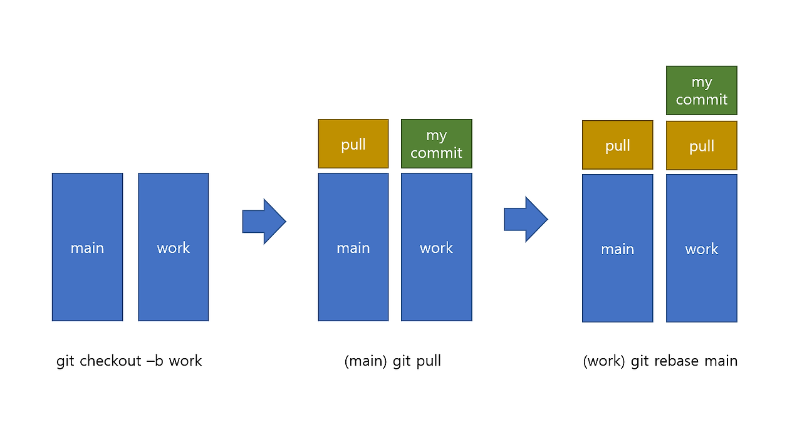

# merge 와 rebase 차이점 

---

>

## merge

1. 특정 브랜치의 변경 내용들을 현재 브랜치로 가져오기 
2. 즉, 커밋을 다 합쳐서 얹기라고 생각하면 됨 


## rebase

1. 병합하는 것으로, 다른 브랜치의 변경사항을 현재 브랜치로 가져올 때(동기화) 사용한다. 
   - merge와 rebase 둘 다 병합이다. 
   - merge와는 다르게 commit 이 여러갈래가 아닌 한줄로 정리된다. 



### 사용 기준 

1. 병합 (Merge)
   1. 변경 사항을 병합한 커밋으로 기록하고 싶을 때.
   2. 커밋 히스토리가 병합된 기록으로 남는 것을 허용할 때.
2. 재배치 (Rebase)
   1. 커밋 히스토리를 깔끔하게 유지하고 싶을 때.
   2. 다른 브랜치에서 작업한 내용을 내 브랜치 위로 이동시키고 싶을 때.

### 사용되는 곳 

1. 분리해온 브랜치의 최신을 땡겨와 기능개발이 완료된 브랜치에 적용 시킨다. 
   1. 바로 병합하지 않는 이유는 머지할때 충돌이 나는것을 방지하기 위해서이다. 
2. 동기화에 사용할 수 있는 방법
   1. merge : 지정 브랜치의 내용을 현재 브랜치로 병합 
   2. rebase : 다른 브랜치에서 작업한 내용을 내 브랜치 위로 이동

##### 2-1. 병합 (Merge) 예제

```bash
git checkout feature/branch-test # feature/branch-test 브랜치로 이동(switch)
git merge main # feature/branch-test 브랜치로 main브랜치의 변경사항 가져오기 
```

##### 2-2. 재배치 (Rebase) 예제

```bash
git checkout feature/branch-test # feature/branch-test 브랜치로 이동(switch)
git rebase main # feature/branch-test 브랜치의 변경사항 위로 main브랜치의 변경사항 올리기 ( 가져오기 ) 
```

##### 2-3. 결과

```bash
git fetch origin # 원격 저장소의 최신 변경사항 내려받기 
git merge {branch명} # 현재 브랜치에 기준 브랜치 변경사항 병합
git pull origin {기준 branch명} # 이 명령어가 더 좋음 ( origin 브랜치와 local 브랜치를 구분해 주기 때문에 )
```

