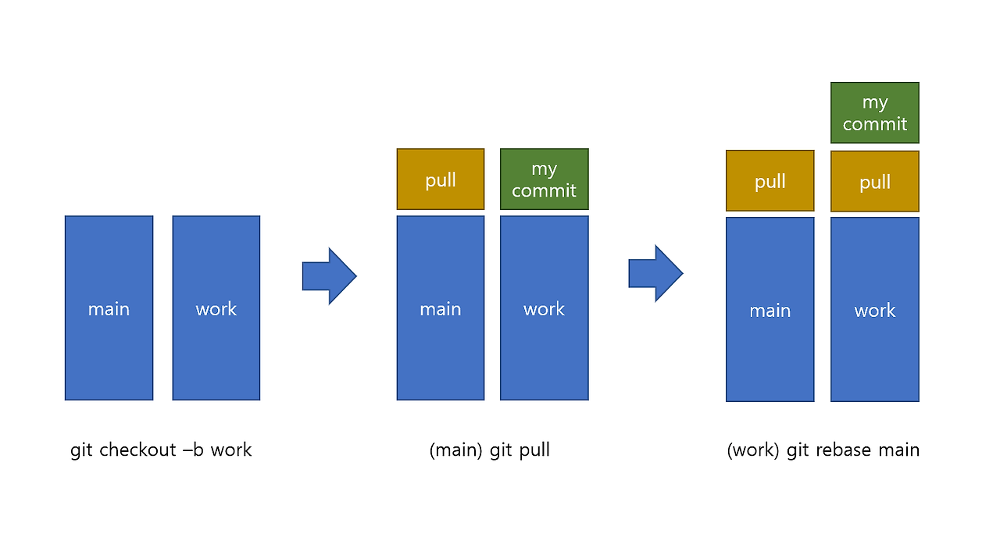
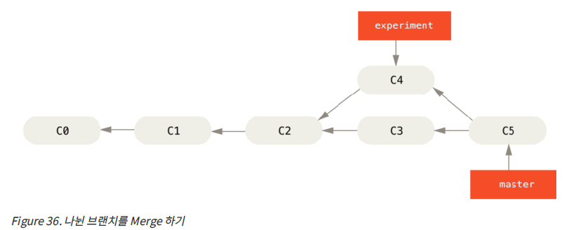
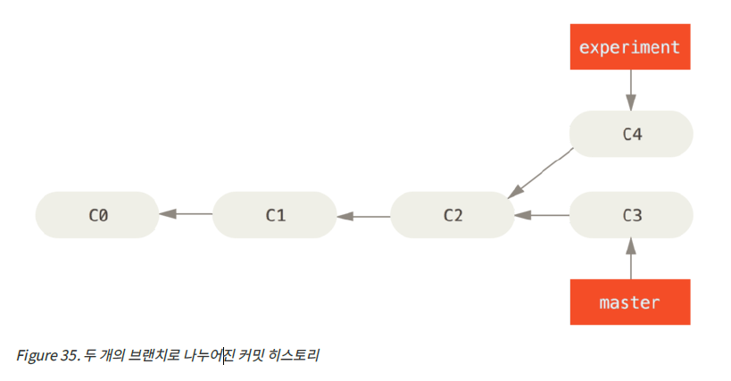
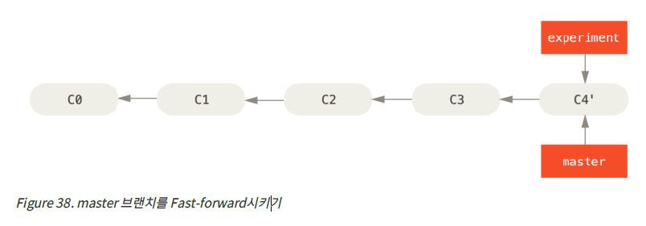

# git rebase 개념정리

---

>[참고 사이트1](https://wormwlrm.github.io/2020/09/03/Git-rebase-with-interactive-option.html)

## rebase

### 정의

- 병합하는 것으로, 다른 브랜치의 변경사항을 현재 브랜치로 가져올 때(동기화) 사용한다. 
  - merge와 rebase 둘 다 병합이다. 
  - merge와는 다르게 commit 이 여러갈래가 아닌 한줄로 정리된다. 
- **base를 재설정한다는 의미**로, 하나의 브랜치가 다른 브랜치에서 파생되서 나온 경우, 다른 브랜치에서 진행된 커밋을 다시 가져와서 base 를 재설정한다는 것이다. 
  - Rebase 는 커밋의 시간에 관계없이 마지막에 merge 되는 브랜치의 커밋을 가장 뒤에 붙이는 전략이다. 


### 동작방법

- main브랜치에서 git pull을 하면 원격서버의 변경사항이 당겨와 지는데, 내가 작업한 브랜치에서 git rebase main을 해주면 당겨온 내용이 작업 브랜치에도 적용된다.

1. checkout 한 브랜치(이동한 브랜치.현재 브랜치)가 생성한 commit들을 diff로 차례대로 만들어 patch에 저장
2. 체크아웃한 브랜치가 기준이 되는 브랜치를 가리키게 한다. 
3. 기준 브랜치로부터 생성된 Patch들(변경된 부분. commit된것들)을 적용한다. 



### 차이점

1. merge



2. rebase





---

## 커밋 순서 변경

- **리베이스할 커밋의 직전 커밋**에는 내가 수정하고 싶은 커밋의 바로 직전 커밋을 입력하면 된다. 
- 즉, 세 번째 커밋을 수정하고 싶다면 두 번째 커밋을 넣는다. 
  - 이 때 커밋 해시를 넣는 방법도 가능하고, HEAD를 기준으로 입력할 수도 있다. 

### 방법

```bash
# 형태 : git rebase -i ${수정할 커밋의 직전 커밋}

# 커밋 해시를 이용한 방법
git rebase -i 9d9cde8

# HEAD를 이용한 방법
git rebase -i HEAD~3
```

