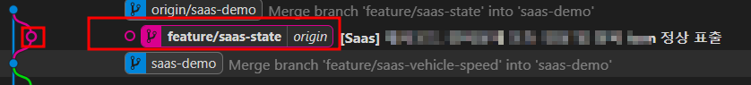
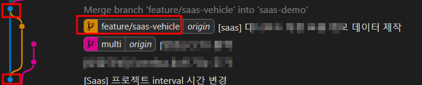

# squash 개념정리

---

>

## squash 

### 정의

1. 기능개발한 브랜치의 여러 commit 기록을 하나의 commit 기록으로 만들어준다. 
2. 분리 후 개발한 브랜치의 commit 기록을 깔끔히 하기 위해 사용되기 때문에 사용이 권장된다. 

### 사용 구분 

### 1. squash 사용

1. 해당 브랜치의 commit 기록이 최종 commit 기록 하나로 합쳐저 base branch 로 병합된다. 

2. 예시

   1. 파일을 A~E 까지 작성하는 것이 목표인 브랜치가 있다면
   2. 첫번째 커밋에서 `A` -> 두번째 커밋에서 `AB` -> .... -> 다섯번째 커밋에서 `ABCDE` -> 개발 완료 
   3. 이때 상위 브랜치로 바로 합쳐버리면, Commit 기록이 여러 point 로 기록되어 한번에 식별하기 어렵게 된다. 
   4. 그래서 SQUASH 하게 되면, 단 한개의 커밋 기록인 `ABCDE` 의 변경사항으로 커밋 기록이 새로 생성되고
   5. `ABCDE ` 의 커밋 기록이 base branch 로 병합되어 표시된다.

3. git graph

   1. branch 삭제 x , squash 적용 o

      1. 분리된 `feature/saas-state` 브랜치가 삭제되지 않아 `saas-demo` 와 분리되어있는 것을 확인할 수 있음 
      2. squash로 인해 여러 commit 이 새로 생성된 하나의 commit 으로 생성된 것을 확인할 수 있음 
         1. 즉, 분홍색 point 가 모든 commit 기록이고, 초록색 point가 모든 commit 기록이 합처져 새로 생성된 commit 기록이다. 
         2. 따라서 분홍색 point 의 전체 변경 내용이 초록색 commit 으로 되어 병합된다. 

      

   1. branch 삭제 o , squash 적용 o

      1. 분리된 `feature/saas-state` 브랜치가 `saas-demo` 브랜치로 연결되는것을 확인할 수 있음 
      2. squash로 인해 여러 commit 이 하나의 commit 으로 생성된 것을 확인할 수 있음 
         1. commit 기록이 하나이기 때문에 새로운 commit 만들지 않고 바로 합쳐짐 

      

### 2. squash 사용 X

1. git graph 상 commit 기록이 각각 하나의 point 로 남아 기록된다. 
2. branch 삭제 o , squash 적용 x
   1. 즉, git graph 상에서 분리된 브랜치의 commit 기록들이 base branch 와 연결된다. 
   2. 여러 commit 이 있었다면 분홍point 처럼 갈색 point가 여러개 표시됐을 것이다. 
   3. 따라서 가장 마지막 commit 기록이 base branch인 `saas-demo` 와 연결됐을 것이다. 

