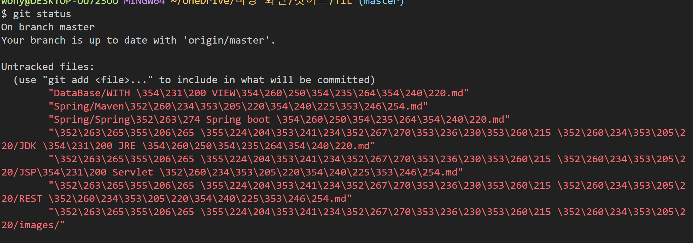
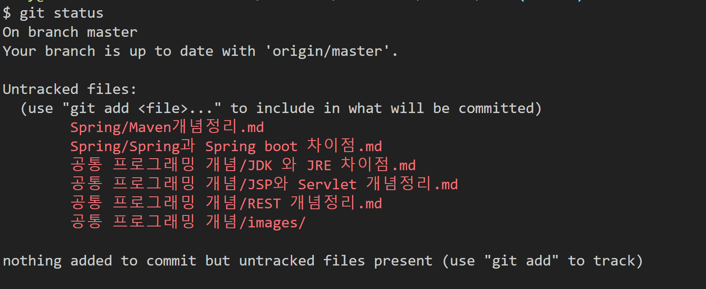

# git status 시 한글 파일명 깨짐 현상

---

## 문제 현상 

- git status 시 한글 파일명이 깨지는 현상이 발생한다.

---

## 해결방법

`git config --global core.quotepath false`

- 해당 명령어를 git bash에 입력한다. 
-  `core.quotepath`를 끄면 `commit`, `status` 등에서 한글 출력이 정상으로 돌아온다. 
- 이 설정은 일반적이지 않은 문자를 탈출문자로 처리하는 기능을 수행한다. 그래서 한글 앞에 탈출 문자를 붙인 탓에 이런 문제가 발생했다.

