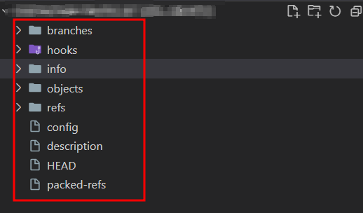

# git 레포지토리 mirror 방법

---

>

## 사용 목적

1. 기존 레포지토리를 새 레포지토리로 완전 복제를 하고싶었다. (커밋기록, 파일 모두 다 )
2. 그래서 찾아보면 중 `git clone --mirror` 명령어를 알게 되었다. 

## mirror 옵션이란? 

1. **mirror clone은 “.git만 복사하는 bare repo”** 실제 코드, 작업 파일이 안 보이고 새 서버로 이동/백업/복사 용도로 사용한다. 
   1. 따라서 코드 보려면 일반 clone 을 해야함. 
2. 즉, `--mirror` 하면 **로컬 디렉토리 구조**가 일반적으로 `git clone`할 때와 완전히 다르게 잡힌다. (“작업 트리 없는 Git 서버 구조”)

## mirror 시 프로젝트 구조

|                | 일반 clone          | mirror/bare clone            |
| -------------- | ------------------- | ---------------------------- |
| 작업 디렉토리  | O (코드 파일 있음)  | X (코드 파일 없음)           |
| .git 폴더      | 디렉토리 내 `.git/` | 루트에 Git 구조              |
| 용도           | 개발, 커밋, 작업    | 백업, 이관, 서버용, 완전복제 |
| push 가능 여부 | O                   | O                            |

```bash
oldrepo.git/
├── HEAD
├── branches/
├── config
├── description
├── hooks/
├── info/
├── objects/
├── packed-refs
├── refs/
├── logs/
└── ... (기타 git 메타데이터 파일)
```



## mirror 시 주의할점!!! 

1. **원격(타겟) 저장소가 완전히 동일해져**  옮길 새 레포에 내용이모두 다 삭제후 동기화된다. 
2. 실수로 잘못된 repo에 쓰면 **데이터가 삭제될 수 있으니 꼭 주의**가 필요하다. 

## mirror 방법

1. `git clone --mirror`

   1. 원본 A를 읽어서, 새로운 디렉토리에 모든 이력, 브랜치, 태그 등을 로컬 저장소로 “복제”함
   2. 이때 로컬로 받아진 레포지토리 구조는 ` bare repo` 로, 원격 레포지토리와는 완전 다름 
   3. 파일을 clone 하는게 아닌 **오직 git 데이터와 히스토리만 저장**

   ```bash
   git clone --mirror <기존_repo_URL>
   cd <repo>.git
   ```

2. `git push --mirror`

   1. 로컬의 remote 주소를 `새 레포지토리 url` 로 변경 
   2. 복제한 저장소에서 새 원격(B)으로 모든 내용을 push
   3. B에만 변경사항/로그가 남고, A는 영향 없음

   ```bash
   git remote set-url origin <새_repo_URL>
   git push --mirror
   ```

## mirror 시 파일 용량 에러

- 만약 clone 하는 레포지토리에 대용량 파일이 있으면 `push --mirror` 에 실패한다. 

1. `BFG install `**(`git clone --mirror <원본 저장소>` 에서 BGF를 해야함!!)**

```bash
#  BFG install
wget https://repo1.maven.org/maven2/com/madgag/bfg/1.14.0/bfg-1.14.0.jar

# (예시: .czml 파일을 모두 LFS로)
java -jar ../bfg-1.14.0.jar --convert-to-git-lfs '*.czml' --no-blob-protection
# 여러 확장자면 '*.zip' '*.mp4' '*.csv' 등 추가
```

3. LFS 정리 

```bash
# 2-2. LFS 초기화 및 정리
git lfs install
git reflog expire --expire=now --all
git gc --prune=now --aggressive
```

4. 새 래포로 `mirror push `

```bash
# push 
git push --mirror
```

## git-lfs 안되는 경우 (우분투)

- **우분투 환경**인 경우 그냥 apt-get 으로 하면 GITHUB 공식저장소의 설치파일이 아닌 다른걸 설치하는것같다. 
- 따라서 `apt-get` 의 저장소 목록 중 GitHub 공식 패키지 저장소를 업데이트 해줘야한다. 

1. `git lfs install ` 

```bash
# apt 저장소 리스트 업데이트 
curl -s https://packagecloud.io/install/repositories/github/git-lfs/script.deb.sh | sudo bash

# 업데이트한 경로에서 라이브러리 install 
sudo apt-get install git-lfs
```

## "GitHub 공식 패키지 저장소 등록"이란?

- Ubuntu에서 소프트웨어를 설치할 때 **apt**가 프로그램을 다운로드하는 "저장소(Repository)" 목록을 보고 설치한다. 
  - Ubuntu 기본 저장소에는 `git-lfs`의 최신 버전이 없거나, 실행 파일이 포함되어 있지 않은 경우가 많다. 
  - 그래서 GitHub에서 공식으로 운영하는 패키지 저장소(서버)를 내 컴퓨터의 apt 저장소 목록에 "등록"해야 **최신/정상적인 `git-lfs`를 apt로 설치**할 수 있다.
- `/etc/apt/sources.list.d/` 폴더 아래에 새로운 `.list` 파일이 생기고,그 파일에 **GitHub LFS 저장소 주소**가 기록된다. 