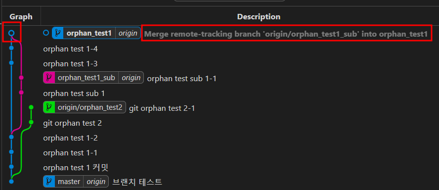

# git 브랜치의 커밋 위치 이동(병합 브랜치 살리기)

---

>[테스트 진행한 레포지토리](https://github.com/wonyoung0207/git_test_repository)

## 발생이유

1. 개발을 하던 중, `a 브랜치`에서 `b 브랜치`를 분리해 사용중이였다. 
2. 두 브랜치는 각기 다른 기능을 하도록 개발을 진행하여 브랜치가 하나의 프로젝트를 의미하게 되었다. 
3. 이때 나의 실수로 `a 브랜치`  와 `b 브랜치` 가 병합되는 일이 발생했다. 
   1. vsCode 사용중이였는데, 브랜치를 `b브랜치 -> a 브랜치`변경했는데, 변경 기록이 `b 브랜치` 에서 `a 브랜치` 로 넘어오기전에 pull 을 받아버렸나보다. 
   2. 이로인해 conflict 가 발생했고, 아무생각없이 merge request 를 한 다음 remote 저장소로 push 해버렸다. 
   3. 따라서 `b 브랜치` 가 아예 `a 브랜치` 가 되어 `b 브랜치` 는 사라지는 `고아 브랜치` 가 되어버린 것이다. 
4. 나는 `b 브랜치` 를 살리기 위해 해당 내용을 토대로 작업환경을 만들어 테스트 후 해결했다. 

## 진행 순서

#### 1. merge 전 상황

1. `orphan_test1` 로부터 나온 `orphan_test1_sub` 브랜치 존재
2. 두 브랜치는 각각 다른 기능 개발이 이루어진 커밋을 가짐 ( 즉, 다른 버전이 되어버림 )


#### 2. 두 브랜치 merge 

1. `orphan_test1` 으로 `orphan_test1_sub` 브랜치가 병합되는 상황을 고의로 발생시킴
2. 이렇게 되면 두 브랜치가 같아지게 된다 ( 즉, 두 브랜치가 한점으로 진행됨 )
   1. 이런 브랜치를 `고아 브랜치(orphan branch)` 라고 한다. 




#### 3. merge 되기 전 commit 으로 브랜치 되돌리기 

1. 사용 명령어

   ```bash
   # 명령어
   git branch --force [기준 브랜치] [커밋 해쉬 코드]
   
   # 실사용
   git branch --force orphan_test1 adsfbdsfjslsdflsjd
   ```

   

   

   

   

   

   

2. 주의할점 1

   1. merge 된 브랜치와 into 된 브랜치의 기준을 확실히 해야한다. 
   2. 즉, Git 기록을 merge 이전으로 되돌리기 위해서는 기준 브랜치(merge 된 브랜치)의 merge 이전 커밋 코드를 이용해야 한다. 

3. 주의할점 2

   1. 가장 마지막(상단)에 있던 remote 올라가있는 브랜치를 지워야 한다. 
   2. 여기서는 remote 브랜치와 local 브랜치의 개념을 알아야 한다. 
   3. `branch --force` 를 이용해 해당 브랜치의 commit 기록을 이전 commit 으로 돌려도 remote 에 올라간 기록으로 인해 git 그래프에는 남아있는 상태가 된다. 
   4. 이때 완전히 해당 브랜치를 돌리기 위해서는 remote 브랜치를 지워줘야한다. 

4. 주의할점 3 

   1. remote 브랜치(origin 브랜치) 를 삭제하기 전에 해당 브랜치로 변경하면, 이전 merge한 기록들을 pull 하라고 한다. 

   2. 이때 pull 받으면 `branh --force` 로 커밋으로 현재 브랜치 이동한 이유가 없어지니 remote의 기록을 **삭제** 해줘야한다 .

      

## 진행시 궁금했던 부분 정리 

#### 1. merge 후 기준 브랜치 아닌 병합된 브랜치 이동한 경우 

1. 기준 브랜치인 `a 브랜치(orphan_test1)`  가 아닌 `b 브랜치(orphan_test1_sub)` 의 커밋 기록으로 `b 브랜치` 를 되돌린 경우 

2. merge 된 분기는 합쳐져 있지만, `b 브랜치` 의 기록은 그 이전으로 돌아가 있기 때문에 `b 브랜치` 는 머지의 영향을 받지 않는다. 

3. 즉, 이동 후 커밋하면 밑의 캡쳐처럼 합쳐졌던 git 그래프에서 분기처럼 다시 `b 브랜치` 분기로 쭉 진행되는것을 볼 수 있다. 

   

### 2. 브랜치 이동 

1. 현재 브렌치와 `git branch --force 브랜치` 명령어에서 사용한 브랜치가 같은 경우 명령어가 싫행되지 않는다. 

2. 즉, 다른 브랜치로 switch 하고 `git branch --force 브랜치`  명령어를 사용해야 한다. 

   

### 3. 삭제된 커밋 내용 

1. 커밋 기록을 삭제했을 때 해당 커밋 기록이 정말로 remote 저장소에서 삭제되었는지에 대한 내용

2. **결론먼저 말하자면, 놀랍게도 남아있다고 한다. ( 커밋 해쉬 코드로.... )**

   1. **하지만 삭제하면 깃 히스토리상 지워지기 때문에 삭제 전 해쉬 코드를 먼저 복사해놔야 한다.** 

3. 깃 히스토리 상에서는 보이지 않지만, 해당 레포지토리에서 url 에 `커밋 해쉬 코드` 로 삭제된 커밋 내용을 볼 수 있음 

   ```bash
   # url 이용 커밋 로그 확인 방법 
   https://github.com/[유저이름]/[레포지토리 이름]/commit/[커밋 해쉬 코드]
   
   # 커밋 로그 확인 방법
   https://github.com/wonyoung0207/git_test_repository/commit/d10e264aa9f728719
   ```

   