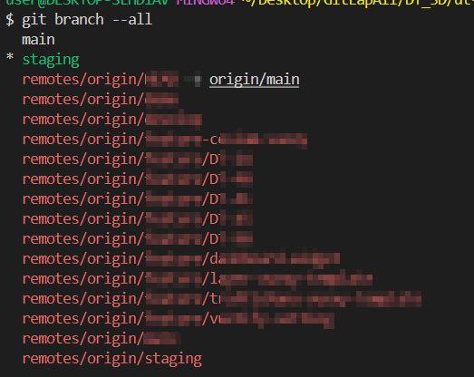

# git 원격저장소 브랜치 삭제 후 로컬 잔여 현상 해결

---

>

## 문제 발생 1

##### 원인

1. 원격 브랜치 정보 업데이트 안되는 문제 
1. `git fetch`만 실행하면 원격 저장소의 최신 상태를 로컬 저장소로 가져오지만, 원격에서 삭제된 브랜치는 로컬에서 자동으로 정리되지 않는다.

##### 문제점

1. MR 로 인해 `원격 브랜치`에서 브랜치가 삭제되었다. 
2. 로컬에서 `git fetch` 를 이용해 **원격 저장소와 동기화**를 진행했는데도, `git branch --all` 명령어를 사용하면 **원격의 삭제된 브랜치 정보가 출력**되었다. 
3. 즉, 실제로 원격 저장소에서는 브랜치가 삭제되었지만, 로컬에서는 `fetch` 를 해도 원격에서 **삭제된 브랜치 정보가 남아있는것**이다. 
   1. 밑의 이미지는 원격 브랜치에서 삭제된 브랜치가 로컬에는 남아있는 모습이다. 



##### 해결책

1. `--prune` 옵션 사용 

   1. 원격 저장소에 없는 브랜치를 로컬에서 삭제할때 사용한다. (**필요 없는 원격 추적 브랜치를 정리(가지치기)한다**는 의미)

      1. 가지치기 : pruning

   2. 즉, 원격 저장소에 없는 브랜치 정보를 정리하려면, **원격 추적 브랜치를 삭제**해야 하는데, 이때 `--prune` 옵션을 사용한다. 

      ```bash
      git fetch --prune
      
      # git config를 사용해 기본 동작으로 prune 설정
      git config fetch.prune true
      ```


