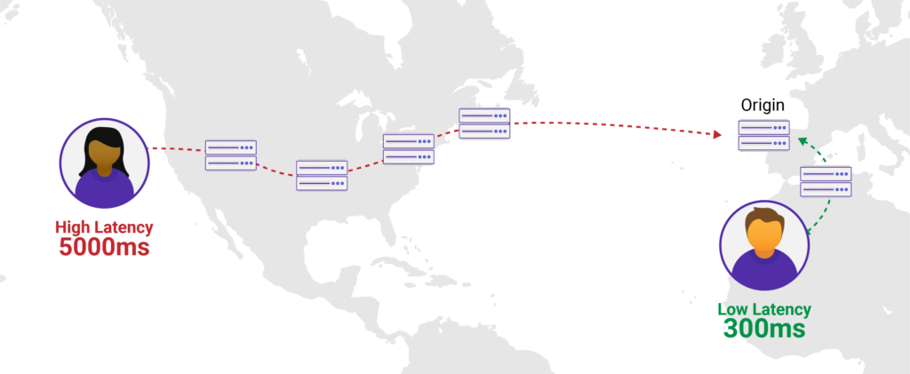
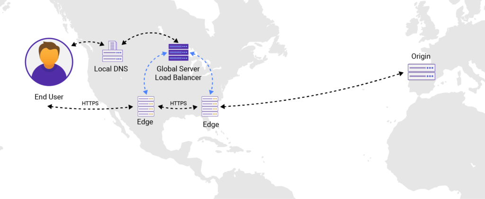

# CDN 개념정리

---

> 

## CDN ( Content Delivery Network )

### 정의

- 콘텐츠 전송 네트워크
  - 데이터 사용량이 많은 애플리케이션의 웹 페이지 로드 속도를 높이는 상호 연결된 서버 네트워크
- 지연을 최소화하면서 사용자에게 콘텐츠를 배포하는 데 도움이 되는 서버 및 해당 데이터 센터를 지리적으로 **분산**시켜 저장한 네트워크이다. 
  - 따라서 멀리 있는 원본 서버를 가까운 CDN 서버를 사용해 더 빠르게 페이지 로딩을 할 수 있다. 
- 인터넷에서 최종 사용자에게 대량의 데이터를 신속하게 전달하는 문제를 해결하기 위해 만들어졌다. 

### 사용이유

- **클라이언트와 웹 사이트 서버 간에 중간 서버를 두어 효율성을 높인다.**

  - 만약 사용자와 웹사이트 서버간의 물리적 거리가 멀다면 그만큼 네트워크에서의 전송에 있어 많은 지연이 발생할 수 있다. 

- 대용량의 파일( 이미지, 동영상 등 ) 을 지리적으로 가까운 CDN 서버에 저장해 사용자 컴퓨터에 더 빠르게 도달하도록 만들기 위해 사용한다. 

- CDN 사용 안했을 경우( 여러 네트워크 거쳐 웹 서버에 접속한다. )

  

- CDN 사용했을 경우 ( 직접 웹 서버에 접속하는것이 아닌 CDN 서버에서 정보를 불러온다. )

  - 맨 처음에 GSLB가 웹 서버로부터 정보를 가져오고 사용자와 가장 가까운 CDN즉 Edge 서버에 저장해놓는다. 
  - 이렇게되면 후속 사용자들은 해당 CDN 을 이용해서 데이터를 더 빠르게 받아올 수 있게된다. 

  

### GSLB 란?

- Global Server Load Balancer 라고 함 
- GSLB는 문자 그대로 **전체 인터넷을 측정하는 로드 밸런싱 기능을 지원**한다.
  - 따라서 사용 가능한 모든 리소스 및 해당 성능에 대한 정보를 추적한다. 

### 장점

1. 웹 사이트 페이지 로드 시간 개선 
   - 가까운 CDN 서버를 사용해 웹 사이트 방문자에게 더 가까운 웹 콘텐츠 배포를 가능하게 한다. 
2. 대역폭 비용 절감 
   - 원본 서버가 요청에 응답할때마다 대역폭을 사용하게 되는데, 이 대역폭은 많은 비용이 들어갈 수 있다. 
   - CDN은 원본서버가 제공하는 데이터의 양을 줄여 비용절감을 할 수 있게 된다. 
3. 컨텐츠 가용성 및 중복성 증가 
4. 웹사이트 보안 개선 
   - DDos 공격을 완화하는데 좋다. 
   - DDos 공격은 악의적인 행위자가 엄청난 양의 요청을 전송해 원본서버를 마비시키는 공격이다. 