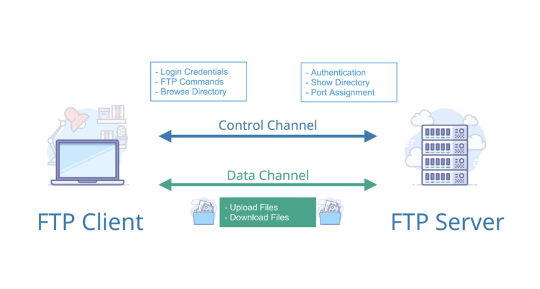

# FTP 개념정리 

---

>[참고 사이트1](https://m.blog.naver.com/hdj20/40155944026)
>
>[참고 사이트2](https://www.websiterating.com/ko/web-hosting/glossary/what-is-ftp/)
>
>[참고 사이트3](https://www.easymedia.net/Culture/EasyStory/index.asp?no=172&mode=view&IDX=1170&p=1)

## FTP 

### 정의

- 파일 전송 프로토콜 (File Transfer Protocol)의 약자
- 인터넷을 둘러볼때 사용하는 HTTP와는 다르게  **파일의 이동만을 위한 프로토콜**이다. 
  - HTTP보다 빠르게 파일을 주고받을 수 있는 데이터 전송 프로토콜
  - 2개의 포트 (20번, 21번) 를 기본으로 사용한다. 
- 따라서 **인터넷을 통해** 파일을 전송하는 **대용량 파일**을 목적으로 한 **프로토콜**이다. 

### 동작방식 

- FTP 서버와 여기에 접속하는 Client 가 중점이 된다. 
- 이 두 개체의 사이에 2개의 연결통로가 생성된다. 
  1. 21번 포트 : 데이터 전송시 제어를 위한 통로 
  2. 20번 포트 : 데이터 전송만을 위한 통로 

1. Client가 FTP Server로 로그인을 요청한다. 
2. 로그인이 되면 통로역할을 하는 2개의 포트가 생성된다. 
3. Client는 put, get 같은 다양한 명령을 통해 FTP서버와 컴퓨터간 파일을 이동할 수 있게 된다. 
4. FTP는 지속적인 응답 메시지 전송을 통해 **연결상태를 유지**한다. 

### 장점

1.  인터넷 연결만 되어있다면 어디서든 **대량의 파일**을 주고받을 수 있다.

### 단점

1. 보안에 취약하다. 
   - 데이터가 암호화되지 않기 때문에 발신자와 수신자 사이에 컴퓨터가 있다면 암호가 네트워크 패킷을 통과하는 동안 암호를 캐치할 수 있다.  
2. 로그인 인증이 없다 .
   - 누구나 아이디와 비밀번호를 통해 로그인이 가능하다. 

### 결론

- FTP는 대량의 파일을 주고받을 때 유용하지만 보안에 취약하다는 단점을 가지고 있다. 
  - 이것을 보완하기 위해 SSH 라는 프로토콜이 존재한다. 

---

## SFTP

- **sftp**는 ssh의 파일 전송 버전
- 일반적인 FTP와 달리 PC와 서버간의 데이터 전송을 암호화하기 때문에 해킹이나 보안상의 문제점을 방지, 안전한 호스팅 서비스를 이용할 수 있다.

### 종류 

1. **텔넷(telecommunication network)** 
   -  인터넷을 통하여 원격지의 호스트 컴퓨터에 접속할 때 지원되는 인터넷 표준 프로토콜
2.  **SSH(Secure Shell)** 
   -  원격 컴퓨터에 안전하게 액세스하기 위한 유닉스 기반의 명령 인터페이스 및 프로토콜
   -  강력한 암호화 기능을 구현해 모든 데이터가 암호화 되기에 높은 보안을 지원

