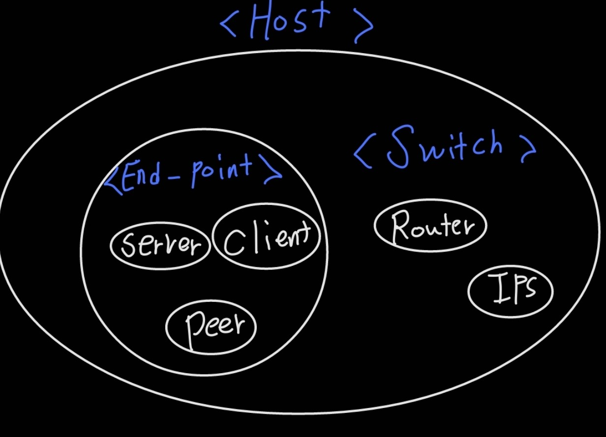

# [Host ]

#### 개념

1. Computer + Network 
2. 컴퓨터에 인터넷이 연결되어있으면 Host라고 한다. 

#### 구성

1. Switch
   1. 네트워크 그 자체를 이루는 host
   2. IP 가진 모든 컴퓨터 
   3. End-Point가 Switch 의 한 부분이다.
   4. Router, Tab, IPS
2. End-Point
   1. 단말기 ( End-Point + Computer )
   2. 네트워크 이용 주체 
   3. 즉, 인터넷을 통해 이용되는 주체 ( Server, Client, Peer 등등.. )