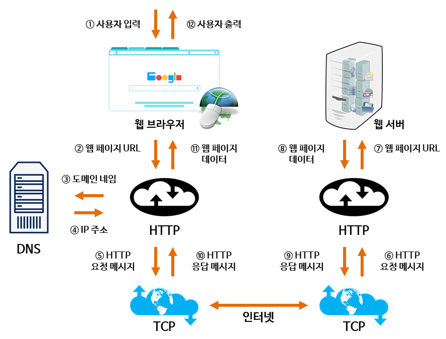

# HTTP 프로토콜 

---

>[참고사이트 1](https://dev-coco.tistory.com/161)

## 웹 동작 방식 

1. 사용자가 브라우저에 URL([www.naver.com](http://www.naver.com/))을 입력
2. DNS 서버에 도메인 네임으로 서버의 진짜 주소를 찾음
3. IP 주소로 웹 서버에 TCP 3 handshake로 연결 수립
   - TCP와 UDP
     - **TCP는 연결 지향 방식**으로, 송신자와 수신자가 1:1로 연결 상태를 유지하면서 통신하는 것을 의미한다.
     - **UDP는 비연결 지향 방식**으로, 데이터 송신자는 수신자의 수신 여부와 상관없이 일방적으로 데이터를 뿌리고 끝내는 것을 의미한다. 
   - 3 - handshake 
     - 발신지와 수신지 사이에 논리적인 접속(세션)을 성립하는 과정을 의미
4. 클라이언트는 웹 서버로 HTTP 요청 메시지를 보냄
5. 웹 서버는 HTTP 응답 메시지를 보냄
6. 도착한 HTTP 응답 메세지는 웹 페이지 데이터로 변환되고, 웹 브라우저에 의해 출력

## HTTP  (Hyper Text Transfer Protocol)

### 정의

- **데이터를 주고 받기 위한 프로토콜**이며, **서버/클라이언트 모델**을 따른다.
- HTTP는 **상태 정보를 저장하지 않는 Stateless**의 특징과 클라이언트의 요청에 맞는 **응답을 보낸 후 연결을 끊는 Connectionless**의 특징을 가지고 있습니다.

### 장점

- 통신간의 연결 상태 처리나 상태 정보를 관리할 필요가 없어 서버 디자인이 간단하다.
  - 각각의 HTTP 요청에 독립적으로 응답만 보내주면 OK ( 요청에 대한 응답만 해주면 됨 )

### 단점

- 이전 통신의 정보를 모르기 때문에 매번 인증을 해줘야 한다.
  - 이를 해결하기 위해 쿠키(cookie)나 세션(session)을 사용해서 데이터를 처리한다.

### HTTP와 HTTPS의 차이점

- HTTP 문제점
  - HTTP는 평문 데이터를 전송하는 프로토콜이기 때문에, HTTP로 중요한 정보를 주고 받으면 제 3자에 의해 조회될 수 있다.
- 문제점 해결 방법
  - HTTPS 를 사용한다. 
  - **HTTP에 암호화가 추가**된 프로토콜이 **HTTPS**이다. HTTPS는 SSL의 껍질을 덮어쓴 HTTP라고 할 수 있다.
    - **SSL(Secure Socket Layer) 인터넷을 통해 전달**되는 **정보를 보호하기 위해 개발한 통신 규약**
- 따라서 
  - HTTP는 **원래 TCP와 직접 통신**했지만, HTTPS에서 HTTP는 **SSL과 통신하고 SSL이 TCP와 통신**함으로써 암호화와 증명서, 안전성 보호를 이용할 수 있게 된다.

### 쿠키와 세션

1. 쿠키
   - **쿠키는** 사용자의 컴퓨터에 저장하는 **작은 기록 정보 파일**입니다. HTTP에서 클라이언트의 상태 정보를 PC에 저장했다가 필요시 정보를 참조하거나 재사용할 수 있다.
   - 따라서 로컬에 사용자의 정보를 저장하는 것이 "쿠키" 이다. 
   - 특징 
     1. 브라우저가 종료되도, 만료시점이 지나지 않으면 삭제되지 않음
     2. 저장형식이 Text이다. 
     3. 세션보다 빠르지만 보안에 취약하다. 
2. 세션
   - **세션은** 일정 시간동안 같은 사용자로부터 들어오는 **일련의 요구**를 **하나의 상태**로 보고, **그 상태를 유지**시키는 기술
   - 즉, 방문자가 **웹 서버에 접속해 있는 상태**를 하나의 단위로 보고 그것을 세션이라고 한다.
   - 특징
     - 브라우저 종료시 세션은 지워진다. 
     - 저장형식이 Object이다. 
     - 세션보다 느리지만 보안에 좋다. 