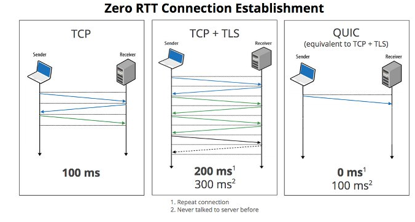

# HTTP3 개념정리

---

>[참고 사이트1](https://peering.google.com/#/learn-more/quic)

## HTTP3 란?

1. http3는 http2가 2015년도에 등장하고 약 6년 뒤인 2021년에 발표된 **http프로토콜의 업그레이드 버전**이다. 
   1. 무엇이 다르냐고 한다면 바로 **새로운 전송 프로토콜을 쓴다**는 점이 있다.

## 사용 프로토콜

1. **QUIC(Quick UDP Internet Connections)** 프로토콜 이용 
2. UDP통신을 이용하여 RTT(Rount-Trip Time)을 TCP에 비해 낮게 가져가면서 Connection UUID라는 패킷 식별자를 통해 conection을 유지할 수 있다.
3. 그리고 TLS 적용과 전방 오류정정(Forward Error Correction)방식의 적용을 통해 이를 보완하고 있다.
4. FEC는 BEC와는 다르게 패킷이 전송 중 변조 혹은 훼손 시, 재전송이 아닌 정정 비트를 통해 훼손된 비트를 복구하도록 설계됐다.
   1. 즉, 이러한 방식을 통해 안정성을 높이되, UDP를 통해 오버헤드를 감소한 것이 QUIC라고 할 수 있다.