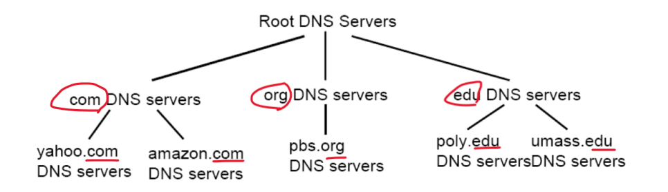
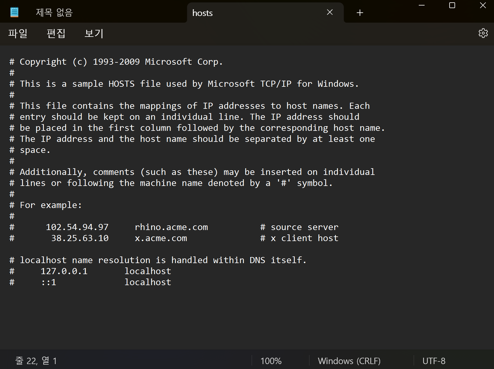
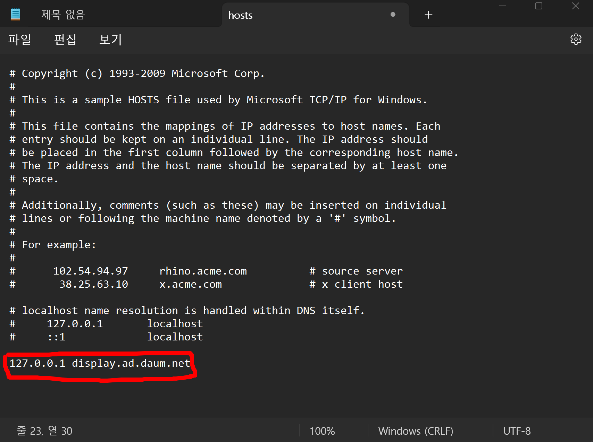

# Hosts 파일 개념정리 

---

>[참고 사이트1](https://goddaehee.tistory.com/90)

## Hosts 파일

### 정의

-  **호스트 이름에 대응하는 IP 주소가 저장되어 있어서 도메인 이름 시스템(DNS)에서 주소 정보를 제공받지 않고도 서버의 위치를 찾게 해주는 파일.**
   -  따라서 해당 파일에 입력한 도메인 주소로 접속했을 경우, DNS 서버에서 IP 주소를 찾는것이 아닌 해당 파일에 적힌 IP 주소로 바로 이동할 수 있게 도와주는 파일이다. 
   -  이렇게하면 해당 주소에 빠르게 접속할 수 있기 때문에 주로 광고를표시할 때 사용된다.  


### 역할 

- 네이버를 예를 들어보자. 일반적으로 IP주소보단 http://www.naver.com이라는 도메인 주소를 외우기 쉽다.

  - 그렇기 때문에 우리는 http://www.naver.com라는 도메인 이름을 주소창에 입력하여 접속한다.
  - 도메인 이름을 주소창에 입력하지만 실제로 우리가 접속하는 서버의 주소는 IP 주소이다.

- 도메인 이름을 IP 주소로 바꿔주는 역할을 하는곳이 DNS 서버이다. 

  - DNS 서버에서 도메인 이름에 대한 IP 주소를 찾아 사용자가 접속할 수 있게 도와준다. 

  

- 이때 DNS 서버를 통해 IP 주소를 찾는것이 아닌 바로 로컬에서 해당 사이트의 IP를 찾도록 도와주는 역할을 하는것이 **hosts 파일**이다. 

  - hosts 파일에 적힌 도메인 주소에 접속하면 그앞에 설정해놓은 IP주소로 바로 이동할 수 있다.   

### 작성 방법

1. 샵 기호(#)로 시작하는 줄(line)은 주석문, 개별 줄(line) 앞이나 호스트 이름 다음에 작성
2. 각 항목은 한 줄(line)로 작성
3. 항목은 IP 주소 + 호스트 이름 순서로 제한
4. 호스트 이름과 IP 주소의 간격은 최소한 1칸을 띄움
5. 호스트 이름 부분에 'IP 주소' 등록 제한 : 호스트의 IP 주소 검색이 목적. IP 주소를 이미 찾은 상태
6. 호스트 이름의 글자수는 255자로 제한
7. 프로토콜 형식 'http:', 와일드카드 문자 '*', 주소 맨끝에 사선기호 '/' 사용 제한

### 파일 위치

```
C:\windows\system32\drivers\etc\hosts
```

### 파일 내용 및 형태



- display.ad.daum.net 에 접속하는 광고를 차단하는 방법 

  

### 장점

1. 인터넷 속도 향상
2. 리소스 사용을 줄임
3. 보안 문제 예방적 대처

### 단점

1. 사이트 방문이 차단될 수 있다
2. 페이지 내에서 부분 차단된 경우 디자인, 속도 문제