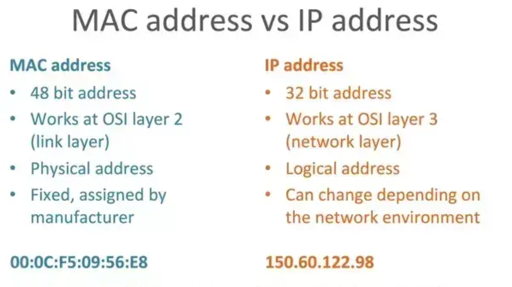

# IP 주소와 Mac 주소의 차이점

---

>[참고 사이트1](https://jhnyang.tistory.com/404)
>
>[참고 사이트2](https://www.quora.com/Is-it-possible-to-compare-an-IP-address-and-Mac-address-If-yes-how)

## IP 주소

### 정의

- **네트워크주소**라고도 한다. 
  - 두 기기가 통신할 때 주로 사용된다. 
- 컴퓨터 네트워크에서 장치들이 서로를 인식하고 통신을 하기 위해서 사용하는 특수한 번호
  - IPv4 가 여태까지 많이 사용되었지만, 이제는 기기가 너무많아져 IPv6가 이용되고있다. 
- **외우기 힘들기 떄문에 사람이 이해할 수 있는 Domain 주소를 만들어 DNS 를 통해 IP주소를 찾아주는 순서로 진행된다.** 

---

## Mac 주소

### 정의

- **컴퓨터간 데이터를 전송하기 위해 있는 컴퓨터의 물리적 주소(하드웨어 주소)**
  - 2계층인 데이터 링크 계층에서 사용되는 주소이다. 
  - 기기의 물리적인 주소를 뜻하며, 해당 주소는 제조사에서 지정한 기기 고유의 번호이다. 
  - 사람으로 따지면 주민등록번호 라고 이해하면 됨
- ip주소와 다르게 영문이 포함되어있다. 

---

## IP 주소와 Mac 주소 차이점 

- IP 주소
  - 내가 미국에 있는 A 주소로 편지를 보낼께! 즉 **시작점과 끝점**에 해당하는 주소
  - OSI 의 3계층 (네트워크) 계층에서 사용된다. 
- MAC주소
  - 바로 옆에 나와 물리적으로 연결되어 있는 **노드와 통신할 때 사용되는 주소**를 의미한다.
  - OSI의 2계층 (데이터 링크) 에서 사용된다. 
- 정리하자면, 시작점에서 끝점으로 가기위해서는 사이사이 노드들을 거쳐야 한다. 
  - 따라서 IP 주소를 이용한 통신은 각각의 Mac주소간의 통신이라고 할 수 있다. 
- 데이터 링크의 통신에 문제가 없어야 네트워크 통신이 가능하다. 
  - 다른말로, Mac주소의 통신이 재대로 이루어져야 IP주소를 이용한 통신이 이루어 진다. 

