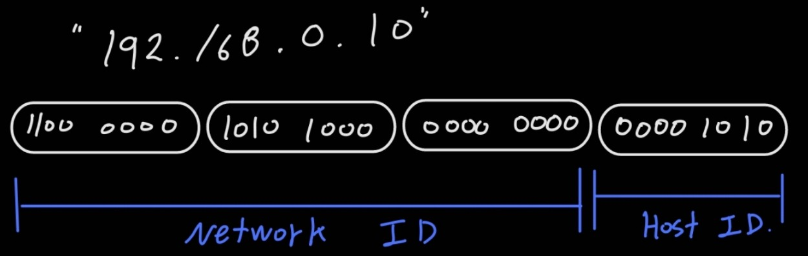

# [IPv4]

#### IP

1. Host를 식별하는 네트워크 주소이다. 
2. Network ID와 Host ID로 나뉜다. 

#### 구조

1. Network ID
   1. 배송시 사용되는 주소지로 예를들면, 시, 구, 동 같은 큰 범위를 나타내는 "물류센터" 이다. 
2. Host ID 
   1. 개별집을 구분하는 "개인컴퓨터" 이다. 

# [IPv4 Header 형식 ]

1. Version
2. IHL ( Internet Header Length )
   1. 기본적으로 Header 20Byte + Payload 1480Byte  = 1500Byte 이다. 
3. TOS
4. Total Length
   1. 2의 16승 = 65515Byte = 64KB 
5. Identification
6. Flags + Fragment Offset
   1. 단편화 정보로, Packet 자르는 경우 사용 
7. TTL 
   1. 홉 단위로 네트워크 지날때마다 줄어들고 모두 사용되면 사라진다. 
   2. 즉, TTL 다 사용할때까지 목적지 찾지 못하면 소멸 
8. Protocol
   1. 프르토콜 별 번호로 표기됨 (TCP : 6)
   2. Payload 안에 다음 Header 가 오는데, 그게 어떤 값이냐에 따라 Payload 해석이 달라짐 
9. Header Checksum 
10. 출발지 & 목적지 주소
11. Option
12. Data