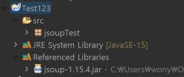

# JSOUP 개념정리 

---

>[참고 사이트1](https://ming9mon.tistory.com/41)
>
>[참고 사이트2](https://offbyone.tistory.com/116)
>
>[참고 사이트3](https://jforj.tistory.com/68)

## JSOUP 

### 정의

- **크롤링을 도와주기 위한 라이브러리**로, **자바**로 만들어져 HTML  의 내용을 psrsing 할 수 있도록 돕는다. 
  - 따라서 Jsoup 라이브러리를 이용하면 웹 사이트의 HTML 파일의 태그 및 데이터들을 가져와 사용할 수 있다. 
- Parsing 
  - 구문 분석이라는 뜻으로 문장을 이루고 있는 구성 성분을 분해하여 구조화하는 것을
  - 따라서 **html태그 및 정보들을 가져와 새로운 구조를 만든다**

### 요소 종류

| Document   | Jsoup 얻어온 결과 HTML 전체 문서                             |
| ---------- | ------------------------------------------------------------ |
| Element    | Document의 HTML 요소                                         |
| Elements   | Element가 모인 자료형. for나 while 등 반복문 사용이 가능하다. |
| Connection | Jsoup의 connect 혹은 설정 메소드들을 이용해 만들어지는 객체, 연결을 하기 위한 정보를 담고 있다. |
| Response   | Jsoup가 URL에 접속해 얻어온 결과. Document와 다르게 status 코드, status 메시지나 charset같은 헤더 메시지와 쿠키등을 가지고 있다. |

### 동작과정

1. Connection 객체를 통해 URL에 접속하고(혹은 로컬 파일/문자열), 
2. Response 객체에서 세션ID같은 쿠키와 HTML Document를 얻어낸 후, 
3. Document의 Element들을 파싱하는 과정으로 나누어진다.

### 이용방법

1. JSoup 라이브러리 다운로드

   - **jar 파일을 다운로드** 받아서 클래스 path 에 추가해서 사용해도 되고, **메이븐**을 사용중이라면 다음 **의존성을 추가**하면 사용할 수 있습니다.

   - 파일 다운로드 방법

     1. https://jsoup.org/download 에 접속하여 jsoup-?.??.?.jar 파일을 다운받아 준다.

        

   - 의존성 추가 방법

     ```xml
     <dependency>
         <!-- jsoup HTML parser library @ https://jsoup.org/ -->
         <groupId>org.jsoup</groupId>
         <artifactId>jsoup</artifactId>
         <version>1.15.4</version>
     </dependency>
     ```

2. 자바 프로젝트에서 build path 에다가 .jar 파일 등록하기 

   - 해당 프로젝트 우클릭 -> Properties -> Java Build Path -> Add External JARs -> 다운받은 Jar파일 추가

   

   

3. 라이브러리 import 해서 크롤링 하기 

   - 내 github 에서 내 이름 파싱해보기 

     ```java
     package jsoupTest;
     import java.io.IOException;
     import org.jsoup.Jsoup;
     import org.jsoup.nodes.Document;
     import org.jsoup.nodes.Element;
     import org.jsoup.select.Elements;
     
     public class jsoupTestClass {
     
     	public static void main(String[] args) {
     		String url = "https://github.com/wonyoung0207"; //크롤링할 url지정
     		Document doc = null;        //Document에는 페이지의 전체 소스가 저장된다
     
     		try {
     			doc = Jsoup.connect(url).get();
     			System.out.println("connect...");
     			
     		} catch (IOException e) {
     			e.printStackTrace();
     		}
     
     		Elements e_all = doc.select("div.Layout-sidebar h1 span");  // div 태그밑에 있는 클래스 이름이 Layout-sidebar 를 찾고 해당 태그 밑에있는 h1 태그 밑에 span 태그의 모든 내용을 가져옴   
             
     //		Element e_one = e_all.select("span").first();
     
     
     		System.out.println("============================================================");
     		System.out.println(e_all.text());// 가져온 태그안에 내용만 출력 
     		System.out.println("============================================================");
     	}
     }
     ```

     


### 발생오류


- java.lang.NoClassDefFoundError 

  - 해당 에러 발생이유는 **컴파일 환경에서는 클래스 참조가 되었지만 실행 환경에서는 해당 클래스를 찾을수 없는 경우** 발생한다.
  - 즉, 이클립스의 빌드패스에서 .jar 파일의 빌드패스는 잘 이루어졌지만 컴파일 과정에서 javac 의 기본 빌드패스가 맞지않아 사용할 수 없는 경우이다. 

- 해결방법

  -  컴파일 시에 참조했던 클래스패스와 라이브러리들(jar...들)을 실행환경에서나 서버에서도 동일하게 맞춰주면 된다.
  - 나의 경우에는 컴퓨터의 **jdk 환경변수 설정**이 재대로 이루어지지 않아서 발생한 오류였다.
  - javac 가 재대로 동작하지 않아 발생한 문제여서 **JAVA_HOME 과 PATH 설정**을 지우고 다시 했다. 

  

  