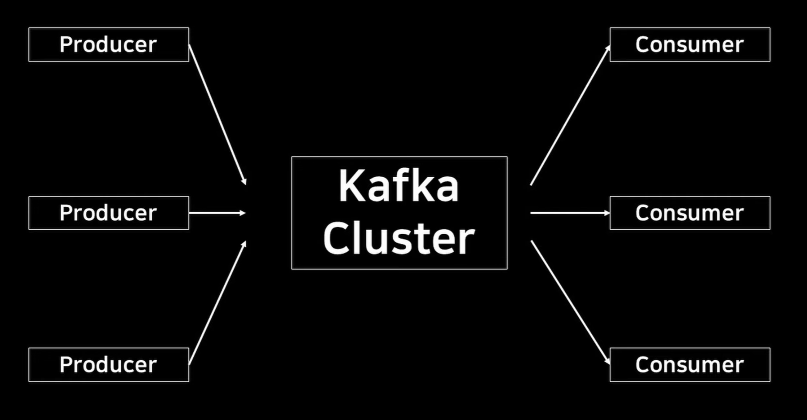

# Kafka

---

>[참고 영상1](https://www.youtube.com/watch?v=Nh3AZx8D9KY)

## Kafka

### 정의

1. Apach Softwere 에서 개발된 소프트웨어로, 데이터 스트림을 실시간으로 처리하기 위해 만들어졌다. 
2. 

### 사용이유

1. 데이터 영속성
   1. 다른 Message Queue 는 메모리 상에서 동작해 시스템이 다운되면 메시지가 유실될 수 있다. 
   2. kafka 는 디스크에 이벤트를 저장하기 때문에 시스템이 다운되더라도 데이터의 유실을 막을 수 있다. 
2. 대규모 트래픽 분산처리 
   1. 서비스의 크기가 커질 때 처리할 트래픽을 확장하는것이 쉽다. 
3. 안정성
   1. Zookeeper 가 클러스터를 관리를 해주기 때문에 관리가 용이하다. 

### Topic 이란 ? 

1. Kafka 는 발생하는 이벤트를 Topic 이라는 단위로 가지고 있다. 
   1. Topic (주제별)별로 이벤트에 대한 데이터를 모으게 된다. 
   2. 즉, **이벤트가 발생했을때, 이벤트에 매핑되어있는 Topic 으로 데이터를 전송한다.** 
2. Topic은 한개 이상의 파티션으로 구분된다. 

### 파티션

1. 파티션이란 
   1. 데이터를 쌓아 놓을 수 있는 곳을 말한다. 
2. 처리 방법 
   1. 이벤트가 Topic에 들어오면 append의 형태로 파티션에 순차적으로 붙게 된다. 
   2. 이때 offset이 할당되는데, Offset은 메시지를 구분할 수 있는 유니크한 값으로 사용된다. 
   3. 즉, offset에 의해 순차적으로 처리될 수 있는 것임. 
3. 여러 파티션의 장점 
   1. 여러 Producer 가 있는 경우 특정 이벤트로 발생된 데이터는 특정 Topic으로 보내야 한다. 
   2. 이때 각각의 Producer 마다 Topic의 파티션을 설정할 수 있있는데, 
   3. Topic 에 각각의 Producer로 부터 온 데이터를 정해진 규칙에 따라 파티션별로 쌓는다. 
   4. 이것의 장점은 다른 데이터의 쓰기를 기다리지 않고 여러가지 일을 한번에 처리할 수 있다는 것이다. 

### 구조

1. Producer , Kafka Cluster, Consumer 로 구분된다. 

#### Producer

1. 데이터를 생성하고 Cluster의 Topic으로 데이터를 보내는 역할을 한다. 
2. 데이터를 단일 Topic, 여러 Topic으로 보낼 수 있다. 
   1. Topic 은 한개 이상의 파티션으로 구성된다. 
   2. Topic 내 파티션에 데이터를 분배한다. 

#### Kafka Cluster

1. 구성
   1. Zookeeper 와 Broker 로 나뉜다. 
2. **Zookeeper** 
   1. 분산 형산 관리 도구로, **클러스터의 구성정보와 상태를 관리**하는 관리자 역할을 한다. 
   2. 하는일 
   3. 클러스터의 구성
   4. 토픽 메타데이터 
   5. 브로커 상태
      1. 브로커 추가 및 제거 
   6. 컨슈머 그룹 을 추적하고 유지한다. 
3. **Broker**
   1. **데이터의 저장과 전달**을 관리하는 **실제 저장소**의 역할을 한다. 
   2. 
4. 역할
   1. 데이터 저장소 역할을 한다. 
   2. producer로 부터 생성된 데이터를 Topic 별로 쌓아서 가지고 있다가 Customer 가 요청한 데이터를 순차적으로 전송한다. 
   3. Topic 별로 데이터를 구분하기 때문에 Consumer 에게 순차적으로 보낼 수 있다. 

#### Consumer 

1. Kafka Cluster에 Topic 별로 쌓여있는 데이터를 가져와 사용하는 곳 
2. 따라서 Topic별로 저장된 데이터를 Cluster의 Broker 에서 순차적으로 꺼내와 Consumer 가 처리하는 구조이다. 
   1. 데이터를 파티션별로 읽어올 때 offset을 기록해 자체적으로 읽은 데이터를 추적할 수 있다.

