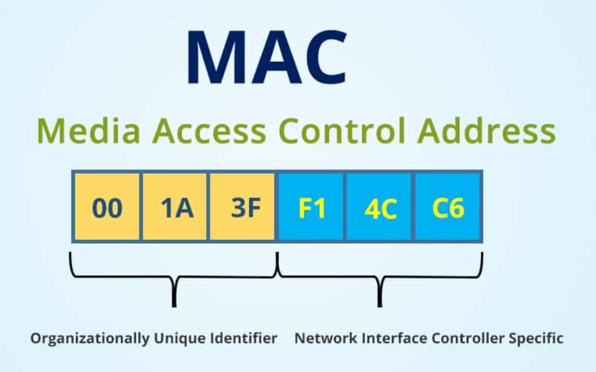

# Mac 주소 개념정리 

---

> [참고 사이트1](https://jhnyang.tistory.com/404)
>
> [참고 사이트2](https://www.quora.com/Is-it-possible-to-compare-an-IP-address-and-Mac-address-If-yes-how)

## Mac 주소

### 정의

- **컴퓨터간 데이터를 전송하기 위해 있는 컴퓨터의 물리적 주소(하드웨어 주소)**
  - 2계층인 데이터 링크 계층에서 사용되는 주소이다. 
  - 기기의 물리적인 주소를 뜻하며, 해당 주소는 제조사에서 지정한 기기 고유의 번호이다. 
  - 사람으로 따지면 주민등록번호 라고 이해하면 됨
- ip주소와 다르게 영문이 포함되어있다. 

### 왜 하드웨어 주소라고 하는지 

- Mac 주소는 기기의 물리적 주소를 나타내는 주소로, 제조사별로 해당 기기를 식별하기 위해 사용되는 주소이다. 
- 따라서 기기의 렌카드를 생산하는 업체에서 ROM 에다가 삭제와 수정이 불가능한 정보를 저장하는데,  
  - 이때 ROM안에는 OS와 함께 Mac 주소가 포함되어있다.
  - ROM안의 데이터는 사용자가 임의로 수정할 수 없다. 
- 고유한 번호이기도 하고 삭제할 수 없는 정보이기 떄문에 Mac주소를 하드웨어 주소 라고 부른다.  

### ARP 프로토콜

-  A가 B한테 데이터를 전송할 때 전송하는 데이터의 목적지 IP주소뿐만 아니라 MAC어드레스가 지정되어야 전송할 수 있다.
-  이때 필요한 것이 ARP 이다.  
   -  **ARP이란 ,네트워크단에서 IP주소로 MAC주소를 알아오는 기능을 하는 프로토콜 이다.**

### 형태

- 2가지 방법이 존재
  1. ipconfig -all 
  2. getmac -v

1. cmd 에서 "ipconfig -all " 명령어 입력
   - 물리적 주소라고 적혀있는 것이 MAC 주소이다. 
2. cmd 에서 "getmac -v " 명령어 입력 
   - 내 컴퓨터의 하드웨어 mac 주소가 모두 출력된다. 

### 구조

- 제조사의 고유번호와 해당 제품만의 고유번호를 나타낸다. 

1. 주소 앞의 6개의 16진수 (사진상으로 노란 바탕에 있는 부분)는 생산자를 나타내는 코드로 이 코드를 **OUI**(Oranizational Unique Identifier)라고 한다.
   - **장비를 만든 회사**를 나타내는 번호로, 앞의 자리수를 보면 어디 회사에서 생산된 제품인지 알 수 있다.
2. 그 뒤에 파란색 부분, 즉 나머지 6개의 16진수는 고유 번호를 부여하기 위한, 시리얼넘버
   - **제품의 고유번호**를 나타낸다. 