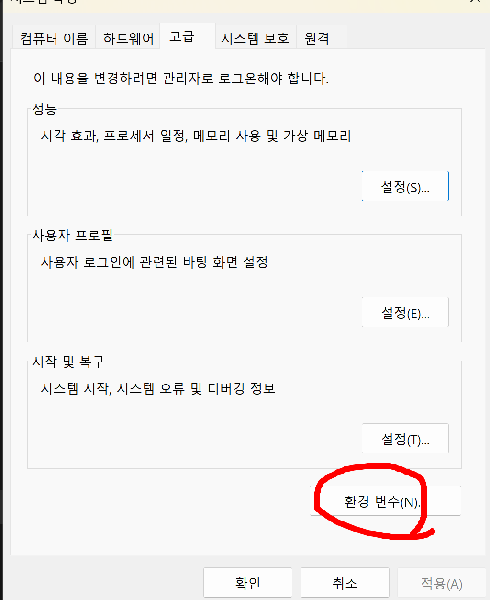

# Mosquitto 개념정리 

---

>[참고 사이트1](https://www.youtube.com/watch?v=8EgEF9PckNA)

## Mosquitto

### 정의

- MQTT 프로토콜 버전을 구현한 오픈소스 **메시지 브로커**이다. 
  - 따라서 가벼운 환경에서 사용하는 통신환경에서 브로커 역할을 한다. 
  - IBM 에 의해서 개발되었고 2014년 국제 민간 표준기구인 오아시스에 의해서 표준으로 채택되었다. 
- pub/sub 모델을 사용한 메세지 이동에 관한 가벼운 메소드를 제공

### 사용이유

-  **저전력** 파워센서 나 **모바일 디바이스** , 임베디드 컴퓨터나 아두이노 마이크로 컨트롤러  같은 "디바이스 to 디바이스 " 간의 **메세징을 처리하기에 적합**하다. 
- 경량화가 가능해서 통신 대역폭이 제한적인 사물인터넷에 적합하다. 
  - 현재 페이스북도 회원들간의 메시지 전송에 MQTT 프로토콜을 이용하고 있다.

### 사용방법

1. Mosquitto 다운로드

   - [mosquitto 사이트 ](https://mosquitto.org/) 에서 Download 목록을 선택한다. 
   - window 전용 버전에서 older 를 클릭하고 1.6.9 버전을 다운받아준다. ( 다른 버전 선택해도 됨 )

   

   

   

2. .exe 파일을 실행시켜 mosquitto 를 설치한다. 

3. 환경변수 설정 

   1. mosquitto 가 설치 된 경로를 기억한다. 

      - 내 경우엔 mosquitto 의 기본설치 경로인 "C:\Program Files\mosquitto" 였다.

   2. "내 PC - 속성 - 고급 시스템 설정 - 환경변수 " 로 들어간다. 

   3. Path - 편집 - 새로 만들기 - "C:\Program Files\mosquitto" 입력 - 추가 및 확인 

      

      

      

      

   4. CMD 에서 mosquitto 버전 확인

      - mosquitto 의 포트번호는 1883으로 통일되어 있다. 

      

      - mosquitto 를 설치하면 pub/sub 역할을 하는 mosquitto 가 함께 설치된다. 

      

   5. mosquitto sub등록 

      - sub / pub 를 실행시키기 위해선 mosquitto broker 가 동작중에 있어야한다.

        - 따라서 먼저 cmd에 "mosquitto -v " 를 입력해 broker를 실행시킨다.  

      - broker 실행 후 mosquitto_sub 와 mosquitto_pub 를 등록한다.

      - **mosquitto_sub -t wony**

        - wony라는 토픽이름을 구독한다. 
        - \-t : topic 등록시 사용되는 명령어 

        

   6. mosquitto pub 등록

      - mosquitto_pub 를 통해 메시지를 broker로 보낸다. 

      - broker는 메시지를 받고 해당 토픽을 구독한 client에게 message 내용을 전송한다. 

      - **mosquitto_pub -t wony -m "Topic wony message"**

        - pub 가 wony 라는 토픽으로 Topic wony message  내용을 담은 메시지를 전송한다. 

        

   7. 특정 IP 주소로 메시지 전송 

      - mosquitto_sub **-h** 192.168.00.00 **-p** 1883 **-t** ip_addr_wony

        - \-h : 호스트 등록 시 사용하는 키워드 ( 해당 기기의 ip 주소 )
        - \-p : mosquitto 가 열려있는 port 번호
        - 입력한 ip주소에 열려있는 1883 포트에 "ip_addr_wony" 으로 토픽 등록

      - mosquitto_pub **-h** 192.168.00.00 **-p** 1883 **-t** ip_addr_wony **-m** "wony ip go message1"

        - 입력한 ip주소에 1883 포트로 열려있는 곳으로 "ip_addr_wony" 토픽이름으로 메시지 전송 

        

## 정리 

- mosquitto 는 MQTT 통신에서 Broker 역할을 하는 프로그램이다. 
- Pub / Sub 모델로 동작하여 1:1 통신이 아닌 다중 통신에 적합하다. 
  - 누구든 message를 전송할 수 있는 Publisher 가 될수도 있고, message를 수신하는 Subscriber가 될 수 있다.
- 따라서 iot 통신에 사용할 수 있는 경량형 프로토콜인 MQTT에서 broker 역할을 하는것이 Mosquitto 이다. 

