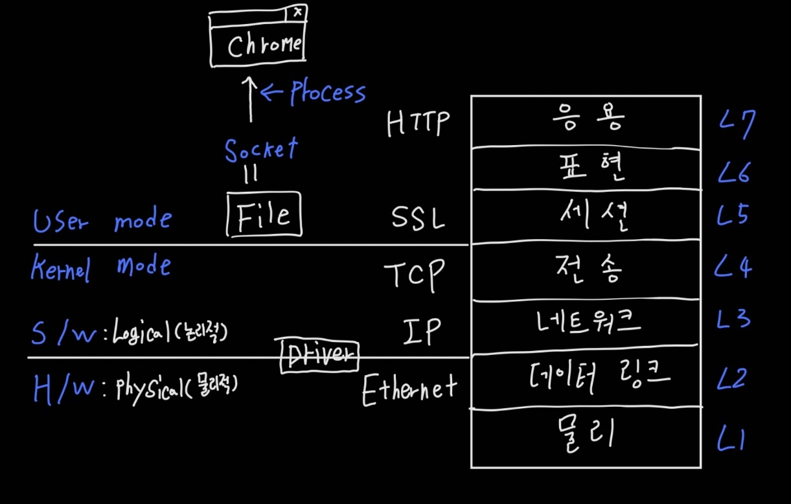

# [OSI 7Layer]

#### Layered 

1. 층층이 쌓여있는 것으로, 상호간 의존관계로 되어있는 것을 뜻한다. 
2. 즉, 위에가 있으려면 무조건 밑에가 있어야함을 의미한다. ( 의존 관계!! )

#### 식별자

1. L2
   1. **Mac 주소** : NIC 식별자 
   2. 물리적 주소
   3. 48bit 주소체계 사용
2. L3 
   1. **IP 주소** : HOST 의 식별자 
   2. 인터넷 주소 
   3. 32bit 주소체계 사용 
3. L4
   1. Port번호 : 인터페이스(서비스, 프로세스)의 식별자 
4. **Socket** 
   1. socket은 File 이고, OS와 의사소통 하기 위한 Interface 이다. 
      1. 즉, **Socket은 User Mode의 Process(서비스)가 Kernel Mode(OS) 에 접근할 수 있도록 추상화한 인터페이스** 이다. 
   2. **socket을 열었다라는것은 File을 열었다는 것이고, 여는 주체는 Process (Program) 가 된다.** 

#### 1.  물리 계층

1. HW
   1. NIC 같은 완전한 HW가 여기에 속한다. 
2. NIC 
   1. 네트워크 인터페이스 카드 (LAN 카드)
   2. NIC를 식별하기위한 것이 **MAC 주소** 이다. 

#### 2. 데이터링크 계층

1. HW와 SW의 중간
   1. Driver 가 여기에 속함 
2. Ethernet
   1. 유선 인터넷 

#### 3. 네트워크 계층

1. Internet 
2. IP

#### 4. 전송 계층

1. TCP
2. UDP

#### 5. 세션 계층

1. TLS ( SSL )

#### 6. 표현 계층

#### 7. 응용 계층

1. HTTP 