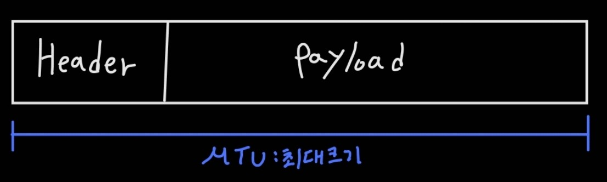

# [Packet ]

#### 개념

1. L3 = IP = Packet 
2. 하나의 조각을 뜻하며, 기본 크기는 1500Bytes (1.4KB) 이다. 
   1. 즉, 데이터 덩어리가 분할된 Segment 하나가 포장된 형태를 **Packet** 이라고 부른다. 

3. 기본크기 
   1. Packet : **MTU** ( Maxium Transmission Unit ) => 1500 Bytes
   2. Segment : **MSS** ( Maxium Segment Size ) => 1460 Bytes 

4. 분할 
   1. MSS 는 MTU 보다 크기가 작다. 
   2. 만약 Socket의 Stream 데이터가 MSS 보다 크다면 이때 데이터의 "분할" 이 일어난다. 
   3. **일정 크기의 MSS 로 잘라서 Internet 에서 MTU의 사이즈로 통신하게 된다.** 

#### 구조

1. Header 
   1. **출발지(Src), 목적지(Dst)**
2. Payload
   1. 데이터 

# [캡슐화 ( Encapsulation )]

#### 개념

1. 내용물을 포장(캡슐화) 하는것을 뜻한다. 
   1. 내용물을 푸는것은 "Decapsulation" 이다. 
   2. 즉, 하나의 데이터 덩어리(Header + Payload)를 포장하는 것이 캡슐화이다. 
2. 단위화
   1. 데이터를 포장한다는 것은 "단위화" 한다는 것이다. 

3. 주로 Encapsulation은 송신측에서 일어나고, 수신측에서는 Decapsulation 이 일어난다. 
   1. 송신 : 데이터를 분할 후 포장
   2. 수신 : 포장된 데이터를 분해 

#### 전송 

1. packet으로 포장된 데이터는 Dst 인 목적지 정보를 이용해 찾아간다. 
2. 라우팅에 의해 목적지까지 도달한 Packet은 해당 PC의 특정 서비스로 보내져야한다. 
3. 이때 PC의 특정 서비스로 갈때 사용되는 정보가 "Port 번호"이다. 

#### 구조

