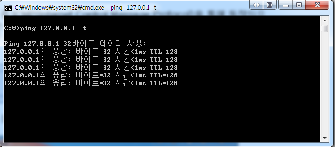
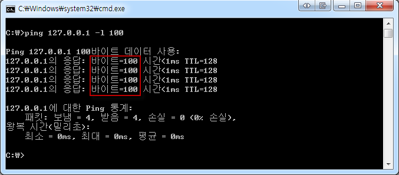
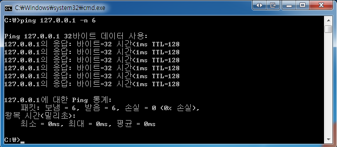
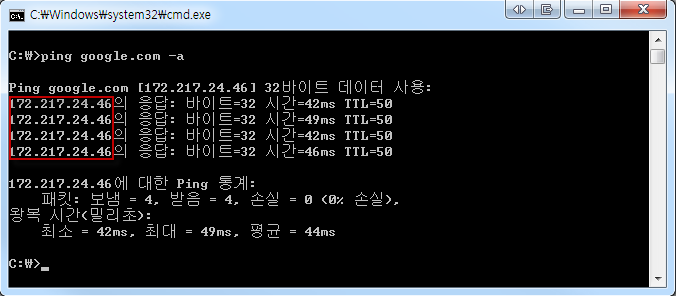

# Ping (Paket Internet Groper)

---

>

### 정의

- 컴퓨터 네트워크 상태를 점검, 진단하는 명령이다. 

### 동작 방식 

- 네트워크 **상태를 확인하려는 대상(target)** 컴퓨터를 향해 일정 크기의 **패킷(packet, 네트워크 최소 전송단위)**을 **보낸후(ICMP echo request)** 대상 컴퓨터가 이에 대해 **응답하는 메시지(ICMP echo reply)**를 보내면 이를 수신, 분석하여 대상 컴퓨터가 작동하는지, 또는 대상 컴퓨터까지 도달하는 네트워크 상태가 어떠한지 파악할수 있다.

### 주의할점

- ping 명령은 **TCP/IP 프로토콜 중 ICMP(Internet Control Message Protocol)을 통해 동작**하므로, 이 프로토콜을 지원하지 않는 기기를 대상으로 ping 수행할수 없다.
- 또한 보안의 이유로 ICMP 사용을 차단하는 기기역시 ping 요청에 대응하지 않는다. 

### 사용법

1. **ping [목적지] [옵션]**

   - 여기서 옵션은 생략 가능하다. 

   - 본적으로 4회 수행하고 -t 옵션을 넣어주면 반복적으로 수행한다. 

     

2. **ping [목적지] -l [전송되는 패킷]**

   - ping 명령에서 **-l** 옵션을 주면 ping 수행시 **전송되는 패킷(데이터가 전송되는 단위)**의 **크기를 지정**활수 있다. 

     

3. **ping [목적지] -n [횟수]**

   - ping 명령에서 **-n** 옵션을 주면 ping 수행시 **지정된 횟수 만큼 실행**하는 옵션이다. 

   - ping 127.0.0.1 -n 6 입력했을때 6번을 수행한것을 확인할수 있다. 

     

4. **ping [도메인] -a**

   - ping 명령에서 -a 옵션을 주면 ping 수행시 **도메인의 ip주소를 확인할수 있는 옵션**이다. 

     

## ping 과 RTT 관계 

1. Ping
   1. 유틸리티( 측정 도구 )
   2. RTT를 측정하기 위한 가장 기본적인 툴 
   3. 특정 Host에 대한 RTT 를 측정할 목적으로 사용됨 
   4. 동작 방법
      1. `Echo Request` 를 송신측으로 전송 ( 내용물은 그냥 `ABCDE....` 같은 문자열)
      2. 받은 곳은 `Echo Reply` 를 날려 응답 ( 내용물은 Request 한것과 동일한 내용 )
2. RTT ( Round Trip Time )
   1. **Ping 으로 소요된 시간** 
   2. 즉, 클라이언트 요청 후 서버의 응답을 받은 전체 시간을 뜻한다. 
   3. **ICMP 프로토콜** 사용함 
   4. Dos 공격용으로 악용되기도 한다.   