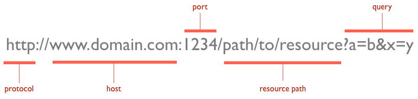

# Port 번호 개념정리 

---

>[참고사이트1](https://velog.io/@ragnarok_code/Port%EB%9E%80)
>
>[참고사이트2](https://study-recording.tistory.com/13)
>
>[참고사이트3](https://sangbeomkim.tistory.com/101)

## Port

### 정의

- airport 같이 **항구**라는 뜻을 가지는 것으로, 컴퓨터 혹은 서버내의 IP 내에서 **프로세스 구분을 하기 위해서 사용**한다.

  - "논리적인 접속장소"이며, 특히 인터넷 프로토콜인 **TCP/IP**를 사용할 때에는 클라이언트 프로그램이 네트워크 상의 **특정 서버 프로그램을 지정하는 방법으로 사용**된다.

-  Port는 **프로그램(어플리케이션)을 찾을 때 필요한 이정표**라고 할 수 있다. 

  - port 를 통해 어떤 서비스를 이용할 것인지 알 수있기 때문에 

### 사용이유

1. 네트워크 상에서 통신을 할 때 **IP를 토대로 해당 서버가 있는 컴퓨터에 접근**한다.
   - 그런데 대부분의 경우 **하나의 컴퓨터**에는 **여러 개의 서버가 실행**될 수 있다.
   - 컴퓨터에 여러 개의 서버가 실행되고 있다면, **어느 서버에 접속해야 하는지** 컴퓨터에게 알려주어야 한다.
   - 이때 사용되는 것이 `포트 번호`이다.
2. 또한, 포트를 입력하지 않고 특정 **IP 만을 목적지로 잡아 접속을 시도**한다면, 해당 서버는 사용자가 **접속한 목적과 용도를 알지 못해** 알맞은 서비스를 제공하지 못한다. 
   - 따라서 port 를 IP와 함께 명시해줬을 떄, 서버는 사용자의 접속 목적을 알게되어 해당 **서비스를 제공하는 어플리케이션으로 재대로 안내**할 수 있게된다,

---

## Port 번호

### 정의 

- 컴퓨터에서 실행되고 있는 서버를 구분 짓기 위한 16비트의 논리적 할당으로 0~65536번이 존재한다.

### 존재 이유와 목적

- 예시
  1. 회사 내의 서버에 접속한다고 가정
  2. 그 서버는 **웹 서비스**뿐만 아니라 **`MySQL`, `DNS`, `SMTP`, `SSH`, `Telnet` 등의 서비스를 제공**하고 서버의 IP는 `10.10.10.1/24`이다.
  3. 서버에 직접 접속하여 일부 설정을 변경하고자 할때  SSH(22 port)나 Telnet(23 port)을 통해 접속할 수 있다. 
  4. 그런데 만약 10.10.01.1 + Port 80으로 접속을 시도한다면 서버는 웹서비스로 안내하게 된다. 
- 따라서 URL 작성시 port 번호 생략하면 기본 port인 80 에 연결되지만, 8080 으로 하면 8080 port에 연결된다. 

### 포트번호 종류

- 포트는 총 0번 ~ 65535번으로 이루어져있고 크게 3가지 종류로 구분된다. 
  - URL상 도메인 주소 바로 뒤에 port 번호가 온다. ( port 번호 생략 가능 )

#### 1. Well-known port (잘 알려진 포트)  **(0 ~ 1023)**

- **특정한 쓰임새를 위해서 할당 TCP, UDP 포트 번호로 이루어져있다. **
- `FTP` - 20, 21 (TCP)
- `SSH` - 22 (TCP)
- `텔넷` - 23 (TCP)
- `SMTP` - 25 (TCP)
- `DNS` - 53 (TCP/UDP)
- `DHCP` - 67 (UDP)
- `HTTP` - 80 (TCP)
- `HTTPS` - 443 (TCP)
- `RDP` - 3389 (TCP/UDP)

#### 2. registered port (등록된 포트) **(1024 ~ 49151)** - 국제 도메인 관리기구에 등록

- `MySQL` - 3306
- `PostgreSQL` - 5432

#### 3. dynamic port (동적 포트) **(49152 ~ 65535)** - 임시 포트들, 어떤 프로세스들에게 임의로 사용가능

### port 제어하는 곳 

- 주로 포트를 사용하는 프로토콜은 **전송 계층 프로토콜**이다. 
- 그래서 포트 또한 **전송 제어 프로토콜(TCP)**와 **사용자 데이터그램 프로토콜(UDP)**이 관리한다. 