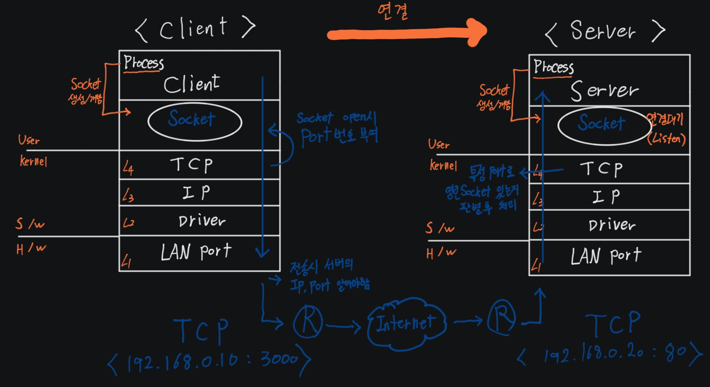

# TCP 통신과정

---

>

##### 1. Server Socket Open

1. 서버는 Process 에 대한 Socket을 특정 Port 를 통해 Open 해놓는다. 
2. 이때 연결하는것이 아닌 "**연결대기**" 상태로 Client 요청을 기다린다. 

##### 2. Client Socket Open

1. Process가 통신할 수 있는 **Socket을 Open**한다. 
2. Process 마다 PID 있어 **PID 가진 Process 가 Socket을 Open** 한다.

##### 3. TCP Port 번호 생성 

1. 운영체제는 Open 된 Socket에 **"TCP Port "**번호를 Process에게 부여한다.
2. 이때 Process에 설정해놓은 Port 가 없으면 아무 남는 Port 를 제공한다. 
3. 즉, Port는 인터넷 연결하기 위한 하나의 구멍이라고 생각하면 된다. 

##### 4. 연결

1. `192.168.0.10:3000` Client는 Port 번호를 통해 Server와 연결을 시도한다. 
2. **서버에 접속하기 위해선 서버의 IP와 접속 가능한 Port** 를 알아야 한다. 

##### 5. Server 접속

1. 연결 요청이 Server의 `192.168.0.10:80` 으로 들어온다. 
2. 이때 Server에 특정 Port가 존재한다면 **Socket 을 통해 데이터를 Client로 전달**한다. 
3. 하지만 요청한 Port 가 Server에 없다면 **운영체제의 TCP 부분에서 해당 Port로 열려있는 Socket 이 없다고 Cient에게 Response** 한다. 

# TCP 연결과정 (  3-way handshaking )

1. TCP 의 연결 = **정책을 교환하는 것**
   1. **정책 = "Sequence number" + "MSS(Maxium Segment Size)"**
2. TCP연결은 **논리적 연결**이다. 
   1. 직접 LAN 선같은걸로 연결하는것이 아닌 인터넷을 통한 연결이다. 
   1. **연결시 SRTT 값을 계산**해 평균 대기 시간을 설정해 놓는다. 
3. 시퀸스 번호 교환
   1. 클라이언트와 서버는 연결시마다 달라지는 값인 "Sequence Number" 를 각각 가지고 있다. 
      1. 연결 끊기면 다른 시퀸스 넘버로 변경됨 
   2. 만약 클라이언트가 `1000 의 시퀸스 번호`를 가진다면, 연결시 서버로 1000의 시퀸스 번호를 보낸다. 
   3. 서버는 잘 받았다는 의미로 `"자신의 시퀸스 번호 + 상태 시퀸서 번호 + 1"` 을 보낸다. 
      1. `+1` 의 의미는 해당 시퀸스 번호에 대한 잘 받았다는 의미이다. 
      1. 여기서 TCP 연결이 착각이라는 것을 알 수 있다.
      1. **이유는 서버로부터의 `SYN + ACK`은 클라이언트가 보낸 `SYN` 만 알 수 있다면 누구나 해당 컴퓨터와 TCP 연결이 가능하다는 것을 뜻하기 때문이다.** 
4. 상태
   1. SYN_SENT : 연결 요청 
   2. Establish : 연결완료 

# TCP 연결 종료 ( 4-way handshaking)

1. 과정
   1. Client 가 `FIN + ACK` 을 보내고 `FIN + ACK` 응답을 기다린다. 
   2. Server는 `ACK` 를통해  알겠다는 응답을 한다. 이때 Client는 `FIN + ACK` 을 받지 못했기 때문에 `FIN_WAIT` 상태로 대기한다. 
   3. Server 가 연결을 끊자는 신호인 `FIN + ACK`  를 Client 에게 보낸다.
   4. Client는 해당 신호를 받으면 **`TIME_WAIT`** 상태가 되고, 일정 시간이 지나면 `CLOSED` 상태가 되서 Socket이 회수된다. 
      1. **` TIME_WAIT` 가 발생하면 일정시간 Socket이 낭비되기 때문에 Server는 자신이 연결을 끊지 않고 Client 에게 부탁해서 끊게 만들어야 한다. 이때 사용되는것이 App 프로토콜 이다.** 
   5. 즉, `FIN + ACK` 을 보내면 `FIN + ACK` 을 기다린다. 
2. **`TIME_WAIT`** 는 "연결 최종 완료 전" 에 발생한다. 
   1. `TIME_WAIT` 가 발생했다는 것은 Server가 연결을 끊자고 한것이다.
   1. 마지막 ACK을 보내면 연결 끊김
3. `CLOSED` 상태가 되면 Socket(자원) 이 회수된다. 
   1. 따라서 클라이언트 측에서 연결을 끊게 유도해야 한다. 
   2. 서버에에서 `TIME_WAIT` 가 발생하는것을 방지하기 위해서 