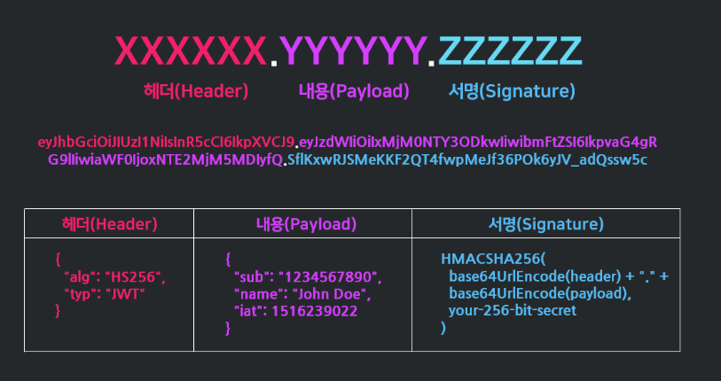

# Token 개념정리

---

>[참고사이트1](https://inpa.tistory.com/entry/WEB-%F0%9F%93%9A-JWTjson-web-token-%EB%9E%80-%F0%9F%92%AF-%EC%A0%95%EB%A6%AC)
>
>[참고사이트2](https://defineall.tistory.com/861)
>
>Cookie, Session, Token 의 개념을 이해하고 비교한다. 

## Token ( 토큰 )

### 정의

- 서버가 각각의 클라이언트를 누군지 정확히 구별할 수 있도록 유니크한 정보를 담은 **암호화 데이터**.
- 해쉬함수와 개인 데이터를 이용해 암호화 한다.

### 특징

1. 암호화해서 브라우저에 저장한다. 
   - 웹 페이지 접속시 저장된 정보를 가져와 

### 동작 방식 

1. 사용자가 서버에 로그인 한다.
2. 서버가 로그인 정보를 받아서 **유일한 토큰**을 만든다.
3. 사용자는 브라우저에서 토큰을 받아 임시저장한다.
4. 사용자가 HTTP 요청헤더에 토큰을 함께담아 서버에 요청을 보낸다.
5. 서버는 자신이 만든 토큰이 맞는지 확인하고, 토큰이 맞는 경우에만 올바른 응답을 보내준다.
   - 토큰 자체에 유저 정보가 있기 때문에 **데이터베이스를 거치지 않고** 바로 **복호화**를 통해 누가 사용하고 있는지 파악할 수 있다. 

### 장점

1. 데이터베이스의 오버헤드 감소
   - 기존에는 세션 정보를 데이터베이스에서 조회하는 과정이 필요했다. 
   - 토큰은 클라이언트에 저장되기 때문에 해당 과정을 거칠필요가 없어졌다.  

### 단점

1. 쿠키/세션과 다르게 토큰 자체의 **데이터 길이가 길어**, 인증 요청이 많아질수록 네트워크 부하가 심해질수 있다.
2. Payload 자체는 암호화되지 않기 때문에 **유저의 중요한 정보는 담을 수 없다.**
3. 토큰을 탈취당하면 대처하기 어렵다. (따라서 **사용 기간 제한**을 설정하는 식으로 극복한다)

---

## JWT ( JsonWebToken)

### 정의

- **인증에 필요한 정보들을 암호화시킨 JSON 토큰**을 의미한다. 
  - JSON 데이터를 **Base64 URL-safe Encode** 를 통해 **인코딩**하여 직렬화한 것
-  **JWT은 서명(인증)이 목적**
  - 토큰 내부에는 위변조 방지를 위해 개인키를 통한 **전자서명**도 들어있다.
  - **토큰의 진짜 목적**은 정보 보호가 아닌, **위조 방지**이다.

### 구조

- JWT는 **.** 을 구분자로 나누어지는 세 가지 문자열의 조합이다.

- **Header**
  - JWT 에서 사용할 **타입**과 **해시 알고리즘의 종류**가 담겨있다.
- **Payload** 
  - 서버에서 첨부한 **사용자 권한 정보와 데이터**가 담겨있다.
  - 서버와 클라이언트가 주고받는 시스템에서 실제로 **사용될 정보에 대한 내용**을 담고 있는 섹션
- **Signature**
  - 헤더에서 정의한 알고리즘 방식을 활용해 **"헤더내용 + PayLoad + 서버의Key" 내용을 암호화**한것
  - Signature는 서버 측에서 관리하는 비밀키가 유출되지 않는 이상 복호화할 수 없다. 따라서 Signature는 토큰의 위변조 여부를 확인하는데 사용된다.

### 동작방식 

- 사용자가 JWT 를 서버로 전송하면 서버는 서명을 검증하는 과정을 거치게 되며 검증이 완료되면 요청한 응답

1. 사용자가 ID, PW를 입력하여 서버에 로그인 인증을 요청한다.
2. 서버에서 클라이언트로부터 인증 요청을 받으면, Header, PayLoad, Signature를 정의한다.
   - Hedaer, PayLoad, Signature를 각각 Base64로 한 번 더 암호화하여 JWT를 생성하고 이를 쿠키에 담아 클라이언트에게 발급한다.
3. 클라이언트는 서버로부터 받은 JWT를 로컬 스토리지에 저장한다. (쿠키나 다른 곳에 저장할 수도 있음)
   - API를 서버에 요청할때 **Authorization header에 Access Token을 담아**서 보낸다. 
4. 클라이언트가 Header에 담아서 보낸 JWT가 내 서버에서 발행한 토큰인지 일치 여부를 확인하여 일치한다면 인증을 통과시켜주고 아니라면 통과시키지 않으면 된다.
5. 클라이언트가 서버에 요청을 했는데, 만일 액세스 토큰의 시간이 만료되면 클라이언트는 리프래시 토큰을 이용해서 서버로부터 새로운 엑세스 토큰을 발급 받는다.

### 장점

1. Header와 Payload를 가지고 Signature를 생성하므로 **데이터 위변조를 막을 수 있다.**
2. 인증 정보에 대한 **별도의 저장소가 필요없다.**
   - DB를 거치지 않고도 사용자가 누구인지 파악할 수 있음 
3. JWT는 토큰에 대한 기본 정보와 전달할 정보 및 토큰이 검증됐음을 증명하는 서명 등 필요한 모든 정보를 자체적으로 지니고 있다.
4. **서버는 무상태(StateLess)**가 되어 서버 확장성이 우수해질 수 있다.
5. **다른 로그인 시스템에 접근 및 권한 공유가 가능하다. (쿠키와 차이)**

### 단점

1. 토큰길이
   - 토큰 길이가 길어지면 해석하기 어려워진다. 
2. Payload 인코딩
   - payload 자체는 암호화 된 것이 아니라 BASE64로 인코딩 된 것이기 때문에, 중간에 Payload를 탈취하여 디코딩하면 데이터를 볼 수 있으므로, 보안에 취약하다. 
   - 반면 Signature는 서버 측에서 관리하는 비밀키가 유출되지 않는 이상 복호화할 수 없다.
3. 토큰 자체를 탈취당하면 대처하기가 어렵게 된다.