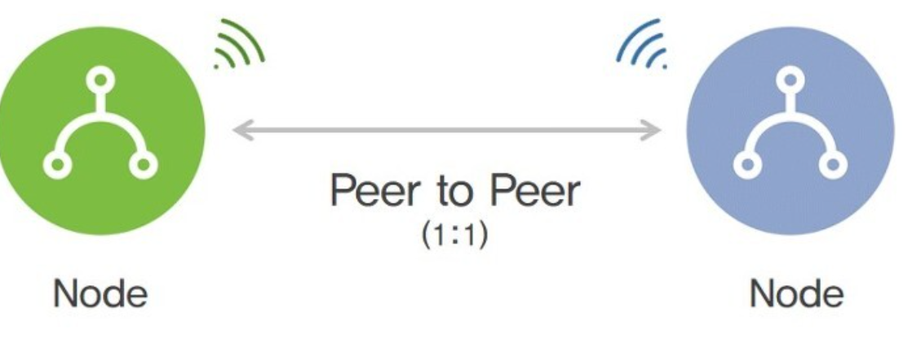
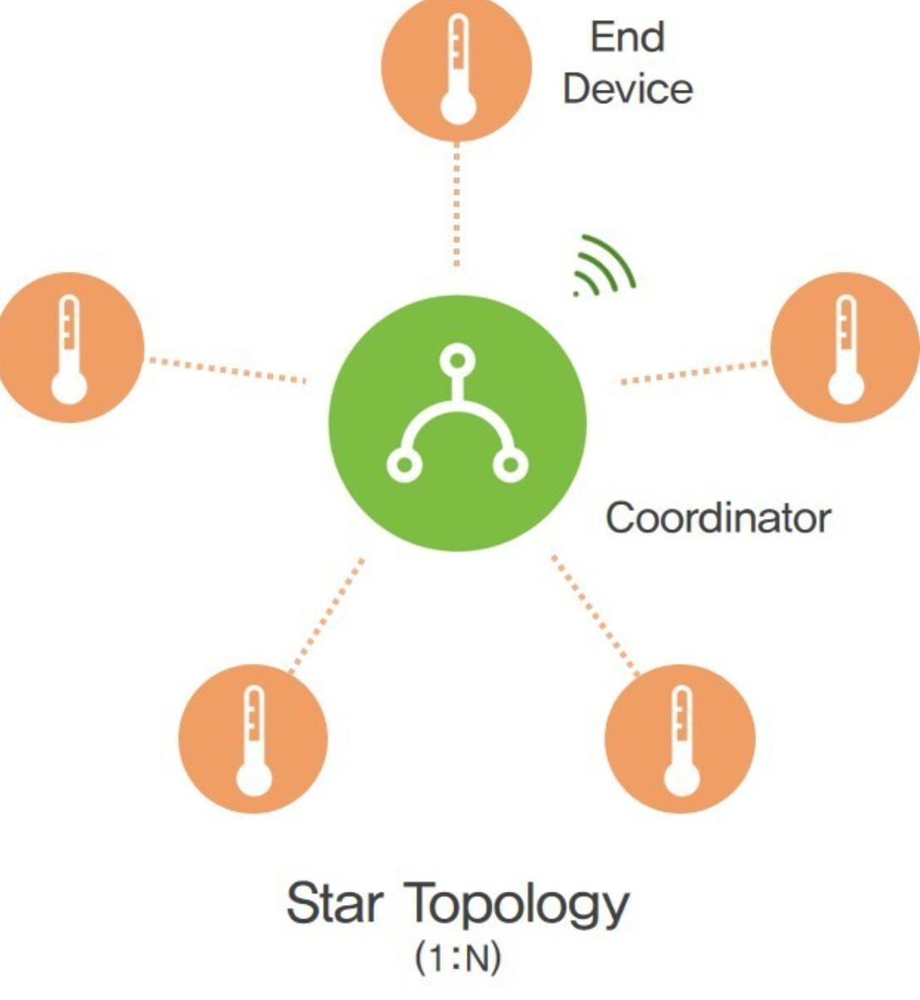
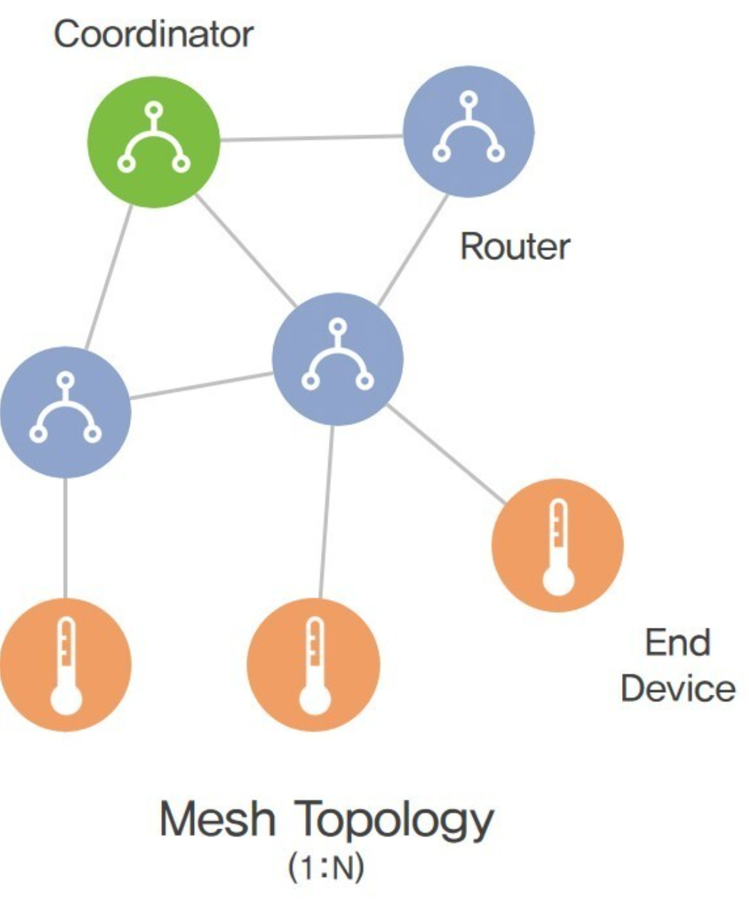

# Zigbee 개념정리 

---

>[참고 사이트1](https://itinformation.tistory.com/151)
>
>[참고 사이트2](https://creamp.tistory.com/11)
>
>[참고 사이트3](https://www.tessol.com/bbs/board.php?bo_table=notice&wr_id=91)
>
>[참고 사이트4](https://blog.acronym.co.kr/128)

## Zigbee

### 정의

- **근거리 저전력 무선 통신을 위한 프로토콜**로, **메쉬형 토폴로지**에 속한다. 
  - 따라서 직접 데이터를 전송하는것이 아닌 **여러 중간노드를 거쳐 전송**하기 때문에 저전력임에도 넓은 범위로 전송할 수 있다. 
- 애드혹 네트워크의 특징을 가진다. 
  - 애드혹 네트워크 : 고정된 유선망을 가지지 않고 이동 노드(핸드폰)만으로 구성된 자율적이고 수평적인 네트워크

### 네트워크 토폴로지 

- 컴퓨터 네트워크에 참여하는 요소((노드)들의 배치형태,망 구성방식 을 말한다. 
  - **단말기 상호 간에 데이터를 전송할 수 있도록 연결된 형태**를 말한다.
  - 이는 데이터가 잘 보내지고 받을 수 있도록 어떻게 네트워크를 구축할 것인가 라는 **네트워크 전략**과도 일맥상통하며 어떤 형태를 구축하느냐에 따라서 **데이터의 흐름이 결정되게 된다**.
  - 따라서 데이터를 전송하기 위해 어떤 형태로 네트워크를 구축하는지에 대한 전략이라고 생각하면 된다.
- 대표적으로 3가지 토폴로지가 있다. 
  1. 일대일 토폴로지 
  2. 스타형 토폴로지 
  3. 메쉬형 토폴로지 

1. 일대일 토폴로지 ( Peer to Peer )

   - 두 노드 사이에 데이터를 전달하기 위한 가장 간단한 네트워크 형태 

     

2. 스타형 토폴로지 ( Star )

   - 중앙의 연결 지점에 허브나 라우터 같은 중심 노드(Coordinator)가 배치되어 모든 노드들을 관리하는 네트워크 형태 

     - 모든 데이터가 중앙 지점으로 모여지는 중앙 제어 방식이기 때문에 관리가 편하고 확장이 용이하다.
     - 하지만 그만큼 부하가 많이 걸리게 되며 중앙 노드에 장애가 발생하면 전체 네트워크 사용이 불가능하게 되는 단점이 있다.

     

3. 메쉬형 토폴로지 ( Mesh )

   - 모든 노드가 네트워크상에서 혹은 개별적으로 현결된 그물망 형태로 다수의 노드 쌍이 동시에 통신하는 네트워크 형태

     - 특정 노드의 장애가 다른 노드에 영향을 주지 않기 때문에 **장애에 유연한 대처가 가능**하며 **가용성이 극대화** 된다. 
     - 하지만 그만큼 회선구축 **비용이 많이** 들게 되며, 새로운 노드를 추가할 시에 **선로 구성이 복잡**해지고 비용부담이 발생한다. 

     

### 다른 네트워크와 성능 비교

|              | Zigbee   | Bluetooth | Wi-Fi        | NFC         |
| ------------ | -------- | --------- | ------------ | ----------- |
| 전송거리     | ~100m    | ~10m      | ~100m        | ~20cm       |
| 전송속도     | ~250Kbps | ~24Mbps   | 11M / 54Mbps | 106~848Kbps |
| 최대 채널 수 | 32000    | 7         | 14           | 1           |
| 소비전력     | Very Low | Medium    | High         | Low         |
| 복잡성       | Low      | Low       | High         | Low         |
| 비용         | Low      | Low       | High         | Low         |

- **지그비 통신 장점** 
  - 복잡하지 않은 시스템 구조로 구성되어 있으며 **적은 소비전력**으로 인해 **소형화**가 가능함을 알 수 있다.
  - 비록 전송 속도면에서 블루투스나 와이파이 통신이 우수하긴 하지만 가격이 비싸기 때문에 **상대적으로 저렴하고 간단한 무선 네트워크를 구축**할 수 있다.
  - 또한 **네트워크 규모도 방대**하기 때문에 다수의 센서를 활용하거나 모듈을 사용하는 시스템에 적합한 형태를 보인다.