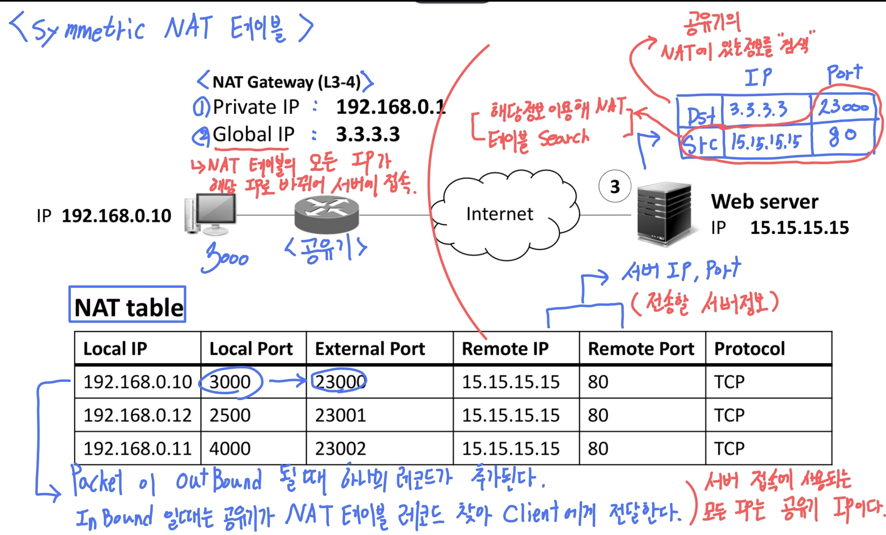

# 공유기 

---

>

## 개념

1. 내부 클라이언트들이 Internet으로 나가기 전 **NAT 를 이용해 IP,Port 를 변환하는 작업을 수행**하는곳 
1. 대부분의 공유기는 NAT 기술을 사용한다. 
1. **IP 주소를 변환한다**

## IP 종류

1. Public
2. Private

## NAT (Network Address Translation)

1. **네트워크 주소 변환**을 뜻하며 일반적인 인터넷 공유기에 적용된 기술이다. 
1. **PtoP 통신을 방해**하기 때문에 여러 방식(Full Cone, Restricted Cone 등등)을 사용한다. 

## 작동원리

1. 제어
   1. IP 주소와 포트번호를 모두 제어 
2. 주소할당
   1. 인터넷 IP주소 부족 문제를 Private, Public 주소로 나누어 해결한다. 
3. 보안성 
   1. 패킷 필터링 방화벽과 비슷한 보안성 제공 

## 구조에 따른 분류 

1. **Cone NAT**
   1. **Host 단위**로 외부포트 지정
   2. Full Cone
   3. Restricted Cone
      1. IP Restricted
      2. Port Restricted
2. **Symmetric NAT**
   1. **TCP 세션**마다 외부 포트 지정
   2. **보안성**이 뛰어나다. 

## Symmetric NAT

##### 개념

1. IP와 Port 가 바뀌면 무조건 NAT Table 에 추가해 관리한다. 
   1. 즉, External Port 를 무조건 하나 생성한다. 
2. **최대한 막아서 보안성을 높이는 경우 사용한다.(PtoP 통신에 어려움이 있음) ** 

##### 동작방법

1. 전송 (Out Bound)
   1. 클라이언트가 외부와 통신하기 위해 `TCP/IP Header` 에 `Src`와 `Dst `를 추가한다. 
   2. 이때 `Src와 Dst`는 사설 `IP, Port` 인데, 이것은 공유기의 `Private IP,Port` 이다. 
2. 변조
   1. **Out Bound(외부로 나갈때)** 일때 공유기에서 IP 주소와 prot를 Global IP,Port 로 변경한다. 
   2. 즉, TCP/IP 의 Header 내용이 변경된다. 
   3. 모든 IP는 공유기 IP로 변환되어 서버에 접속한다. 
      1. 즉, **서버는 내부 Client 가 다르지만 하나의 공유기로 접속했기 때문에 같은 IP가 여러번 접속했다고  판단한다.** 
3. 기록
   1. 공유기에 변환 기록이 남게 된다. 
   2. **OutBound 될때** 공유기의 **NAT Table 에 변환된 내용들이 기록**된다. 
   3. 변경된 Port 를 **External Port** 로 기록한다. 
4. 응답 ( InBound)
   1. 연결될 서버로부터 `SYN + ACK ` 이 오게되면 Header의 Dst(목적지)와 Src(출발지) 정보를 이용해 **NAT Table에서 조회**한다. 
   2. 조회한 내용을 토대로 IP 및 Port 를 **내부에서 사용했던 정보로 변환**된다. 

## Cone NAT

### 1. Full Cone NAT

##### 개념

1. Host 의 IP, Port 를 공유기의 NAT Table에 기록할 때 External Port를 사용해 기록한다. 
2. 이렇게되면 External Port 와 Global IP(공유기IP)만 안다면 어떤 PC 에 상관없이 해당 클리아이언트와 통신할 수 있다. 
3. 단점
   1. 하지만 이렇게되면 InBount 될때 **Remote의 IP, Port를 보지 않기 때문에 보안성이 약해**진다. 
4. 최대한 열어둬서 게임같은 곳에서 연결이 쉽도록 할 때 사용한다. (PtoP 통신에 사용됨)

##### 동작방법

1. 연결
   1. 클라이언트가 통신을 위해 공유기를 거친다. 
2. 변환
   1. 이때 Packet의 IP,Port 를 Global로 변환한다. 
3. 기록
   1. 변환된 내용을 그대로 NAT Table에 기록하는것이 아니라 **External Port 를 특정 포트**로 열어놓고 **Remote IP, Port 를 Any**로 설정해 기록한다. 
   2. 이렇게되면 나중에 다른 서버 및 PC가 연결할때 Global IP와 External Port 만 알면 연결할수가 있게된다. 

### 2. Restricted Cone NAT

##### 개념

1. Full Cone 방법의 취약점을 개선하기 위해 나온 방법이다. 
   1. 다른점은, **Remote IP 가 Any가 아니라는 점**이다. 
2. 즉, Full Cone은 NAT Table 에 기록할 때 Remte IP, Port 가 모두 Any라서 External Port 와 공유기 IP만 안다면 해당 클라이언트와 모든 PC가 통신을 할 수 있었다. 
3. Restricted Cone은 Remote IP 를 접속한 서버 IP를 사용하기 때문에 연결하지 않았던 다른 PC가 External Port를 이용해 접속한다면 Drop 된다. 

### 3. Port Cone NAT

##### 개념

1. Restricted Cone NAT + Remote Port  까지의 정보를 보고 판단한다. 

