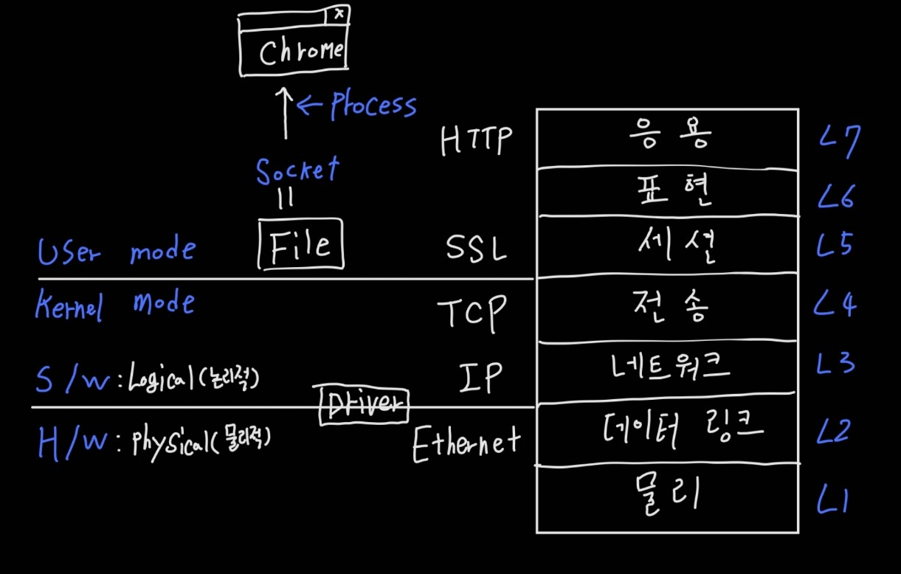
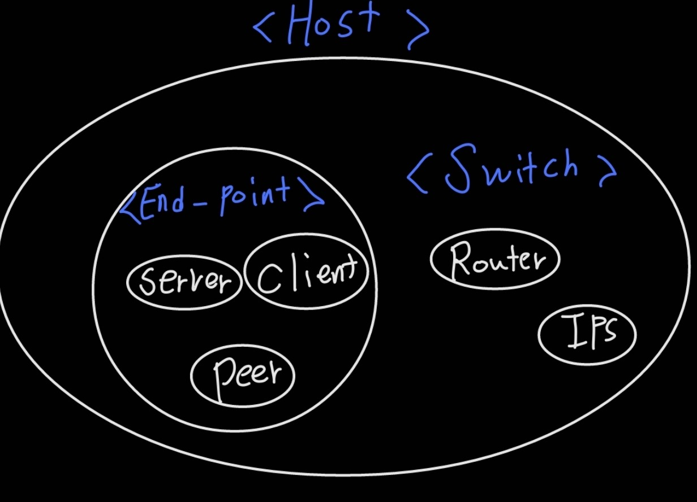
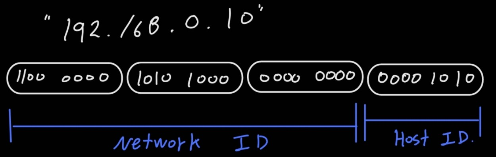
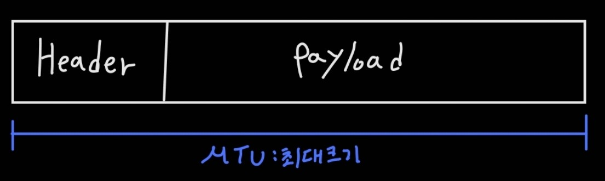
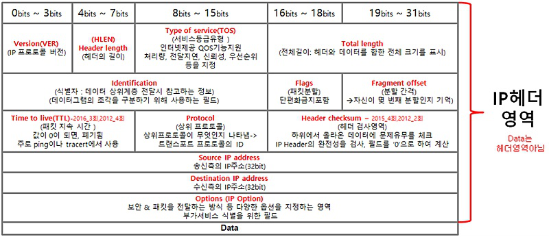
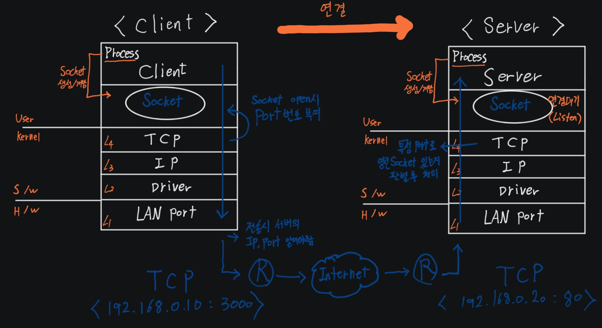
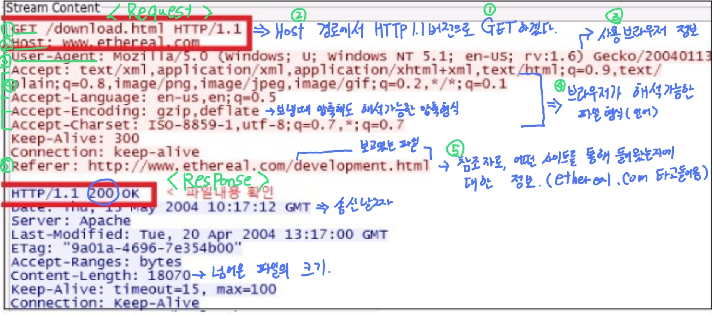

# 내용정리

---

>[외워서 끝내는 네트워크 핵심이론 - 기초](https://www.inflearn.com/course/%EB%84%A4%ED%8A%B8%EC%9B%8C%ED%81%AC-%ED%95%B5%EC%8B%AC%EC%9D%B4%EB%A1%A0-%EA%B8%B0%EC%B4%88)

# [컴퓨터 구조]

#### S/W : Logical

1. **User Mode**
   1. App
   2. L5 의 윗부분을 나타냄
   3. Socket 또한 여기 속하며, Socket은 File로써 Process 에 의해 열리고 닫힌다. 

2. **Kernel Mode** 
   1. System(OS)

#### H/W : Physical

1. NIC 같은 물리적 장치 등등...

# [OSI 7Layer]

#### Layered 

1. 층층이 쌓여있는 것으로, 상호간 의존관계로 되어있는 것을 뜻한다. 
2. 즉, 위에가 있으려면 무조건 밑에가 있어야함을 의미한다. ( 의존 관계!! )

#### 식별자

1. L2
   1. **Mac 주소** : NIC 식별자 
   2. 물리적 주소
   3. 48bit 주소체계 사용
2. L3 
   1. **IP 주소** : HOST 의 식별자 
   2. 인터넷 주소 
   3. 32bit 주소체계 사용 
3. L4
   1. Port번호 : 인터페이스(서비스, 프로세스)의 식별자 
4. **Socket** 
   1. socket은 File 이고, OS와 의사소통 하기 위한 Interface 이다. 
      1. 즉, **Socket은 User Mode의 Process(서비스)가 Kernel Mode(OS) 에 접근할 수 있도록 추상화한 인터페이스** 이다. 
   2. **socket을 열었다라는것은 File을 열었다는 것이고, 여는 주체는 Process (Program) 가 된다.** 

#### 1.  물리 계층

1. HW
   1. NIC 같은 완전한 HW가 여기에 속한다. 
2. NIC 
   1. 네트워크 인터페이스 카드 (LAN 카드)
   2. NIC를 식별하기위한 것이 **MAC 주소** 이다. 

#### 2. 데이터링크 계층

1. HW와 SW의 중간
   1. Driver 가 여기에 속함 
2. Ethernet
   1. 유선 인터넷 

#### 3. 네트워크 계층

1. Internet 
2. IP

#### 4. 전송 계층

1. TCP
2. UDP

#### 5. 세션 계층

1. TLS ( SSL )

#### 6. 표현 계층

#### 7. 응용 계층

1. HTTP 

# [Host ]

#### 개념

1. Computer + Network 
2. 컴퓨터에 인터넷이 연결되어있으면 Host라고 한다. 

#### 구성

1. Switch
   1. 네트워크 그 자체를 이루는 host
   2. IP 가진 모든 컴퓨터 
   3. End-Point가 Switch 의 한 부분이다.
   4. Router, Tab, IPS
2. End-Point
   1. 단말기 ( End-Point + Computer )
   2. 네트워크 이용 주체 
   3. 즉, 인터넷을 통해 이용되는 주체 ( Server, Client, Peer 등등.. )

# [Switch ]

#### 개념

1. 현실의 **교차로**라고 생각하면 된다. 
2. 차량(Packet)이 출발지를 떠나 목적지로 향할때, 여러 교차로를 지나게 된다. 교차로마다 가야할 방향을 정해야 하는데, 이때 사용되는 개념이 Switch 와 Switching이다. 
3. 따라서 각 Layer 마다 Switch 라는 의미가 존재하며 해당 Switch의 역할은 `Interface 선택` 이다. 
4. 이때 Switch는 각 계층마다 `Interface`가 의미하는게 다르다. 
   1. L3 Switch는 Router 의 역할로, 경로 선택을 의미하며 
   2. L2 Switch는 Mac주소 선택의 의미를 가진다. 
5. 비용 (Matric)
   1. 라우팅할 때 Matric 값을 사용하게 되는데, 이때 Matric 이 낮을 수록 좋은 성능을 뜻한다. 

# [NIC ( Network Interface Card )]

#### 개념

1. LAN 카드 라고도 한다. 
   1. 하지만 NIC(닉) 이라고 많이 말함 
2. NIC은 H/W 로**, MAC 주소**를 가진다. 
   1. 즉, **NIC만큼의 Mac 주소가 부여**된다. 

#### 네트워크 규모

1. LAN은 "**네트워크 규모**" 중 하나이다. 
2. 규모중 가장 작은 범위가 LAN이다. 
3. LAN
   1. OSI 의 L1, L2 인 H/W
4. WAN
   1. OSI 의 L3 이상인 S/W

#### NIC 표기법

1. PC에 **검은점과 선**으로 표시한다. 

# [L2 Access Switch] 

#### 개념

1. End-Point 와 직접 연결되는 스위치이다. **(Network Access계층**에서 사용)
2. L2 스위치는 MAC 주소를 가지고 스위칭 한다. 

#### 연결 확인

1. 주황 LED
   1. 연결에 이상있음 (**LINK-DOWN**)이라고함 
2. 녹색 LED
   1. 연결 정상 (**LINK-UP**) 이라고함 

#### L2 Distribution Switch 

1. L2 Switch를 위한 "고성능 스위치" 를 뜻한다. 
2. 대부분 VLAN 기능을 제공한다. 

# [Broadcast ]

#### 개념

1. "방송"의 뜻을 가지며 로컬랜 상에 붙어있는 모든 네트워크 장비들에게 보내는 통신
   1. 즉, "1 : 전체"  라고 생각하면 된다. 
2. 따라서 브로드캐스트를 남발하면 범위안의 네트워크가 엄청 느려져 재기능을 하지 못한다. 
   1. 브로드캐스트 도매인 범위 설정으로 해결가능 

#### 예시

1. 1번 PC의 IP 주소가 "192.168.0.10/24" 인경우, Broadcast 주소는 "192.168.0.255" 이다. 
   1. 이때 Broadcast 주소를 목적지로 하면 1 ~ 6 번 PC 뿐만 아니라 Gateway 까지 전부다 신호를 보내게 된다. 
2. Host IP 의 범위는 Net ID 와 Broad ID 를 제외한 1 ~ 254이다. 
   1. 이때, 1~254 중 1번 IP는 Gateway에 주로 사용되며, 중간 Switch에도 IP가 부여되 대략 250 개의 Host IP 를 사용할 수 있다. 

# [가상 머신]

#### 개념

1. Virtual Machine 으로, H/W를 S/W 로 구현한것
   1. CPU = Machine 이라 부르고, Vertual 은 Logical 한 S/W를 뜻함
   2. 따라서 S/W를 이용해 CPU를 구현한 것이다. 

# [IPv4]

#### IP

1. Host를 식별하는 네트워크 주소이다. 
2. Network ID와 Host ID로 나뉜다. 

#### 구조

1. Network ID
   1. 배송시 사용되는 주소지로 예를들면, 시, 구, 동 같은 큰 범위를 나타내는 "물류센터" 이다. 
2. Host ID 
   1. 개별집을 구분하는 "개인컴퓨터" 이다. 

# [Packet ]

#### 개념

1. L3 = IP = Packet 
2. 하나의 조각을 뜻하며, 기본 크기는 1500Bytes (1.4KB) 이다. 
   1. 즉, 데이터 덩어리가 분할된 Segment 하나가 포장된 형태를 **Packet** 이라고 부른다. 

3. 기본크기 
   1. Packet : **MTU** ( Maxium Transmission Unit ) => 1500 Bytes
   2. Segment : **MSS** ( Maxium Segment Size ) => 1460 Bytes 

4. 분할 
   1. MSS 는 MTU 보다 크기가 작다. 
   2. 만약 Socket의 Stream 데이터가 MSS 보다 크다면 이때 데이터의 "분할" 이 일어난다. 
   3. **일정 크기의 MSS 로 잘라서 Internet 에서 MTU의 사이즈로 통신하게 된다.** 

#### 구조

1. Header 
   1. **출발지(Src), 목적지(Dst)**
2. Payload
   1. 데이터 

# [캡슐화 ( Encapsulation )]

#### 개념

1. 내용물을 포장(캡슐화) 하는것을 뜻한다. 
   1. 내용물을 푸는것은 "Decapsulation" 이다. 
   2. 즉, 하나의 데이터 덩어리(Header + Payload)를 포장하는 것이 캡슐화이다. 
2. 단위화
   1. 데이터를 포장한다는 것은 "단위화" 한다는 것이다. 

3. 주로 Encapsulation은 송신측에서 일어나고, 수신측에서는 Decapsulation 이 일어난다. 
   1. 송신 : 데이터를 분할 후 포장
   2. 수신 : 포장된 데이터를 분해 

#### 전송 

1. packet으로 포장된 데이터는 Dst 인 목적지 정보를 이용해 찾아간다. 
2. 라우팅에 의해 목적지까지 도달한 Packet은 해당 PC의 특정 서비스로 보내져야한다. 
3. 이때 PC의 특정 서비스로 갈때 사용되는 정보가 "Port 번호"이다. 

#### 구조

# [TCP/IP 송수신]

##### 1. copy

1. 서버의 DB로부터 **원본 파일을 복제**한다. 
2. Program의 Buffer에 복제 파일을 넣는다. 

##### 2. send / Recive

1. 운영체제의 입출력을 하기 위해 **`Socket I/O의 Buffer`에 적제**한다. 

##### 3. 분해

1. `Buffer`에 **적제된 내용**을 잘게 **분해**한다. 
2. 이때 데이터 덩어리가 `Segment` 라는 조각으로 분해된다. 

##### 4. 포장

1. 분해된 **`Segment` 조각**을 네트워크 전송을 위해 **포장** 한다. 
2. 이때 포장된 **Segment 조각 하나를 Packet** 이라고 한다. 

##### 5. 운송

1. **하나의 `Packet`을 네트워크를 통해 `Frame`화 시켜 전송**한다. 
2. `Frame`은 유통과정(네트워크)에서 수시로 택배차를 갈아탄다. 
3. 이때 `Packet`은 순서대로 보내지며, 일정량을 보내고 나면 ACK 을 받을때까지 `wait` 상태로 대기한다. 
   1. 만약 수신측의 `여유공간(Window Size)` 이 없는경우에도 `wait` 상태로 전환되어 더이상 데이터를 전송하지 않는다. 

##### 6. 배송

1. 전송된 `Frame`을 받아 `Packet`의 형태로 전달받는다. 

##### 7. 포장해제 

1. 포장된 `packet` 안에있던 `segment` 를 꺼낸다. 
2. 여기서 Network 가 잘 받았다는 **ACK 신호를 송신측에 전송**한다. 
   1. 운영체제(L3) 에서 잘 받았다는 신호를 보낸다. 
   2. 이때 **`ACK + 여유공간`** 에 대한 정보를 전송한다.
   3. 예를들어, `ACK #3` 의 신호를 송신측으로 보내면 송신측은 `ACK #2` 까지의 데이터가 잘 갔다고 판단하고 3번 데이터부터 전송하는데, 이때 같이온 `여유공간` 정보를 토대로 `wait` 할것인지 `send` 할 것인지를 결정하게 된다. 
3. **Network 장애**
   1. 여기서 Network 에 대한 장애가 발생할 수 있다. 
   2. Loss ( 유실 )
      1. Frame 전송시 데이터가 유실되는 경우 발생
      2. 무조건 Network 상의 문제이다. 
   3. Re-Transmission
      1. 송신측으로 Ack 이 안오는 경우 발생
      2. Packet을 재전송 하게되는데, 이때도 `Ack-Duplication` 에러가 추가적으로 발생할 수 있다. 
      3. 무조건 Network 의 문제이다. 
   4. Out Of Order
      1. 패킷의 전송 순서가 잘못된 경우 발생 
      2. Network 문제 
      3. 예를들어, `3번이 안오고 4번이 도착한 경우` OR `4번이 오고 3번이 뒤늦게 온 경우` 
   5. Zero Window 
      1. Network 가 `Process 의 Buffer`를 비워내는 속도보다 빨라서 `I/O Buffer` 에 Full 이 일어난 경우
      2. 즉, 여유공간이 없어 송신측에서 데이터 보내도 처리 못하는 경우
      3. End-Point 의 App(Program) 문제

##### 8. 채움

1. 전송받은 `Segment` 를 Socket I/O 에 순차적으로 적제한다. 
2. I/O Buffer에는 계속 "**채움**" 이 일어나게 되는데, Network 성능에 따라 속도차가 생기게 되므로 항상 **여유공간** 을 계산하게 된다. 
3. **여유공간(Window Size)** 은 `I/O Buffer` 에서 관리되며, 일정량의 `Segment`가 조립되면 `Process Buffer` 로 올리게 된다. 
4. I/O Buf 에 쌓는것은 운영체제의 TCP 가 쌓아준다. 

##### 9. Read / Recive

1. `Program의 Buffer` 에 데이터를 적제한다. 
2. 해당 `Buffer`는 개발자가 용량을 정할 수 있다. 

##### 10. 비움 

1. `Process Buf` 에서는 계속해서 **비움** 이 일어난다
   1. "**비움**" 은 Program에 데이터를 사용하는 것을 뜻함

# [IPv4 Header 형식 ]

1. Version
2. IHL ( Internet Header Length )
   1. 기본적으로 Header 20Byte + Payload 1480Byte  = 1500Byte 이다. 
3. TOS
4. Total Length
   1. 2의 16승 = 65515Byte = 64KB 
5. Identification
6. Flags + Fragment Offset
   1. 단편화 정보로, Packet 자르는 경우 사용 
7. TTL 
   1. 홉 단위로 네트워크 지날때마다 줄어들고 모두 사용되면 사라진다. 
   2. 즉, TTL 다 사용할때까지 목적지 찾지 못하면 소멸 
8. Protocol
   1. 프르토콜 별 번호로 표기됨 (TCP : 6)
   2. Payload 안에 다음 Header 가 오는데, 그게 어떤 값이냐에 따라 Payload 해석이 달라짐 
9. Header Checksum 
10. 출발지 & 목적지 주소
11. Option
12. Data

# [인터넷 통신]

### 개념

1. 인터넷은 **라우터의 집합체**이며, **논리 네트워크** 이다. 
   1. 즉, "라우터 + DNS " 이다 

### 사용되는 개념 

#### 1. TTL

1. 라우터를 지날때마다 Hoc(홉) 수가 줄어들고, 만약 hoc 수가 0이되면 해당 패킷은 소멸하게된다. 
2. 소멸시 송신측에 알려주는 라우터도 있고, 그대로 소멸하는 라우터도 있다. 

#### 2. 단편화 

1. 분할
   1. MTU 의 크기 차이로 인해 발생한다. 
   2. 즉, Packet의 크기가 1500Byte인데, 특정 라우터의 MTU 가 1400Byte 라면 단편화가 발생한다. 
   3. MTU 가 1400Byte인 경우 = VPN

2. 조립
   1. 단편화가 일어난 Packet은 L3(IP Protocol) 을 만나 다시 조립된다. 
   2. L4로 올라가면서 분할된 payload를 합쳐 Segment를 꺼내게 된다. 

#### 3. DHCP

1. IP 주소 + Subnetmask + Gateway 주소 + DNS 서버 주소 를 자동( Dynamic ) 으로 설정해준다. 
2. 인터넷 설정
   1. PC의 인터넷 설정에서 DHCP 가 사용된다. 
   2. IP주소, SubnetMask, Gateway IP주소, DNS 를 설정할 수 있는데, 이때 DNS 만 L3가 아니다. 
   3. `자동으로 IP or DNS 주소 받기` 가 DHCP를 사용하는 것이다. 

3. Dynamic이란 네트워크에서는 Runtime과 같다. 
   1. Runtime = Host가 작동중에 **서버가 클라이언트에게 IP 주소를 알려준다.** 
4. 동작과정 
   1. Runtime
      1. 특정 PC 의 전원이 켜진다. 
   2. DHCP 설정 유무 파악
      1. 만약 네트워크 설정이 "자동" 으로 되어있다면 DHCP 를 이용하게 된다. 
      2. "수동" 설정이라면 설정한 IP, Subnetmask, DNS, Gateway IP주소를 사용한다. 
   3. Gateway 정보
      1. Gateway 정보를 받아오는데, 이때 GW의 IP 주소만 받고 Mac 주소는 받지 않는다. 
      2. 왜냐하면 ARP 프로토콜 이용해 GW의 IP 주소를 가지고 Mac 주소 알 수 있기 때문에 
   4. **Brodcast 전송**
      1. DHCP 설정시 **Broadcast 를 날려 DHCP Server를 찾게**된다. 
      2. 이때 Broadcast 의 신호는 자신의 네트워크 풀 즉, 외부 네트워크가 아닌 내부망 으로만 신호를 보낸다. 
      3. DHCP Serever만 응답하고, 나머지 PC는 신호를 받지만 응답하지 않는다. 
   5. DHCP 에서 네트워크 설정 제공
      1. DHCP는 `IP Pool `이라는 저장공간을 가지고있어, 내부망의 IP 주소를 관리하고 있다. 
      2. 여기서 연결된적이 있는지 유무 파악 후 연결된 적이 있으면 동일 네트워크 설정을 제공하고, 처음 연결이라면 새로운 네트워크 설정을 제공한다. 
      3. 이때 제공되는 네트워크 정보는 "IP, Subnetmask, DNS, Gateway IP주소" 이다. 

#### 4. ARP ( Address Resoultion Protocol )

1. IP 주소를 이용해 Mac 주소를 알아낼때 활용되는 프로토콜  
   1. **통신은 L3 수준에서 Internet을 이용해 서버의 L3 로 이어진다. 이때 L2 인 Mac 주소는 서버와 통신시 알필요가 없다.** 
   2. L2 수준은 Local 망으로, GW , 라우터 등의 주소에만 사용된다. 

2. 보통 PC 를 부팅하면 Gateway(공유기) 의 Mac 주소를 찾는다. 
   1. **왜냐하면 네트워크를 이용하기 위해선 무조건 Gateway를 거쳐야하기 때문이다.** 
   2. 이때 Mac 주소를 찾는 프로토콜이 ARP 이며 Request 인 IP 를 통해  Gateway의 Mac 주소를 Reply 받는다. 

#### 5. 네트워크 통신 구조 

1. 네트워크 연결 
   1. 네트워크 사용시 Gateway의 IP주소 이용해 Gateway의 Mac 주소를 얻어옴
   2. 대부분 이전에 네트워크 연결이 있다면 Host 에서 Cache로 Gateway Mac 주소를 가지고있음
2. Naver 로 접속 요청 
   1. naver 의 IP 가 3.3.3.3 이라면, Host는 **Frame Header**에 Dst(목적지) 와 Source (출발지) 주소를 설정한다. 
3. Host 주소 설정 
   1. **(중요!!)**Frame Header에 **목적지 Mac 주소**는 Naver의 Mac 주소가 아닌 **Gateway의 Mac 주소**이다. 
   2. 왜냐하면 Gateway가 인터넷과 직접 통신하기 때문에 Host는 Gateway로 보내야함 
   3. 그렇게 **Dst , Source 에 Mac과 IP 가 설정되어 Gateway를 통해 외부**로 나간다. 

#### 5. ping 과 RTT 관계 

1. Ping
   1. 유틸리티( 측정 도구 )
   2. RTT를 측정하기 위한 가장 기본적인 툴 
   3. 특정 Host에 대한 RTT 를 측정할 목적으로 사용됨 
   4. 동작 방법
      1. `Echo Request` 를 송신측으로 전송 ( 내용물은 그냥 `ABCDE....` 같은 문자열)
      2. 받은 곳은 `Echo Reply` 를 날려 응답 ( 내용물은 Request 한것과 동일한 내용 )
2. RTT ( Round Trip Time )
   1. **Ping 으로 소요된 시간** 
   2. 즉, 클라이언트 요청 후 서버의 응답을 받은 전체 시간을 뜻한다. 
   3. **ICMP 프로토콜** 사용함 
   4. Dos 공격용으로 악용되기도 한다.   

#### 6. TCP와 UDP

1. TCP
   1. 연결지향 (순서번호)으로, `논리적` 이다 
   2. `TCP Connection , TCP Session, Vertual Circuit` 으로 불린다. 
   3. 연결 + 상태(전이) 개념이 붙어다님 
   4. L4 수준의 식별자는 **Port 번호** 이다. 
   5. "Port 번호" == "서비스 식별자"
2. UDP

# [TCP]

### 1. TCP 통신과정 (논리적 연결)

1. Server Socket Open
   1. 서버는 Process 에 대한 Socket을 특정 Port 를 통해 Open 해놓는다. 
   2. 이때 연결하는것이 아닌 "**연결대기**" 상태로 Client 요청을 기다린다. 
2. Client Socket Open
   1. Process가 통신할 수 있는 **Socket을 Open**한다. 
   2. Process 마다 PID 있어 **PID 가진 Process 가 Socket을 Open** 한다.
3. TCP Port 번호 생성 
   1. 운영체제는 Open 된 Socket에 **"TCP Port "**번호를 Process에게 부여한다.
   2. 이때 Process에 설정해놓은 Port 가 없으면 아무 남는 Port 를 제공한다. 
   3. 즉, Port는 인터넷 연결하기 위한 하나의 구멍이라고 생각하면 된다. 
4. 연결
   1. `192.168.0.10:3000` Client는 Port 번호를 통해 Server와 연결을 시도한다. 
   2. **서버에 접속하기 위해선 서버의 IP와 접속 가능한 Port** 를 알아야 한다. 
5. Server 접속
   1. 연결 요청이 Server의 `192.168.0.10:80` 으로 들어온다. 
   2. 이때 Server에 특정 Port가 존재한다면 **Socket 을 통해 데이터를 Client로 전달**한다. 
   3. 하지만 요청한 Port 가 Server에 없다면 **운영체제의 TCP 부분에서 해당 Port로 열려있는 Socket 이 없다고 Cient에게 Response** 한다. 

### 2. TCP 연결과정 (  3-way handshaking )

1. TCP 의 연결 = **정책을 교환하는 것**
   1. **정책 = "Sequence number" + "MSS(Maxium Segment Size)"**
2. TCP연결은 **논리적 연결**이다. 
   1. 직접 LAN 선같은걸로 연결하는것이 아닌 인터넷을 통한 연결이다. 
   1. **연결시 SRTT 값을 계산**해 평균 대기 시간을 설정해 놓는다. 
3. 시퀸스 번호 교환
   1. 클라이언트와 서버는 연결시마다 달라지는 값인 "Sequence Number" 를 각각 가지고 있다. 
      1. 연결 끊기면 다른 시퀸스 넘버로 변경됨 
   2. 만약 클라이언트가 `1000 의 시퀸스 번호`를 가진다면, 연결시 서버로 1000의 시퀸스 번호를 보낸다. 
   3. 서버는 잘 받았다는 의미로 `"자신의 시퀸스 번호 + 상태 시퀸서 번호 + 1"` 을 보낸다. 
      1. `+1` 의 의미는 해당 시퀸스 번호에 대한 잘 받았다는 의미이다. 
      1. 여기서 TCP 연결이 착각이라는 것을 알 수 있다.
      1. **이유는 서버로부터의 `SYN + ACK`은 클라이언트가 보낸 `SYN` 만 알 수 있다면 누구나 해당 컴퓨터와 TCP 연결이 가능하다는 것을 뜻하기 때문이다.** 
4. 상태
   1. SYN_SENT : 연결 요청 
   2. Establish : 연결완료 

### 3. TCP 연결 종료 ( 4-way handshaking)

1. 과정
   1. Client 가 `FIN + ACK` 을 보내고 `FIN + ACK` 응답을 기다린다. 
   2. Server는 `ACK` 를통해  알겠다는 응답을 한다. 이때 Client는 `FIN + ACK` 을 받지 못했기 때문에 `FIN_WAIT` 상태로 대기한다. 
   3. Server 가 연결을 끊자는 신호인 `FIN + ACK`  를 Client 에게 보낸다.
   4. Client는 해당 신호를 받으면 **`TIME_WAIT`** 상태가 되고, 일정 시간이 지나면 `CLOSED` 상태가 되서 Socket이 회수된다. 
      1. **` TIME_WAIT` 가 발생하면 일정시간 Socket이 낭비되기 때문에 Server는 자신이 연결을 끊지 않고 Client 에게 부탁해서 끊게 만들어야 한다. 이때 사용되는것이 App 프로토콜 이다.** 
   5. 즉, `FIN + ACK` 을 보내면 `FIN + ACK` 을 기다린다. 
2. **`TIME_WAIT`** 는 "연결 최종 완료 전" 에 발생한다. 
   1. `TIME_WAIT` 가 발생했다는 것은 Server가 연결을 끊자고 한것이다.
   1. 마지막 ACK을 보내면 연결 끊김
3. `CLOSED` 상태가 되면 Socket(자원) 이 회수된다. 
   1. 따라서 클라이언트 측에서 연결을 끊게 유도해야 한다. 
   2. 서버에에서 `TIME_WAIT` 가 발생하는것을 방지하기 위해서 

# [DNS]

1. 분산 구조형 데이터 베이스 이다. 
   1. 도메인의 네임서버 및 도메인 데이터는 해당 관리주체에 의해 독립적으로 관리됨 
2. 도메인 네임 
   1. Domain : 영역, 영토를 의미
   2. 생성된 도메인 네임은 **언제나 유일 하도록 네임체계가 구성됨** 
   3. 즉, naver.com 라는 도메인 네임은 유일하다. 
3. 도메인 캐시
   1. 도메인 네임과 IP 에 대한 정보를 항상 DNS 에 묻기보단 PC에 저장해놓고 라우팅함  
   2. 즉, User가 www.naver.com 을 썼다면, 해당 도메인 네임에 대한 IP 를 처음에만 DNS 에서 받아오고 그 다음부터는 DNS 캐시에 저장한다. 

# [URI 와 URL ]

#### 1. URI

1. Uniform Resource Identifier ( 자원 식별자 )
2. Resource 는 자원으로, 하나의 File이라고 생각하면 된다. 
3. URL 은 URL 에 포함되어있다. 

#### 2. URL

1. Uniform Resource Locator ( 자원 위치/경로 )

#### 3. 형태 

1. 구조
   1. `Protocol://Address:PortNumber/Path(or filename)?Parameter=value&Parameter...`
   2. `https://www.naver.com/course.do?cmd=search&search_keyword=Test`
   3. `www.naver.com` 은 Domain Name으로, Host 에 대한 주소가 된다. 웹 통신은 거의다 Port를 80 으로 사용하기 때문에 생략이 가능하다. 
   4. `Path`는 File의 경로를 나타낸다. 
   5. `Parameter=value` 는 전송되는 데이터이다. 

# [HTTP 문서]

# 웹 서비스 

1. Resource
   1. HTML 문서 
   2. 자원으로, 서버에 저장되어있는 문서를 뜻한다. 
2. 브라우저 기능
   1. 구문분석기 (Parser)
      1. Text, Tag 등 html 파일의 구문을 분석하기 위한 기능 
      2. HTML, CSS, JavaScript와 같은 다양한 언어로 작성된 웹 페이지를 받아들인다. 
   2. 렌더링 엔진
      1. HTML과 CSS를 해석해 브라우저 화면에 웹 페이지를 렌더링하는 역할
      2. 렌더링이란, 브라우저가 웹페이지의 코드를 기반으로 화면에 정보를 시각적으로 나타내는 과정을 의미한다.
   3. Javascript 엔진
      1. 웹 페이지 내의 JavaScript 코드를 실행하는 역할
      2. 동적인 화면을 위해 필요
3. Javascript
   1. 발전 순서
      1. 정적 HTML 문서를 동적으로 바꾸기 위해 `Mocha script  => Live script => Javascript ` 순으로 발전해왔다.
   2. 실행
      1. 서버에 있는 파일이지만, 실행은 클라이언트 측에서 이루어진다. 
      2. 즉, **클라이언트로부터 CRUD 요청을 받은 서버는 Json, XML 같은 자료 데이터만 넘겨준다.** 
      3. 그다음 클라이언트는 자료와 JS 파일만 받아 실행하는 구조이다. 
         1. 정적인 html 파일을 js가 동적으로 변경하는 역할을 한다. 
   3. 변환
      1. 서버로부터 Data 를 Response 받으면 클라이언트에서 JS를 통해 "동적" 인 문서로 변환된다. 
      2. 이렇게 **"동적" 인 문서로 변환**되는것을 도와주는 것이 **Javascript Framework 인 `React.js` 와 `Vue.js`** 이다. 
4. Spring 
   1. Framwork로, JSP 와 관련된 개념이다. 객체의 생성, 소멸 등 처리를 사용자가 아닌 Spring 이 해준다. 
      1. 만약 사용자로부터 Request가 발생했을 때, 특정 메소드가 실행되야 하는데 Spring 이 필요한 메소드만 메모리에 올리고 나머지는 만들지 않는다. 이렇게 객체의 생성 , 소멸등을 Spring이 관리한다. 
   2. 따라서 Spring Framwork는 **WAS** 이다. 
5. 상호작용
   1. 웹은 클라이언트와 웹서버간 상호작용에 의해 동작한다. 
   2. 상호작용은 "상태전이" 라는 개념과 항상 함께 사용된다. 
   3. HTTP는 Stateless 이기 때문에 "상태전이"를 저장할 방법이 필요하다. 
      1. "상태전이" 를 기억하기 위해 Cookie와 Session이 사용된다. 
6. Cookie 
   1. **상호작용에 의한 기억의 부산물** 
7. APM 
   1. Application Performence Management
   2. 응답시간을 모니터링하는 도구로, JVM을 모니터링하고 수치로 나타내준다. 
      1. Scouter 가 대표적인 예이다.
8. JVM 
   1. User Mode 부분의 App 에다가 S/W 형태로 CPU 를 구현한 것 이다. 
      1. **Java 기반의 S/W 로 구현된 CPU** 
   2. Java + Virtual + Machine
      1. S/W = Logical = Virtual 
      2. H/W의 CPU  = Machin
9. 데이터 검증
   1. 클라이언트의 입력은 무조건 **"검증 대상"** 이다. 
   2. 따라서 JS 로 간단한 Validation 체크를 하고, 
