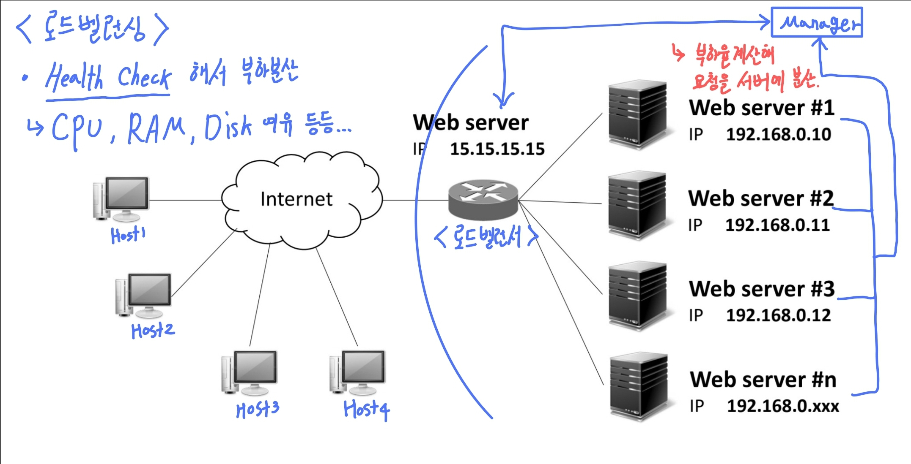

# 로드벨런싱

## 개념

1. L4 Switch를 이용해 서버의 부하를 계산해**(Health Check)** 부하를 분산시켜주는 것 
2. 즉, 여러 Host가 Web Server에 접속했을 때, 로드벨런서가 여러대의 Web Server로 요청을 분산시켜 처리함

## GSLB (Global Server Load Balancing)

1. 대규모 부하분산을 위해 DNS 체계를 활용하는 구조 
2. 부하율 + 지리적 위치 
   1. 로드벨런싱인 L4 Switch 에서 지리적 위치까지 고려해야 한다. 
   2. 즉, 접속하는 클라이언트의 지리적 위치에 따라 다른 서버에 접속이 된다. 
   3. 지리위치는 IP 주소를 이용해 파악한다. 
   4. 각각의 서버간 동기화는 **CDN(content Delivery Natework)** 을 통해 이루어진다. 

