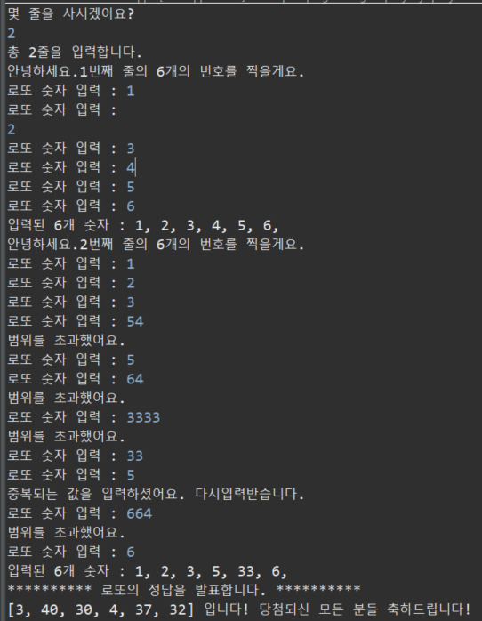
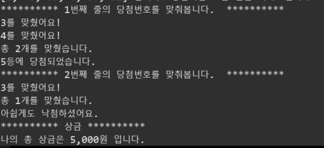

# LotteGame_WonYoung
---

> 직접 로또 게임을 만들어 본다. 
>
> 랜덤으로 6개의 숫자가 지정되고, 사용자가 입력하는 6자리의 숫자를 이용해 등수를 나누고 상금을 지급받는다. 
>
> 이때, 사용자는 몇줄을 살지 정할 수 있다. (1줄을 사면 총 6자리의 숫자를 입력받는다. )
>
> 

1. Lotte Game을 만드시오.

   1. 1~45까지의 숫자중 중복되지 않은 6개의 숫자를 배열에 저장 출력한다.

   2. 로또 맞출 숫자 6번 입력받는다.
     2-1. 입력된 값은 중복시 다시 입력받는다.
     2-2범위에 벗어난 값은 다시 입력받는다.

   3. count 변수 선언 -> 몇개 맞췃는지

   4. 각 등수 별 맞춘 숫자의 개수를 장하여 출력 한다

      | 1    |   |
      | ---- | ---------------------------------------------- |
      | 2    |  |

      

   

   ​	