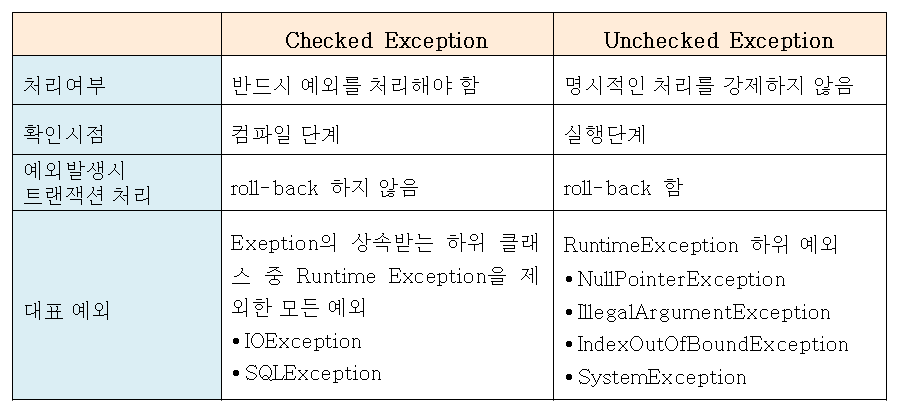

# Ckecked Exception  VS upChecked Exception 

---

>[참고 사이트1](https://devlog-wjdrbs96.tistory.com/351)
>
>[참고 사이트2](https://steady-coding.tistory.com/583)

### 1. Checked Exception

- 체크 예외라고도 하며 , **명시적인 예외 처리를 강제**하여 반드시 예외처리가 필요하다. 
- 즉, **컴파일**(자바 컴파일러가 자바 소스 컴파일)시점에서 예외가 발생해 개발자가 소스코드를 작성할 때 체크를 할 수 있다. 
  - 런타임(실행시점) 에서 발생하는 에러가 아니다. 
  - 컴파일 과정을 통해 컴퓨터가 인식 가능한 기계어코드로 변환
- RuntimeException 을 **제외한 모든 예외**
  - 개발자의 실수가 대부분인 예외로, 예를들면 클래스 이름 잘못 입력이 있다. 

### 2. UnChecked Exception

- 명시적인 **예외 처리를 강제하지 않는 예외**처리 방식으로, **런타임**(컴파일 과정을 마쳐 실행될 때) 시점에서 발생할 수 있는 에러를 처리한다. 
- 즉, 컴파일러에 의해 처리될 수 없는 예외들로써 개발자가 try catch 나 throw,throws 로 예외처리를 해야한다. 
- **RuntimeException의 하위 클래스**들을 의미
  - 대표적으로 **NullPointerException** 이 있음 

### 비교

