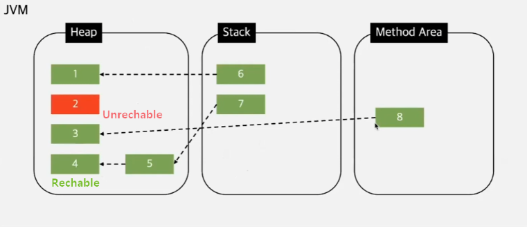

# Garbage Collection ( GC )

---

>[참고 사이트1](https://inpa.tistory.com/entry/JAVA-%E2%98%95-%EA%B0%80%EB%B9%84%EC%A7%80-%EC%BB%AC%EB%A0%89%EC%85%98GC-%EB%8F%99%EC%9E%91-%EC%9B%90%EB%A6%AC-%EC%95%8C%EA%B3%A0%EB%A6%AC%EC%A6%98-%F0%9F%92%AF-%EC%B4%9D%EC%A0%95%EB%A6%AC)

## GC

### 정의

1. 자바의 메모리 관리 방법 중의 하나로 JVM(자바 가상 머신)의 Heap 영역에서 **동적으로 할당했던 메모리 중 필요 없게 된 메모리 객체(garbage)를 모아 주기적으로 제거하는 프로세스**를 말한다.
2. 즉, Heap 영역은 가비지 컬렉션의 대상이다. 

### 장점

1. C나 C++에서는 이러한 가비지 컬렉션이 없어 프로그래머가 수동으로 메모리 할당과 해제를 일일이 해줘야 한다.
2. Java는 **JVM에 탑재**되어 있는 가비지 컬렉터가 **메모리 관리를 대행**해주기 때문에 개발자 입장에서 **메모리 관리, 메모리 누수(Memory Leak) 문제**에서 대해 완벽하게 관리하지 않아도 되어 **오롯이 개발에만 집중**할 수 있다는 장점을 가진다. 

### 단점

1. Stop-The-World (STW )
   1. GC를 수행하기 위해 JVM이 프로그램 실행을 멈추는 현상
   2. GC가 작동하는 동안 GC 관련 Thread를 제외한 모든 Thread는 멈추게 되어 서비스 이용에 차질이 생기게 된다. 
2. 메모리가 언제 해제되는지 정확하게 알 수 없어 제어하기 힘들다. 
3. 가비지 컬렉션(GC)이 동작하는 동안에는 다른 동작을 멈추기 때문에 오버헤드가 발생된다. 

### 동작방법

1. **Reachable** 과 **Unreachable** 의 상태가 존재하는데, 해당 상태는 GC 판단하는 것으로 Unreachable  이라면 Heep 영역에서 제거 대상이 된다. 
   1. Reachable : 객체가 참조되고 있는 상태
   2. Unreachable   : 객체가 참조되고 있지 않은 상태 (GC의 대상이 됨)
2. Reachable 과 Unreachable를 판단하는 방법은 다음과 같다 
   1. Mark
      1. Heep 영역을 순회하며 Stack 영역과 연결된 객체를 찾거나 참조된 **객체가 있는지 판별**한다. 
   2. Sweep 
      1. 참조하고 있지 않은 Unreachable 객체를 **Heap 영역에서 제거**한다. 
   3. Compact
      1. Sweep 후 분산된 객체들을 Heap 의 **시작 주소**로 모아 메모리를 압축한다. 

### Heap 영역 

1. Heap 영역은 `Young Generation` 과 `Old Generation` 으로 나뉜다. 
2. **Young Generation** ( Minor GC )
   1. 새롭게 생성된 객체가 할당되는 영역 **( 짧게 살아남는 객체가 위치 하는 공간)**
   2. 대부분의 객체가 금방 Unreachable 상태가 되기 때문에, 많은 객체가 Young 영역에 생성되었다가 사라진다.
   3. Young 영역에 대한 가비지 컬렉션(Garbage Collection)을 Minor GC라고 부른다.
   4. 또 Young 영역은 3개의 구간으로 나뉜다. ( GC가 더욱 세부적으로 불필요 객체를 거르기 위해 )
      1. **Eden**
         1. new를 통해 새로 생성된 객체가 위치. 
         2. 공간이 다 차면 정기적인 쓰레기 수집 후 살아남은 객체들은 Survivor 영역으로 보냄
      2. **Survivor 0 / Survivor 1** 
         1. 최소 1번의 GC 이상 살아남은 객체가 존재하는 영역
         2. `Survivor 1`에서 살아남은 객체는 Age라는 값을 +1 하게 되고 Age가 증가한 객체는 다시 `Survivor 0 `로 이동한다. 
         3. 이때 Survivor 영역에는 특별한 규칙이 있는데, Survivor 0 또는 Survivor 1 둘 중 하나에는 꼭 비어 있어야 하는 것이다.
3. **Old Generation** ( Major GC )
   1. Young 영역에서 Reachable 상태를 유지하여 살아남은 객체가 복사되는 영역 **( 오래 살아남은 객체가 위치하는 공간 )**
   2. **Young 영역보다 크게 할당**되며, 영역의 크기가 큰 만큼 가비지는 적게 발생한다.
   3. Old 영역에 대한 가비지 컬렉션(Garbage Collection)을 Major GC 또는 Full GC라고 부른다.

|  GC 종류  |      Minor GC      |       Major GC       |
| :-------: | :----------------: | :------------------: |
|   대상    |  Young Generation  |    Old Generation    |
| 실행 시점 | Eden 이 꽉 찬 경우 | Old영역이 꽉 찬 경우 |
| 실행 속도 |      빠르다.       |       느리다.        |

