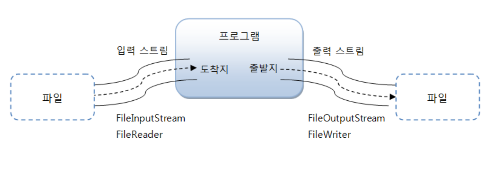

# 파일 입출력 개념정리 

---

>[참고 사이트1](https://www.tcpschool.com/java/java_io_stream)
>
>[학부 자바2 자료 참고 ](https://github.com/wonyoung0207/University-Programming-Classes/tree/master/Java2%20-%20%EC%96%91%EC%9D%80%EC%83%98)

## 스트림

### 정의

- 자바에서는 파일이나 콘솔의 입출력을 직접 다루지 않고, 스트림(stream)이라는 흐름을 통해 다룬다. 
- 프로그램이 주체로써 동작하며,
  - **파일로부터 데이터를 가져**와 프로그램에 쓰는 흐름이 "**입력 스트림**"
  - **프로그램에서 데이터를 입력**해 파일로 내보내는 흐름을 "**출력 스트림**" 이라고 한다. 

### 스트림 (Stream) 구조



- 실제의 입력이나 출력이 표현된 데이터의 이상화된 흐름을 의미한다.
  - 즉, 운영체제에 의해 생성되는 가상의 연결 고리를 의미하며, 중간 매개자 역할을 한다.
- Stream ( 입력 스트림 + 출력 스트림 )
- Java SE 8 버전부터 추가된 스트림 API와는 완전 다른 개념이다. 

### Java.io 패키지

- 해당 패키지에서 파일 입출력을 담당한다. 
  - 따라서 입출력에 관련된 모든 클래스들은 해당 패키지 안에 있다. 

- 종류
  1. File 클래스
  2. Console 클래스
  3. InputStream , OutputStream ... 등 byte단위 입출력 클래스
  4. Reader , Writer ... 등 문자단위 입출력 클래스 

### 입출력 스트림 종류

1. #### 바이트 기반 입출력
   
   - int, Byte 로 데이터를 변형해 입출력 진행하는 것 
   - 문자도 다 바꿔서 표현가능 
2. #### 문자 기반 입출력
   
   - 문자( char, String ) 로 데이터 입출력 진행하는 것
3. 따라서, 바이트 기반이 더 넓은 개념이다. 

#### 1. Byte 기반 입출력 

- 바이트 단위로 데이터를 읽거나 파일로 데이터를 저장할 때 사용
  - 모든 종류의 데이터를 파일 읽기 또는 저장 가능 

1. 상위 클래스 ( 실제로 데이터 주고받을 수 있는 스트림 )
   1. InputStream / OutputStream 

2. 하위 클래스 (실제로 데이터를 주고받을 수는 없지만, 다른 스트림의 기능을 향상시키거나 새로운 기능을 추가해 주는 스트림)
   1. FileInputStream / FileOutputSteam
   2. DataInputStream / DataOutputStream
   3. ObjectInputStream / ObjectOutputStream
   4. PrintStream
   5. BufferedInputStream / BufferedOutputStream


#### 2. 문자 기반 입출력

- 텍스트 파일로부터 문자 데이터를 읽거나 텍스트 파일에 문자 데이터 저장할 때 사용
  - 텍스트가 아닌 그림, 오디오 등의 파일은 읽을 수 없음 
- readLine() 이라는 메소드 사용하기 위해 사용됨
  - 한줄씩 읽어올 수 있음 


1. 상위 클래스 
   1. Reader / Writer

2. 하위 클래스
   1. FileReader / FileWriter
   2. InputStreamReader / OutputStreamWriter
   3. PrintWriter
   4. BufferedReader / BufferedWriter


### 바이트기반, 문자기반 입출력 구별방법

- 바이트 기반 : Input과 Output 이 붙은것 
- 문자기반 : read와 write 붙은것 
  - 따라서 read와 write 붙은거 빼고 다 바이트 기반이라고 생각하면 쉬움 

### File 클래스 (java.io 패키지에 속함)

- java.io 패키지에서 제공되는 클래스로, **파일 및 폴더 관련 정보를 제공**한다. 
  - 파일 크기, 속성, 이름, 생성정보, 삭제 , 디렉토리 생성, 디렉토리에 존재하는 파일의 리스트 등의 정보를 제공

- 파일 객체생성 방법

  ```java
  File file = new File("파일 생성 경로");
  ```

---

## Byte 단위 입출력 스트림

### 1. 출력 스트림

- OutputStream을 상속받아 만들어지며 데이터를 쓰고자할 때 사용한다. 

#### 사용 가능한 메소드

1. write()
   - 바이트단위로 값을 출력한다. 
   - 매개변수로 오는 값에 따라 출력하는 바이트의 양이 달라진다. 
     - 1byte 출력
     - 배열의 모든 바이트 출력
2. flush()
   - 출력 버퍼에 잔류하는 모든 바이트를 출력한다. 
3. close() 
   - 출력 스트림을 닫는다. 

#### 사용방법

```java
OutputStream os = new FileOutputStream("C:/path/test.txt");

// 1. 1byte만 파일에 쓰기 
byte a = 10;
byte b = 20;
os.write(a); // 1byte 쓰기 
os.write(b); // 1byte 쓰기 

// 2. 배열 바이트만큼 쓰기 
byte[] arr = {10, 20, 30, 40};
os.write(arr); // 배열의 4byte를 모두 출력 
os.write(arr,0,2); // 배열의 0번부터 2번까지만 출력 -> 3byte 출력 

os.flush(); // 출력 버퍼에 잔류하는 모든 바이트 출력
os.close(); // 출력 스트림을 닫음 
```

### 2. 입력 스트림 

- 파일로부터 데이터를 가져올 때 사용한다. 

#### 사용 가능한 메소드 

1. read()
   - 파일로부터 데이터를 읽어온다. 
   - 매개변수에 의해 가져오는 바이트 단위가 달라진다. 
     1. 1byte 씩 읽어온다.  ( 반복문 통해 계속 읽어올 수 있음 )
     2. 배열의 길이만큼 byte를 한번에 읽어온다. 
   - **더이상 바이트 읽을 수 없게되면 -1을 리턴한다.** 
2. close()
   - 파일 입력 스트림을 닫는다. 

#### 사용방법

```java
InputStream is = new FileInputStream("C:/path/test.text");

// 1. 1byte 씩 읽기 
while(true){
    int data = is.read(); // 1byte 읽어서 저장 
    if(data == -1){ // 반복문 돌면서 해당 파일의 모든 데이터 다 읽으면 -1 출력되서 해당 조건문 실행 
        break;
    }
    System.out.println(data);
}

// 2. 배열 길이만큼 한번에 출력 
byte[] buffer = new byte[100];

while(true){
    int readByteNum = is.read(buffer); // 한번에 100byte를 읽어옴 
    if(data == -1){ // 반복문 돌면서 해당 파일의 모든 데이터 다 읽으면 -1 출력되서 해당 조건문 실행 
        break;
    }
    for(int i=0; i<readByteNum; i++){ // 읽어온 바이트 만큼 for문돌려서 출력해줘야함 
        System.out.println(readByteNum[i]);
    }
}

is.close(); // 파일 입력 스트림 닫기 
// is.flush() 는 파일 출력시에만 사용한다. 
```

### 3. 보조 스트림 

- 대부분의 파일입출력은 보조스트림을 사용해 구현한다. 
- 보조 스트림이란 파일 입출력을 도와주는 스트림으로 성능향상에 도움이 된다. 
- 주 입출력 스트림을 매개변수로 가진다. 
  - 따라서 보조 스트림만 단독으로해서 사용하지 못한다. 

#### 3-1. BufferedInputStream / BufferedOutputStream

- 프로그램에서 전송한 데이터를 내부 버퍼에 쌓아두었다가 버퍼가 꽉 차면 한꺼번에 처리한다. 
  - 읽기 / 쓰기 속도 향상에 도움이 된다. 

#### 3-1.이용방법

- 그냥 BufferedStream 에 파일 스트림 넣어주기만 하면 된다. 
  - 사용법은 일반 파일스트림과 같음 

```java
FileInputStream fis = new FileInputStream("C:/path/test.txt"); // FileOutputStream도 사용법이 동일하다. 
BufferedInputStream bis = new BufferedInputStream(fis); // 매개변수로 파일 스트림을 가진다. 

while(true){ // 앞에 사용했던 방법과 동일하게 사용 
    int data = bis.read();
    if(data == -1){ // 반복문 돌면서 해당 파일의 모든 데이터 다 읽으면 -1 출력되서 해당 조건문 실행 
        break;
    }
    System.out.println(data);
}
```

#### 3-2. DataInputStream / DataOutputStream

- 기본타입 8가지(byte, char, short, int, long, double, float, boolean) 데이터를 입력할 수 있게 해준다. 
- 입출력 모두 데이터형을 맞춰줘야한다. 
  - 출력시 UTF 로 출력했다면 , 입력시 UTF로 받아온다. 

#### 3-2. 사용방법

```java
// 1. 데이터 출력 
FileOutputStream fos = new FileOutputStream("C:/path/test.text");
DataOutputStream dos = new DataOutputStream(fos);

dos.writeUTF("홍길동"); // UTF형 데이터로 출력
dos.writeDouble(96.6); // Double형 데이터로 출력
dos.writeInt(1); // Int형 데이터로 출력

dos.flush();
dos.close();


// 2. 데이터 입력 
FileInputStream fis = new FileInputStream("C:/path/test.text");
DataInputStream dis = new DataInputStream(fis);

// 꺼내올때 데이터 타입 저장 순서대로 저장되어있기 때문에 타입에 맞춰서 꺼내와야함 
String name = dis.readUTF(); // UTF형 데이터로 가져옴
double avg = dis.readDouble(); // Double형 데이터로 가져옴
int score = dis.readInt(); // Int형 데이터로 가져옴

dis.close()
```

---

## 문자 단위 입출력

### 사용 이유 

- **바이트 스트림에서 문자를 조금 더 편리**하게 출력하기 위해서 reader 와 writer 가 나옴 
  - byte는 1byte 씩 저장이 가능하지만, 
  - char는 2byte씩 가져올 수 있어 한번에 더 많은 양을 가져올 수 있다. 
- 사용하기 쉬운것이 바이트라 문자단위 입출력은 잘 사용하지 않는다. 
- 문자 단위의 파일에만 사용할 수 있다. 

### 사용방법

- 사용법은 Byte단위 입출력과 동일하다. 

```java
// 1. 파일 출력
FileOutputStream fos = new FileOutputStream("C:/path/test.txt");
Writer writer = new OutputStreamWriter(fos);

wrtier.write("문자열");
wrtier.flush();
wrtier.close();


// 2. 파일 입력
FileInputStream fis = new FileInputStream("C:/path/test.txt");
Reader reader = new InputStreamReader(fis);

char[] buffer = new char[100];// byte가 아니라 문자 단위로 꺼내옴 
int readCharNum = reader.read(buffer); // char형으로 꺼내와 200byte 읽어올 수 있음 
reader.close();

String data = new String(buffer, 0 , readCharNum); // char 배열에 읽어온것을 문자열로 변환 
```

### 라인단위로 읽고 쓰기 

- 문자 단위 보조 스트림을 사용하면 **한줄 씩 읽어오는것이 가능**하다. 

```java
Reader reader = new FileReader("C:/path/test.txt"); // 문자 기반 입력 스트림 
BufferedReader br = new BufferedReader(reader); // 보조 스트림 연결 

while(true){
    String data = br.readLine();// 한줄씩 읽어옴 
    if(data == -1) break;
    System.out.println(data);
}
```


