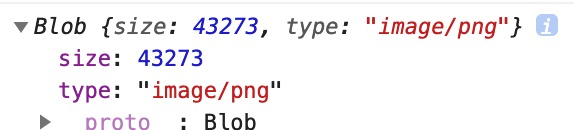
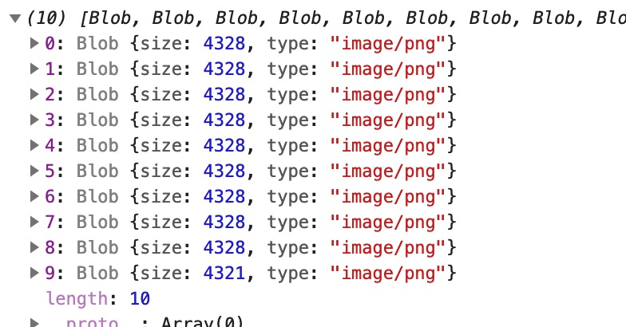

# Blob 을 이용한 파일 다운로드

---

>[MDN의 Blob 정의](https://developer.mozilla.org/ko/docs/Web/API/Blob)
>
>[참고 사이트1](https://medium.com/hcleedev/web-javascript-blob-%EC%95%8C%EC%95%84%EB%B3%B4%EA%B8%B0-9140146e87a8)
>
>[참고 사이트2](https://heropy.blog/2019/02/28/blob/)
>
>[참고 사이트3](https://m.blog.naver.com/PostView.naver?isHttpsRedirect=true&blogId=magnking&logNo=220950061851)

## 1. Blob ( 블랍 )

### 정의 

- **Binary Large Object**의 약자로, 바이너리 형태로 **큰 객체를 저장할때 사용**한다. 
  - 큰 객체라는 것은 주로 이미지, 비디오, 사운드 등과 같은 멀티미디어 객체들을 주로 가리킨다. 
- 다운로드라고는 하지만 서버에서 직접 다운로드를 받는 것이 아니라 **브라우저 상에 저장되어 있는 blob파일을 다운로드** 받는거라고 생각하면 된다

### 사용처

- 대개 데이터의 크기(Byte) 및 **MIME 타입**을 알아내거나, 데이터를 송수신을 위한 작은 Blob 객체로 나누는 등의 작업에 사용된다. 
- [File 객체](https://developer.mozilla.org/ko/docs/Web/API/File)도 `name`과 `lastModifiedDate` 속성이 존재하는 Blob 객체이다. 


## 2. Blob 생성

- Blob 생성자는 새로운 Blob 객체를 반환한다. 

- 생성 시 인수로 `array`와 `options`을 받는다. 

  ```js
  const newBlob = new Blob(array, options);
  ```

### array 

- Blob 생성자의 첫번째 인수로 [ArrayBuffer](https://developer.mozilla.org/ko/docs/Web/JavaScript/Reference/Global_Objects/ArrayBuffer), [ArrayBufferView](https://developer.mozilla.org/en-US/docs/Web/API/ArrayBufferView), Blob([File](https://developer.mozilla.org/ko/docs/Web/API/File)), [DOMString](https://developer.mozilla.org/ko/docs/Web/API/DOMString) 객체 또는 이러한 객체가 혼합된 Array를 사용할 수 있다. 

  ```js
  new Blob([new ArrayBuffer(data)], { type: 'video/mp4' });
  new Blob(new Uint8Array(data), { type: 'image/png' });  
  new Blob(['<div>Hello Blob!</div>'], {
    type: 'text/html',
    endings: 'native'
  });
  ```

### options 

- 옵션으로는 `type`과 `endings`를 설정할 수 있다. 

  - `type`은 데이터의 [MIME 타입](https://developer.mozilla.org/en-US/docs/Web/HTTP/Basics_of_HTTP/MIME_types/Complete_list_of_MIME_types)으로 설정가능하며, 기본값은 `""` 이다. 
  - `endings`는 `\n`을 포함하는 문자열 처리를 `"transparent"`와 `"native"`로 지정할 수 있으며, 기본값은 `"transparent"`이다. 

  ```js
  const blob = new Blob([str], {
    type: 'application/json;charset=utf-8',
  });
  ```

### MIME  Type ( Multipurpose Internet Mail Extensions Type)  

- 위에서 사용된 type의 값은 **MIME Type**이라고 불리는 이메일을 위한 인터넷 파일 표준 포멧기준을 따른다. 
  - MIME Type 은 [해당 링크](https://www.iana.org/assignments/media-types/media-types.xhtml) 에서 확인할 수 있다. 
  - 만약 엑셀 파일 데이터를 넣는거라면 저 목록에서 검색해서 application/vnd.ms-excel라는 값을 얻어서 넣어주면 된다.  


## 3. Blob 객체 속성

- 생성자를 통해 만들어진 Blob 객체는 **`size`, `type`의 속성**을 가진다. 

1. `size`는 Blob 객체의 **바이트(Byte) 단위 크기**를 의미한다. 

2. `type`은 객체의 **MIME 타입**을 의미한다. 

   - MIME 타입을 알 수 없는 경우 빈 문자열(`""`)이 할당된다. 

3. 약 43KB의 PNG 이미지로 생성한 Blob 객체를 보면 다음과 같다. 

   


## 4. Blob 객체의 메소드 

1. `slice` 메소드

   - 지정된 바이트 범위의 데이터를 포함하는 **새로운 Blob 객체를 만드는 데 사용**한다. 

   - 10MB 이상 사이즈가 큰 Blob 객체를 작게 조각내어 사용할 때 유용하다. 

     - `start`는 시작 범위(Byte, Number), `end`는 종료 범위(Byte, Number), `type`은 새로운 Blob 객체의 MIME 타입(String)을 지정

     ```js
     // 형태 
     const blob = new Blob();  // New blob object
     blob.slice(start, end, type);
     
     // 사용 예시 
     // Blob 객체(blob)에서 첫 1KB의 JPG Blob 객체(chunk)를 생성
     const chunk = blob.slice(0, 1024, 'image/jpeg');
     ```

   -  Blob 객체(약 43KB의 PNG 이미지로 생성한)를 10개의 Chunk로 조각

      ```js
      // 총 43kb의 이미지를 가진 blob 객체 생성 
      const blob = new Blob([data] , {
          type : 'image/jpeg'
      });  
      
      // 10개의 청크로 나누는 로직 시작 
      const chunks = [];
      const numberOfSlices = 10;
      const chunkSize = Math.ceil(blob.size / numberOfSlices); // 총 43kb 를 10으로 자름 . 즉, 4.3kb 의 size를 가짐 
      for (let i = 0; i < numberOfSlices; i += 1) {
        const startByte = chunkSize * i; // 사이즈로 나눈 시작 점 
        chunks.push(
          blob.slice(
            startByte, // 시작점
            startByte + chunkSize, // 시작점 부터 사이즈만큼 
            blob.type
          )
        );
      }
      console.log(chunks); // 10개의 blob 객체로 나눠진 청크들을 확인할 수 있음. 
      ```

      

      

2. `text()` & `arrayBuffer()`

   - 현재 **Blob이 가리키고 있는 데이터를 읽을 수 있도록 도와주는 메서드**이다. 
   - `text()` 는 USVString을 반환함으로써 문자열을 반환하고 , `arrayBuffer` 는 ArrayBuffer를 반환한다. 
   - **Promise**로, 비동기 작업이 진행
     - **큰 파일**이기 때문에 **비동기 처리**가 필요하고, 데이터 로드가 완료되면 문자열이든 버퍼든 데이터를 전달한다. 
