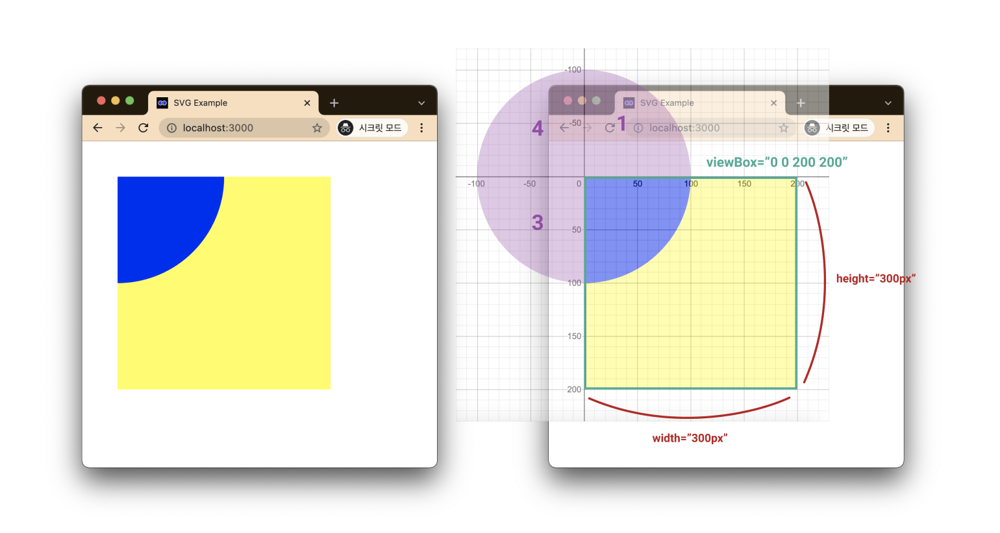
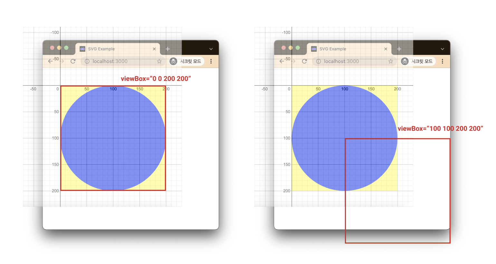

# D3의 ViewBox 요소 

---

>[참고 사이트1](https://tecoble.techcourse.co.kr/post/2021-10-24-svg-viewBox/)

## ViewBox 

### 정의

1. viewBox는 svg 요소가 그려지는 영역에서, svg 요소의 크기를 확대 또는 축소 그리고 위치를 조정할 수 있는 속성이다. 
2. svg 요소를 viewBox 속성 없이도 화면에 그릴 수는 있다. 하지만, 화면의 크기가 달라져도 **svg 요소의 크기는 고정**되어 반응형에 취약한 모습을 보인다. 
3. 즉, **viewBox 속성을 이용하면 화면에 크기에 따라 svg 요소의 크기가 자동으로 조절**된다. 
4. 이런 이유로 svg 요소를 사용하면서 **반응형 웹을 설계**하기 위해서 **viewBox는 필수 속성**이다.

### 속성값

1. viewBox는 속성값으로 **x,y,width,height** 를 사용한다. 
2. svg가 그려지는 영역의 시작점은 왼쪽 상단의 꼭짓점으로, 상단 꼭짓점이 x,y의 0,0이다. 
3. 또한 `width`와 `height`는 각각 영역의 가로, 세로 길이로 그려지는 svg의 넓이와 높이를 뜻한다. 
4. **주의할 점은 `width`와 `height`는 `px` 단위가 아니다.** 

## 사용 예시

### circle 의 1/4 그리기

```vue
const App = () => (
  <div style={{ marginTop: '50px', marginLeft: '50px' }}>
    <div style={{ backgroundColor: 'yellow', width: '300px', height: '300px' }}>
      <svg viewBox="0 0 200 200">
        <circle r="100" fill="blue" />
      </svg>
    </div>
  </div>
);

export default App;
```



1. viewBox에서 svg는 `width`와 `height`가 각각 300px인 영역 안에 위치하고 있다. 
   1. 즉, svg의 viewBox는 `"0 0 200 200"`이므로, viewBox의 `width`, `height` 300px의 길이는 svg viewBox 좌표평면 기준으로 200의 길이가 된다
   2. viewBox의 최대 그릴 수 있는 범위인 width 는 200이고, viewBox의 최대 범위인 200은 화면상 표시될 때 svg의 최대 영역인 300px로 그려진다.
2. svg의 요소 중에서 `circle`의 좌표 또한 svg의 viewBox의 좌표를 따르게 된다. 
   1. `circle` 요소의 중심 좌표 속성 `cx`와 `cy`가 설정되지 않은 상태이므로 현재 `cx="0"`, `cy="0"`, 반지름 `r=100`이 적용된 상태이다. 
3. 원 중심을 기준으로 제1, 3, 4 사분면(보라색 부분)은 svg viewBox 영역을 벗어났기 때문에 viewBox에서 나타나지 않는다

### cirecle 완벽히 그리기 

```vue
const App = () => (
  <div style={{ marginTop: '50px', marginLeft: '50px' }}>
    <div style={{ backgroundColor: 'yellow', width: '300px', height: '300px' }}>
      <svg viewBox="0 0 200 200">
        <circle cx="100" cy="100" r="100" fill="blue" />
      </svg>
    </div>
  </div>
);

export default App;
```



1. viewBox의 `min-x`, `min-y`를 변경하면 viewBox에서 보이는 영역(현재 예시에서의 `width`, `height` 300px 영역)이 동일하지만, svg에서 보여주는 영역은 변경된다
2. viewBox가 `"0 0 200 200"`부터 `"1 1 200 200"`, `"2 2 200 200"` 이런 식으로 `"100 100 200 200"`까지 변경되면 사진의 빨간 네모가 있는 부분만 보이게 된다. 
3. 즉, viewBox의 그리는 위치에 따라 svg에 보이는 것이 달라진다. 

